# Посібник адміністратора CaseStore

> **Для кого цей посібник.** Він написаний для власника магазину та співробітників, які
> **не є програмістами**. Ви не маєте нічого знати про код, бази даних чи SEO — усе пояснено
> простою мовою, крок за кроком. Мета: щоб будь-хто міг самостійно керувати магазином через
> адмін-панель і нічого не зламати.
>
> **Вперше в панелі?** Почніть із короткого маршруту
> [«Знайомство з панеллю»](admin-tour.md) — година, за яку ви пройдете всі розділи й
> спробуєте головне руками. Цей посібник — довідник, до якого той маршрут відсилає.
>
> **Де взяти доступ і допомогу.** Адресу адмін-панелі (посилання) та ваш логін/пароль
> надає розробник або власник магазину. Якщо щось не працює, кнопка недоступна або
> з'явилася незрозуміла помилка — не намагайтеся «полагодити» це через базу даних;
> зверніться до розробника і опишіть, що саме ви робили.

> **Структура посібника.** Розділи йдуть у тому ж порядку, що й пункти бічного меню.
> **Частина 1** (розділи 1–11) — **каталог і продажі**: товари, медіатека, категорії, групи,
> бренди, додаткові послуги, пристрої, характеристики, замовлення, повернення, відгуки,
> клієнти, персонал, журнал дій, профіль і промокоди. **Частина 2** (розділи 12–27) —
> **контент, комунікації та налаштування**: службові сторінки, блог, банери, каруселі,
> карта контенту, повідомлення, підписники, контакти, SEO, FAQ, дашборд, чек-лист перед
> запуском, аналітика, Google, робота зі списками, пошук і назва магазину.
>
> **Опис відповідає панелі станом на 2026-09-17.** Якщо на екрані щось виглядає інакше, ніж
> тут написано, — повідомте розробнику: це або нова зміна, або помилка в посібнику.

---

## Зміст

1. [Вхід у панель і навігація](#1-vhid)
2. [Основні поняття (глосарій)](#2-glosariy)
3. [Товари](#3-tovary)
   - [3а. Імпорт каталогу з файлу](#3a-import)
   - [3б. Медіатека (усі зображення)](#3b-mediateka)
4. [Категорії](#4-kategorii)
5. [Групи товарів](#5-grupy)
6. [Бренди](#6-brendy)
   - [6а. Додаткові послуги](#6a-poslugy)
7. [Пристрої та сумісність](#7-prystroi)
8. [Характеристики (структуровані)](#8-harakterystyky)
9. [Замовлення](#9-zamovlennya)
   - [9а. Повернення](#9a-povernennya)
   - [9б. Відгуки (модерація)](#9b-vidguky)
10. [Користувачі (клієнти)](#10-korystuvachi)
    - [10а. Хто що може: рівні доступу і розділ «Персонал»](#10a-hto-shcho-mozhe)
    - [10б. Журнал дій](#10b-zhurnal)
    - [10в. Мій профіль](#10v-profil)
11. [Промокоди](#11-promokody)
12. [Службові сторінки](#12-storinky)
13. [Блог](#13-blog)
14. [Банери головної сторінки](#14-banery)
    - [14а. Каруселі товарів на головній](#14a-karuseli)
    - [14б. Де що на сайті (карта контенту)](#14b-karta)
15. [Повідомлення (звернення)](#15-povidomlennya)
16. [Підписники розсилки](#16-pidpysnyky)
17. [Контакти магазину](#17-kontakty)
18. [SEO-налаштування](#18-seo)
19. [FAQ (часті запитання)](#19-faq)
20. [Дашборд (головний екран)](#20-dashbord)
21. [Порядок дій перед запуском](#21-cheklist)
22. [Аналітика](#22-analityka)
23. [Підтвердження сайту в Google (Search Console)](#23-search-console)
24. [Google Merchant Center (безплатні товарні оголошення)](#24-merchant-center)
25. [Робота зі списками: пошук, сортування, оновлення, масові дії](#25-spysky)
26. [Пошук по магазину](#26-poshuk)
27. [Де міняти назву магазину](#27-nazva-magazynu)

---

## 1. Вхід у панель і навігація

### Що це

Адмін-панель — це окремий сайт (не той, що бачать покупці), через який ви керуєте всім
магазином: товарами, замовленнями, клієнтами, контентом. Покупці її не бачать і не
можуть туди зайти. Панель працює й з телефона: таблиці на вузькому екрані стають
картками, а меню ховається за кнопкою «Відкрити меню».

### Як увійти

1. Відкрийте посилання на адмін-панель, яке вам дали (сторінка входу).
2. Введіть **Електронну пошту** та **Пароль** вашого службового акаунта.
3. Натисніть **Увійти**.

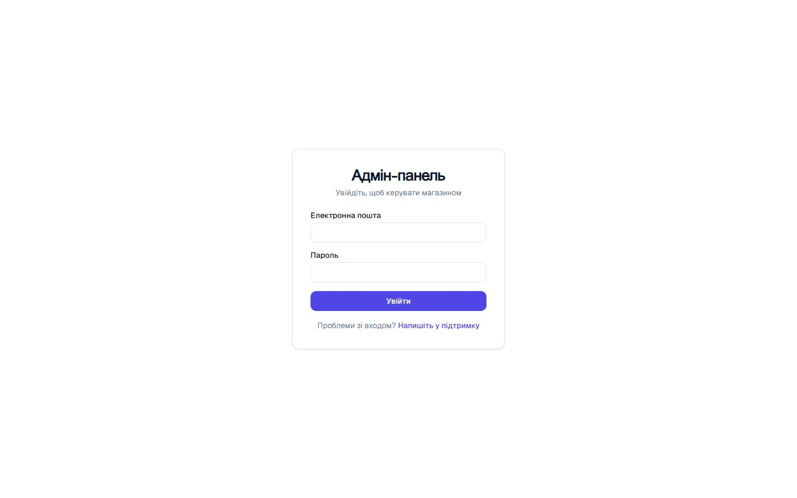

**Хто може увійти:** лише службові акаунти — **власник**, **адміністратор** або
**менеджер** (про рівні — розділ [10а](#10a-hto-shcho-mozhe)). Якщо ввести пошту й пароль
покупця, панель відповість «Цей акаунт не має прав адміністратора.»

Під формою є посилання **«Проблеми зі входом? Напишіть у підтримку»**. Панель свідомо не
пише, _чому_ вхід не вдався (невірний пароль чи вимкнений акаунт), — так безпечніше.
Після кількох невдалих спроб вхід тимчасово блокується; власник або адміністратор знімає
блокування, скинувши пароль (розділ [10а](#10a-hto-shcho-mozhe)).

### Шапка: меню акаунта

Угорі праворуч — **меню акаунта**. Там ваш рівень (Власник / Адміністратор / Менеджер),
пункт **Мій профіль** (розділ [10в](#10v-profil)) і **Вийти**.

### Огляд навігації (бічне меню)

Зліва — бічне меню. Верхня частина — робочі розділи, нижня — налаштування сайту.

**Основні розділи (зверху вниз, як на екрані):**

| Пункт меню            | Що всередині                                                                         |
| --------------------- | ------------------------------------------------------------------------------------ |
| **Панель**            | Головний екран: що потребує дії, показники, останні замовлення — [20](#20-dashbord). |
| **Товари**            | Картки товарів, ціни, залишки, публікація — [3](#3-tovary).                          |
| **Імпорт каталогу**   | Завантаження прайсу постачальника з Excel — [3а](#3a-import).                        |
| **Групи товарів**     | Об'єднання варіантів одного товару (напр. кольори) — [5](#5-grupy).                  |
| **Категорії**         | Дерево категорій каталогу — [4](#4-kategorii).                                       |
| **Бренди**            | Виробники аксесуарів (Baseus, Anker тощо) — [6](#6-brendy).                          |
| **Додаткові послуги** | Гарантії, наклеювання скла тощо, які додають у кошику — [6а](#6a-poslugy).           |
| **Пристрої**          | Гаджети (iPhone, Samsung…) для сумісності аксесуарів — [7](#7-prystroi).             |
| **Промокоди**         | Купони зі знижками — [11](#11-promokody).                                            |
| **Сторінки**          | Службові сторінки (доставка, оферта, «Про нас»…) — [12](#12-storinky).               |
| **Блог**              | Статті й категорії блогу — [13](#13-blog).                                           |
| **Банери**            | Рекламні блоки на головній — [14](#14-banery).                                       |
| **Каруселі**          | Стрічки товарів на головній («Хіти», «Новинки»…) — [14а](#14a-karuseli).             |
| **Медіатека**         | Усі завантажені зображення в одному місці — [3б](#3b-mediateka).                     |
| **Замовлення**        | Усі замовлення покупців — [9](#9-zamovlennya).                                       |
| **Повернення**        | Заявки на повернення товару й грошей — [9а](#9a-povernennya).                        |
| **Відгуки**           | Модерація відгуків про товари — [9б](#9b-vidguky).                                   |
| **Повідомлення**      | Звернення з форми контактів — [15](#15-povidomlennya).                               |
| **Користувачі**       | Клієнти магазину (покупці) — [10](#10-korystuvachi).                                 |
| **Персонал**          | Ваші працівники та їхні права — [10а](#10a-hto-shcho-mozhe).                         |
| **Підписники**        | Підписники email-розсилки — [16](#16-pidpysnyky).                                    |

**Нижня частина меню:**

| Пункт меню         | Що всередині                                                           |
| ------------------ | ---------------------------------------------------------------------- |
| **Де що на сайті** | Схема: яка зона сайту редагується в якому розділі — [14б](#14b-karta). |
| **Контакти**       | Телефон, пошта, графік, месенджери — [17](#17-kontakty).               |
| **SEO**            | Назва магазину, логотип, налаштування для Google — [18](#18-seo).      |
| **Пошук**          | Перебудова пошукового покажчика — [26](#26-poshuk).                    |
| **FAQ**            | Часті запитання — [19](#19-faq).                                       |
| **Журнал дій**     | Хто, що і коли змінив — [10б](#10b-zhurnal).                           |

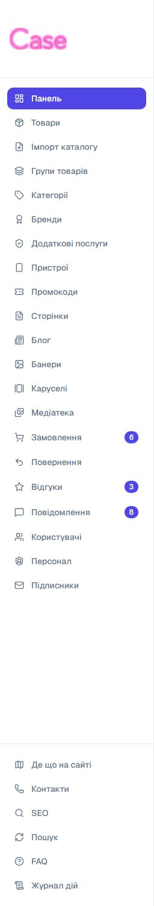

**Лічильники в меню.** Біля **Замовлення** — кількість нових замовлень, біля **Відгуки** —
відгуків на модерації, біля **Повідомлення** — непрочитаних звернень. Вони оновлюються
самі, без перезавантаження сторінки.

> **Меню у кожного своє.** Ви бачите лише пункти, на які маєте права; **Панель** видно
> завжди. Якщо працівник каже, що «у нього немає розділу Замовлення», це не поломка — це
> видані йому права. Хто що бачить і як це змінити — розділ [10а](#10a-hto-shcho-mozhe).

⚠️ **Підводні камені**

- Панель повністю **українською** — назви кнопок у посібнику збігаються з тим, що ви
  бачите на екрані.
- Якщо вас несподівано «викидає» зі сторінки входу — просто увійдіть ще раз; сесія
  коротка з міркувань безпеки.
- **Лічильники біля «Замовлення» і «Відгуки» бачать лише ті, кому видано право «Дашборд і
  показники».** Працівник без нього нових замовлень у меню не побачить — йому варто
  відкривати вкладку «Нові» у списку замовлень.

> **Усі списки в панелі влаштовані однаково** — той самий рядок із пошуком, фільтрами й
> кнопкою «Оновити», ті самі сторінки внизу. Щоб не повторювати це в кожному розділі,
> воно зібране в одному місці: [розділ 25](#25-spysky). Прочитайте його один раз — далі
> будь-який список буде зрозумілий без пояснень.

---

## 2. Основні поняття (глосарій)

Кілька слів трапляються всюди в панелі. Прочитайте цей розділ один раз — далі буде легше.

- **Активний / Неактивний (Прихований).** Більшість об'єктів (категорія, бренд, послуга,
  промокод, модель пристрою…) мають статус **Активний** або **Неактивний** (у деяких
  списках — **Прихований**). «Неактивний» = тимчасово прихований від покупців, але **дані
  нікуди не зникають**: будь-коли можна увімкнути знову. Це головний спосіб «прибрати щось
  із вітрини», нічого не втративши.
- **Чернетка / Заплановано / Опубліковано.** Для **товарів** — «Чернетка» (покупці не
  бачать) і «Опубліковано» (на вітрині); публікація — окрема кнопка, а не галочка у формі
  (розділ [3](#3-tovary)). Для **контенту** (сторінки, статті, банери, каруселі) є ще
  **Заплановано** — з'явиться на сайті сам у вказану дату й час.
- **Видалити — не те саме, що деактивувати.** Для порядку:
  - **Товар** можна **видалити** (право «Видаляти товари»). Він зникає з вітрини й зі
    списку, але замовлення з ним лишаються цілими. Його адреса (slug) і артикул
    звільняються — тому повернути товар у попередньому вигляді самотужки не вийде. Якщо
    треба лише тимчасово прибрати — **деактивуйте**.
  - **Категорії, бренди, моделі пристроїв, додаткові послуги, промокоди** — кнопки
    «Видалити» немає, лише приховати / деактивувати.
  - **Клієнта** може видалити лише власник: людина більше не ввійде, але її замовлення
    лишаться (розділ [10](#10-korystuvachi)).
  - **Сторінки, статті, категорії блогу, банери, каруселі, запитання FAQ, фото товару й
    зображення в медіатеці** — «Видалити» остаточне, з підтвердженням.
- **Slug (частина адреси).** «Людиночитабельний» шматок посилання, напр. у
  `…/products/chohol-silikonovyi` slug — це `chohol-silikonovyi`. Порожнє поле = система
  згенерує slug із назви (під полем видно підказку «Буде згенеровано: …»). Якщо змінити slug
  у вже опублікованого товару, категорії, сторінки чи статті, панель перепитає й
  **автоматично налаштує переадресацію** зі старої адреси на нову.
- **Артикул (SKU).** Ваш внутрішній код товару (напр. `CASE-IP15-BLK`). Необов'язковий, але
  саме за ним імпорт каталогу впізнає товар (розділ [3а](#3a-import)).
- **Ціна та стара ціна.** «Ціна» — те, що платить покупець. «Стара ціна» (більша) —
  закреслена ціна поруч, яка показує розмір знижки. Заповнюйте лише для реальної акції.
- **Залишок: вільно / резерв / фізично.**
  - **Вільний залишок** — скільки можна продати прямо зараз. Саме це поле ви редагуєте у
    формі товару.
  - **Резерв** — одиниці, закріплені за замовленнями, які ще не відправлено. Вони
    віднімаються від вільного залишку одразу при оформленні замовлення.
  - **Фізично** = вільно + резерв, тобто скільки лежить на полиці.
    Коли вільний залишок = 0, купити товар на вітрині не можна.
- **Група та позиція.** «Група товарів» об'єднує варіанти одного товару (напр. один чохол у
  5 кольорах). Кожен варіант — окрема **позиція** (окремий товар), але на вітрині вони
  показані однією карткою з перемикачами.
- **Вісь (axis).** Характеристика, за якою відрізняються позиції в групі (напр. `колір`,
  `набір`). Осі задаються в групі; значення осі (`синій`) — у кожному товарі.
- **Бренд vs Пристрій.** **Бренд** — хто виробив аксесуар (Baseus, Anker). **Пристрій** —
  гаджет, до якого аксесуар підходить (iPhone 15). Це два різні розділи.
- **Медіатека.** Спільна «шафа» всіх зображень магазину. Біля полів із картинкою є кнопка
  **«З медіатеки»** — узяти вже завантажене фото замість того, щоб вантажити його вдруге
  (розділ [3б](#3b-mediateka)).
- **SEO.** «Оптимізація для пошукових систем» — як ваш магазин виглядає в Google. Нічого
  заповнювати не обов'язково: система підставить назви автоматично.
  - **SEO-заголовок (meta title)** — заголовок у вкладці браузера та в результатах Google.
  - **SEO-опис (meta description)** — короткий опис під заголовком у результатах Google.
  - **Теги (для пошуку всередині магазину)** — слова через кому, за якими товар чи сторінку
    знаходять у пошуку магазину. Це **не** «ключові слова для Google» — Google їх не читає.
  - **Картинка для соцмереж (OG)** — прев'ю, коли посиланням діляться у Facebook, Telegram
    чи Viber (розмір 1200×630). Порожнє поле — береться власне зображення сторінки або
    загальна картинка з розділу **SEO**.
- **Права.** Кожна кнопка й кожен пункт меню відкриваються певним правом (галочкою). Якщо
  чогось не видно — найчастіше просто не видано права (розділ [10а](#10a-hto-shcho-mozhe)).

---

## 3. Товари

### Що це

Розділ **Товари** — серце магазину. Тут ви створюєте картки товарів, задаєте ціни,
залишки, фото, характеристики, сумісність і публікуєте товар на вітрині.

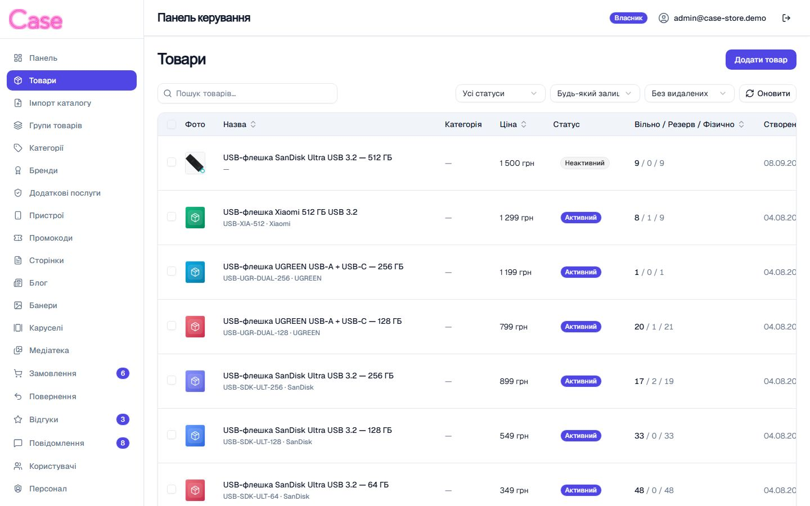

### Список товарів

Список показує і **опубліковані, і приховані** товари (на відміну від вітрини). Колонки:

| Колонка                       | Що показує                                                                                                      |
| ----------------------------- | --------------------------------------------------------------------------------------------------------------- |
| **Фото**                      | Мініатюра головного фото. Напис **«без фото»** — у товару немає жодного зображення, опублікувати його не можна. |
| **Назва**                     | Назва (посилання на картку товару), під нею артикул і бренд.                                                    |
| **Категорія**                 | Категорія товару.                                                                                               |
| **Ціна**                      | Ціна для покупця.                                                                                               |
| **Статус**                    | Позначка «Активний» / «Неактивний». Клік по ній перемикає: активний = товар на вітрині.                         |
| **Вільно / Резерв / Фізично** | Три числа залишку (див. глосарій, розділ [2](#2-glosariy)).                                                     |
| **Створено**                  | Дата створення.                                                                                                 |
| **Дії**                       | **Редагувати** і **Видалити** (кнопку «Видалити» видно лише з правом «Видаляти товари»).                        |

Над списком — пошук і три фільтри:

- **статус**: «Усі статуси» / «Лише активні» / «Лише приховані»;
- **залишок**: «Будь-який залишок» / «Немає в наявності» — ваш робочий список на поповнення;
- **Видалені**: «Без видалених» / «Лише видалені». Видалені товари показуються лише для
  довідки — відкрити, редагувати чи повернути їх із панелі не можна.

Сортувати можна за назвою, ціною, залишком і датою. Масові дії над позначеними рядками:
**Активувати**, **Деактивувати**, **Перемістити до групи** (розділ [5](#5-grupy)) і
**Задати колір** (розділ [8](#8-harakterystyky)). Як працюють пошук, сторінки й галочки —
розділ [25](#25-spysky).

### Щоб створити товар

1. Відкрийте **Товари** → **Додати товар** (вгорі праворуч).
2. Заповніть форму (поля — нижче). На цій самій сторінці вже можна додати **фото**,
   **характеристики**, **сумісні пристрої** і **ексклюзивні додаткові послуги** — вони
   збережуться разом із товаром.
3. Натисніть **Створити товар**. Панель покаже прогрес «Створюємо товар…» — окремо для
   товару, фото, характеристик, сумісності й послуг.
4. Товар зберігається як **чернетка** (прихований від покупців), і ви опиняєтесь на його
   сторінці редагування з повідомленням «Чернетку створено. Перевірте готовність і
   опублікуйте товар.»
5. Коли все готово, натисніть **Опублікувати** на панелі «Публікація» вгорі сторінки.

> **Товар не з'являється на вітрині, доки ви не натиснете «Опублікувати».** Це навмисно:
> покупець не повинен побачити напівпорожню картку без фото й характеристик.

Якщо під час створення щось не збереглося (наприклад, одне фото не завантажилось), на
сторінці редагування з'явиться блок **«Товар створено, але не все збереглося»** з переліком
того, що треба доробити. Сам товар уже створено й приховано — доробіть решту просто там.

### Панель «Публікація»

Угорі сторінки редагування — стан товару («Чернетка — покупці її не бачать» або
«Опубліковано — товар на вітрині») і чек-лист готовності. Пункти з позначкою
**обов'язково** блокують кнопку «Опублікувати»:

| Пункт                            | Обов'язковий? | Чому                                                    |
| -------------------------------- | ------------- | ------------------------------------------------------- |
| Вказана назва                    | так           | Без неї товар неможливо знайти.                         |
| Обрана категорія                 | так           | Товар має десь лежати в каталозі.                       |
| Ціна більша за 0                 | так           | Товар за 0 ₴ — помилка даних, а не акція.               |
| Є хоча б одне фото               | так           | Картка без фото майже не продає.                        |
| Заповнений опис                  | ні            | Порожній опис — порожня сторінка товару.                |
| Залишок більший за 0             | ні            | Товар можна показувати з позначкою «немає в наявності». |
| Заповнені характеристики         | ні            | Без них товар не потрапляє у фільтри каталогу.          |
| Вказана сумісність із пристроями | ні            | Без неї товар не знайдуть за моделлю телефона.          |

Опублікований товар можна зняти з вітрини будь-коли — кнопка **Зняти з публікації** на тій
самій панелі або клік по позначці «Активний» у списку. Чек-лист ніколи не заважає прибрати товар, лише
поставити.

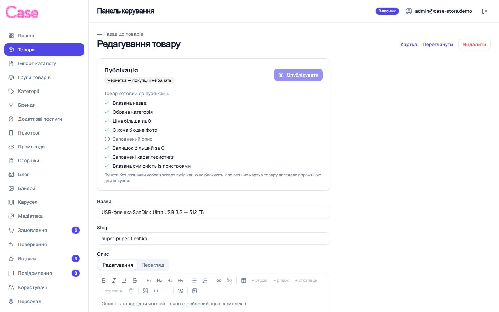

### Щоб відредагувати товар

1. У списку натисніть **Редагувати** напроти товару.
2. Змініть потрібні поля й натисніть **Зберегти зміни**.

Угорі сторінки редагування є ще три посилання:

- **Картка** — сторінка товару «лише для перегляду» (див. нижче);
- **Переглянути** — як товар виглядатиме на сайті, навіть якщо він прихований (відкривається
  в новій вкладці зі службовим банером «Цей товар деактивований і не відображається для
  покупців. Це службовий перегляд.»);
- **Видалити** — див. «Видалення» нижче.

### Ключові поля форми товару

| Поле                | Що вводити                                                                                                                                              |
| ------------------- | ------------------------------------------------------------------------------------------------------------------------------------------------------- |
| **Назва**           | Обов'язкова. Повна назва товару, як її бачитиме покупець.                                                                                               |
| **Slug**            | Частина адреси. Порожнє — згенерується з назви («Буде згенеровано: …»).                                                                                 |
| **Опис**            | Текст із форматуванням. Кнопка **«Зображення»** на панелі редактора вставляє картинку з медіатеки. Вкладка «Перегляд» показує, як це побачить покупець. |
| **Ціна**            | Обов'язкова, більша за 0. Ціна для покупця у гривнях.                                                                                                   |
| **Стара ціна**      | Необов'язкова. Закреслена «доакційна» ціна.                                                                                                             |
| **Артикул**         | Ваш внутрішній код (SKU). За ним імпорт впізнає товар.                                                                                                  |
| **Категорія**       | Обов'язкова. Список із пошуком — почніть вводити назву. Показуються лише кінцеві підкатегорії.                                                          |
| **Вільний залишок** | Скільки штук можна продати зараз. Ціле число ≥ 0. На редагуванні під полем видно, скільки фізично на складі і скільки в резерві.                        |
| **Порядок позиції** | Порядок показу серед варіантів групи. Можна лишити 0.                                                                                                   |
| **Група**           | Необов'язково. «Без групи» — звичайний товар. Оберіть групу, щоб зробити товар варіантом (розділ [5](#5-grupy)).                                        |
| **Бренд**           | Необов'язково. Виробник аксесуара.                                                                                                                      |
| **Атрибути**        | Пари «ключ / значення» — значення осей групи (напр. `колір` / `синій`).                                                                                 |
| **SEO-блок**        | SEO-заголовок, SEO-опис, теги, картинка для соцмереж і **прев'ю «Перегляд у результатах пошуку Google»**. Усе необов'язкове.                            |

Окремої галочки «Активний» у формі **немає** — видимість товару керується лише панеллю
«Публікація» та перемикачем у списку.

### Фото, характеристики, послуги, сумісність

Під формою — чотири блоки:

- **Зображення товару** — див. нижче.
- **Характеристики** — значення параметрів за шаблоном категорії (розділ
  [8](#8-harakterystyky)). На редагуванні зберігаються окремою кнопкою **Зберегти
  характеристики**.
- **Додаткові послуги цього товару** — винятки з послуг категорії (розділ
  [6а](#6a-poslugy)).
- **Сумісні пристрої** — до яких гаджетів підходить аксесуар (розділ [7](#7-prystroi)).

#### Щоб додати й упорядкувати фото

1. У блоці **Зображення товару** перетягніть файли в зону **«Перетягніть фото сюди»** або
   натисніть **Завантажити зображення**. Формати JPEG, PNG, WebP або GIF, до 20 МБ кожен —
   великі фото система зменшить сама.
2. Кожен файл вантажиться окремо, у черзі видно його стан. Якщо один не вдався — натисніть
   **Повторити** біля нього або **Повторити невдалі** для всіх.
3. На сторінці редагування є ще кнопка **«З медіатеки»** — узяти фото, яке вже
   завантажували раніше (розділ [3б](#3b-mediateka)).
4. Наведіть на фото, щоб побачити кнопки: стрілки — змінити порядок, **зірочка** — зробити
   головним (обкладинкою), **кошик** — видалити (з підтвердженням).

На сторінці створення фото лише стоять у черзі й завантажуються після «Створити товар»;
перше в списку стане головним.

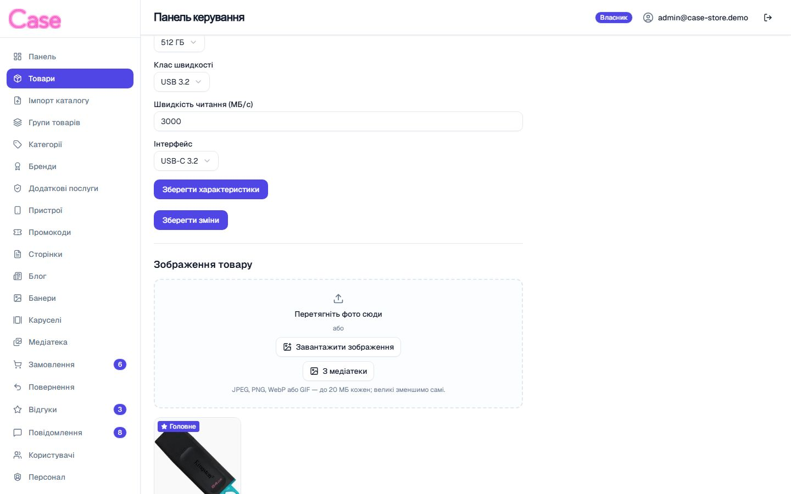

### Картка товару (лише перегляд)

Клік по назві товару в списку (або посилання **Картка**) відкриває картку для перегляду (угорі —
посилання **Редагувати**, **Переглянути** і кнопка **Видалити**):
розділи «Основне», «Залишки», «Опис», «Характеристики», «Зображення», «Додаткові послуги»,
«Сумісні пристрої», «SEO» та **«Історія змін»** — хто й коли змінював товар. Історію бачать
лише власник і адміністратори.

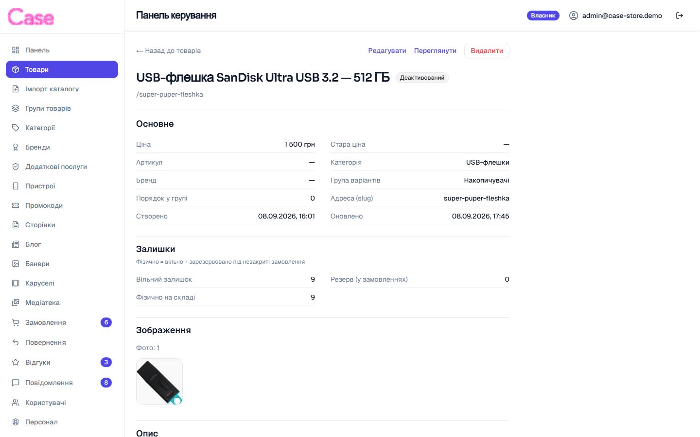

### Видалення товару

Кнопка **Видалити** (у списку або на сторінці редагування) відкриває вікно «Видалити
товар?», яке пояснює наслідки:

- товар зникне з вітрини й зі списку товарів;
- замовлення, у яких він уже є, лишаться цілими;
- адреса (slug) і артикул **звільняться** — їх зможе зайняти інший товар, тож повернути
  товар у попередньому вигляді самотужки не вийде.

Якщо треба лише тимчасово прибрати товар із продажу — закрийте вікно й вимкніть перемикач
статусу. Знайти видалений товар для довідки можна фільтром «Лише видалені».

⚠️ **Підводні камені**

- **Видалити ≠ приховати.** Для сезонного товару чи товару, якого тимчасово немає,
  використовуйте перемикач статусу, а не «Видалити».
- **Показуються лише кінцеві підкатегорії.** Товар прив'язується до конкретної підкатегорії
  (напр. «Чохли для iPhone», а не просто «Чохли»).
- **Залишок зменшується автоматично** з кожним замовленням (одразу при оформленні). Коли він
  дійде до 0, товар на вітрині стане недоступним для купівлі.
- **Не змінюйте артикул** товару, який приходить з імпорту: зв'язок із рядком файлу
  загубиться, і наступний імпорт створить дубль.
- Не плутайте **Атрибути** (значення осей групи, напр. колір) із **Характеристиками**
  (матеріал, потужність — розділ [8](#8-harakterystyky)).
- Колонка «Категорія» у списку зараз часто показує «—» навіть для товарів із категорією —
  це відома помилка відображення (TASK-717); справжню категорію видно на картці товару.

> Технічні деталі: TASK-361 (публікація окремою дією), TASK-427 (видалення й картка),
> TASK-442 (усе на сторінці створення), TASK-254 (три числа залишку).

---

## 3а. Імпорт каталогу з файлу

### Що це

Якщо постачальник дає прайс у форматі **.xlsx**, не треба заводити тисячу товарів руками.
Розділ **Імпорт каталогу** читає такий файл і показує, що саме зміниться, **перш ніж** щось
записати. Розділ відкривається окремим правом «Імпорт каталогу з файлу».

### Порядок дій

1. Відкрийте **Імпорт каталогу** в меню.
2. Оберіть файл `.xlsx` і натисніть **Розібрати файл**. На цьому кроці **нічого не
   записується** — система лише читає файл і порівнює його з магазином. Якщо цей самий файл
   уже імпортували, панель попередить: «Такий самий файл уже імпортували раніше».
3. Перегляньте, що вийшло:
   - плитки вгорі — скільки товарів **Створити**, **Оновити**, **Приховати**, скільки
     **Без змін**, скільки **Помилок у файлі** і скільки **Ручних правок під загрозою**;
   - **Довідники з файлу** — які категорії, бренди, марки й моделі пристроїв,
     характеристики та групи варіантів буде створено (ті, що вже є, використаються
     повторно);
   - **Нові товари** — що буде створено;
   - **Зміни в наявних товарах** — кожне поле окремим рядком «Зараз → Стане», з галочкою;
   - **Зникли з файлу** — ці товари буде приховано;
   - **Рядки, які пропустимо** — з поясненням, чому (найчастіше ціна 0).
4. Зніміть галочки з того, що застосовувати не треба (або **Позначити все**, щоб повернути).
5. Натисніть **Застосувати** і підтвердьте. Запис іде у фоні — «Записано N з M». Вкладку можна
   закрити, імпорт не зупиниться.
6. Передумали — **Відхилити**: розбір скасовується, файл доведеться завантажити заново.

Унизу сторінки — таблиця **Попередні імпорти**: файл, статус («Очікує підтвердження»,
«Записується», «Застосовано», «Помилка», «Відхилено»), коли й хто.

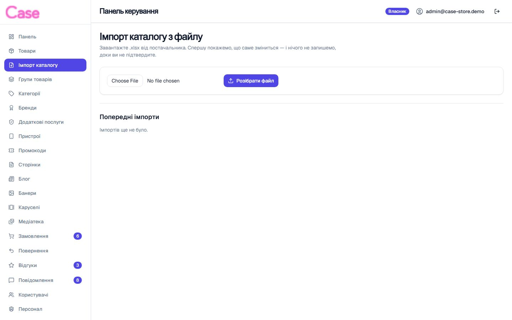

### Що важливо знати

> **Усі імпортовані товари створюються прихованими та з нульовим залишком.** У файлі
> постачальника **немає стовпця із залишками** — тож після імпорту вам треба проставити
> залишки й опублікувати те, що справді є на складі. Зручно робити це через фільтр
> «Немає в наявності» у списку товарів.

> **Фото не переносяться.** Стовпець «Фото» у файлі читається, але його вміст ніде не
> зберігається — магазин не тримає посилань на чужі картинки. Тому одразу після імпорту
> всі нові товари мають чип «без фото»: зображення додаються вручну на сторінці товару.

**Повторний імпорт.** Файл можна заливати скільки завгодно разів — система пам'ятає, що
саме вона записала минулого разу, і пропонує лише те, що змінилось у постачальника:

- ви виправили ціну руками, а в постачальника вона **не** змінилась → ваша ціна лишається,
  система про неї навіть не питає;
- ви виправили ціну руками, і в постачальника вона **теж** змінилась → рядок приходить із
  міткою **«змінено вручну»**. За замовчуванням переможе файл; зніміть галочку, щоб
  зберегти свою правку, або натисніть **«Зняти всі ручні правки»** одразу для всіх;
- товар зник із файлу → його **приховають, а не видалять**. Повернеться у файл —
  повернеться в магазин, тим самим товаром, з усією історією замовлень.

Товари звіряються за **артикулом**. Якщо ви зміните артикул товару в адмінці, зв'язок із
рядком файлу загубиться, і наступний імпорт створить дубль.

⚠️ **Підводні камені**

- **Характеристики з файлу створюються як «Текст».** Панель пише, що «зробити їх фільтрами
  можна пізніше, у налаштуваннях категорії», — але фільтром може бути лише тип «Так/Ні» або
  «Вибір зі списку» (розділ [8](#8-harakterystyky)). Тож спершу змініть тип характеристики
  на «Вибір зі списку» й перелічіть значення, а вже потім вмикайте «фільтр».
- Після великого імпорту, якщо покупці не знаходять нові товари пошуком, перебудуйте
  покажчик (розділ [26](#26-poshuk)).

---

## 3б. Медіатека (усі зображення)

### Що це

**Медіатека** — усі зображення магазину в одному місці: фото товарів, логотипи брендів,
картинки категорій, банери, обкладинки статей. Одне й те саме фото можна використати в
кількох місцях, не завантажуючи його щоразу. Тут же видно, **де саме** використовується
кожне зображення, — і тому нічого не можна видалити «з-під» живої сторінки.

Хто що може:

- право **«Переглядати медіатеку»** — відкривати розділ, шукати, дивитися, де що
  використовується;
- право **«Завантажувати та видаляти медіа»** — завантажувати, змінювати опис і теги,
  видаляти. Без нього поля в картці неактивні, а вгорі видно підказку попросити це право.

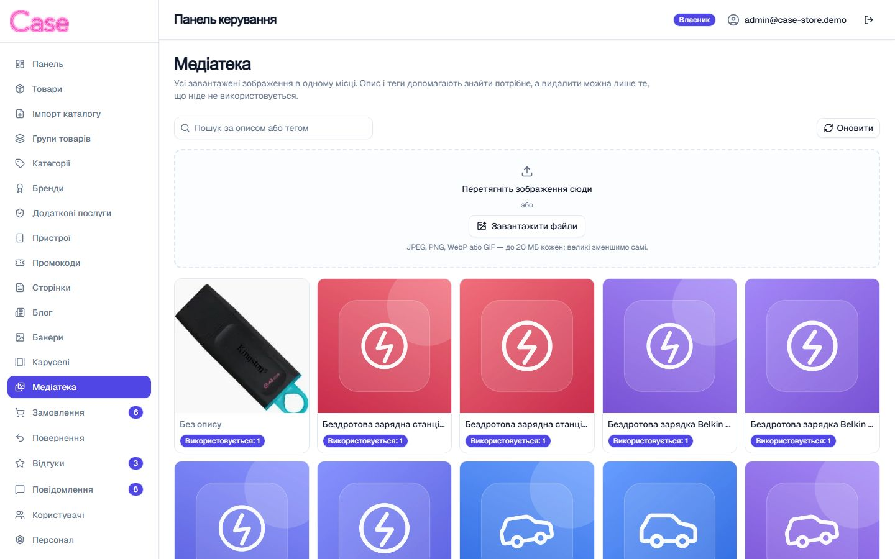

### Щоб завантажити зображення

1. Відкрийте **Медіатека**.
2. Перетягніть файли в зону **«Перетягніть зображення сюди»** або натисніть **Завантажити
   файли**. JPEG, PNG, WebP або GIF, до 20 МБ кожен; великі зменшаться самі.
3. Кожен файл вантажиться окремо. Невдалий можна **Повторити**; **Очистити список** прибирає
   чергу з екрана.

### Щоб знайти й описати зображення

- Поле **«Пошук за описом або тегом»** шукає за тим, що ви вписали в картку зображення.
- На плитках видно: **«Використовується: N»**, **«Ніде не використовується»**, **«Без
  опису»**.
- Клік по плитці відкриває картку: розміри, **Відкрити оригінал**, дата «Завантажено», поля
  **Опис (alt)** і **Теги**, блок **«Де використовується»**.
- **Опис (alt)** — що зображено (напр. «Чохол MagSafe для iPhone 16 Pro, чорний»). Його
  читають незрячі покупці й пошукові системи.
- **Теги** — слова через кому (до 20), за ними працює пошук у медіатеці.
- Опис і теги **зберігаються самі** — під полем з'являється «Збереження…», потім
  «Збережено». Кнопки «Зберегти» немає.

### Щоб видалити зображення

1. Відкрийте картку зображення.
2. Якщо в блоці «Де використовується» написано «Ніде не використовується — можна
   видалити», натисніть **Видалити** → **Так, видалити**.
3. Якщо зображення десь стоїть (наприклад, «Фото товару — «Чохол…»»), видалення заблоковано:
   спершу приберіть або замініть його там, а потім поверніться.

### Кнопка «З медіатеки» в інших формах

Біля полів із зображенням у формах **категорії**, **бренду**, **банера**, **статті** і на
сторінці редагування **товару** є кнопка **«З медіатеки»**. Вона відкриває вікно з двома
вкладками: **Обрати наявне** і **Завантажити нове** (нове одразу потрапляє в медіатеку). У
редакторі тексту (опис товару, сторінка, стаття) те саме робить кнопка **«Зображення»**.

⚠️ **Підводні камені**

- **Видалення з медіатеки — назавжди.** Тому воно й дозволене лише для зображень, які ніде
  не використовуються.
- **На сторінці створення товару «З медіатеки» ще немає** — галерея з'являється після
  першого збереження товару. Звичайне завантаження файлів там працює.
- **Поле «Картинка для соцмереж (OG)»** у формах поки приймає лише посилання — кнопки
  «З медіатеки» там немає (TASK-728).

> Технічні деталі: TASK-441 (медіатека), план 177.

---

## 4. Категорії

### Що це

Категорії — це дерево розділів каталогу (напр. «Аксесуари» → «Чохли» → «Чохли для
iPhone»). Покупці орієнтуються по ньому в меню й фільтрах. Дерево може мати **до чотирьох
рівнів**.

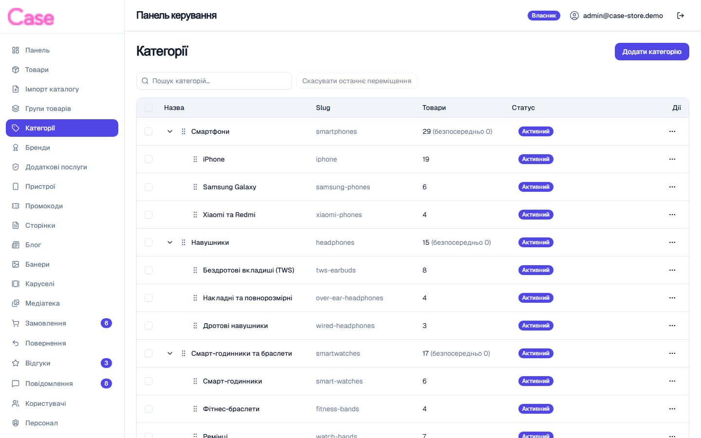

### Дерево категорій

Розділ **Категорії** показує не плаский список, а **дерево**: підкатегорії розгортаються під
батьківською. Колонки:

- **Назва**;
- **Slug**;
- **Товари** — скільки товарів вітрина покаже на сторінці категорії (разом з усіма
  підкатегоріями), а в дужках «безпосередньо N» — скільки лежить у самій категорії;
- **Статус** — «Активний» / «Неактивний». Позначка **«Прихована через батька»** означає, що
  категорія увімкнена, але на вітрині її не видно, бо вимкнено категорію вище по дереву;
- **Дії** — меню з діями (див. нижче).

### Порядок і вкладеність: перетягування

- **Мишею:** візьміть рядок за значок ліворуч і перетягніть на нове місце або всередину
  іншої категорії.
- **Клавіатурою:** Пробіл — узяти рядок; стрілки вгору/вниз — позиція, вліво/вправо — рівень
  вкладеності; Enter — підтвердити, Escape — скасувати. Швидкі клавіші: Alt+Shift+стрілки.
- **Через меню «Дії»** у рядку: **Перемістити вгору**, **Перемістити вниз**, **Зробити
  підкатегорією**, **Підняти на рівень вище**, **Зробити кореневою**, **Перемістити до…**
  (вікно з вибором батьківської категорії й позиції), а також **Редагувати**,
  **Активувати** / **Деактивувати**.

Помилилися? Кнопка **«Скасувати останнє переміщення»** повертає все як було — протягом
30 секунд після переміщення.

Поки в полі пошуку щось введено, переміщення **вимкнене** — очистіть пошук.

### Масові дії

Позначте галочками кілька категорій — з'являться кнопки **Активувати (N)** і
**Деактивувати (N)**. Перед деактивацією панель попереджає, що кожна категорія зникне з
вітрини разом з усім, що під нею (статус самих підкатегорій при цьому не змінюється).

### Щоб створити категорію

1. Відкрийте **Категорії** → **Додати категорію**.
2. Заповніть поля (нижче) і натисніть **Створити категорію**.

### Ключові поля

| Поле                            | Що вводити                                                                                                                                         |
| ------------------------------- | -------------------------------------------------------------------------------------------------------------------------------------------------- |
| **Назва**                       | Обов'язкова. Як категорія називається в меню.                                                                                                      |
| **Slug**                        | Частина адреси; порожнє — згенерується з назви.                                                                                                    |
| **Опис**                        | Необов'язковий текст про категорію.                                                                                                                |
| **Зображення**                  | **Завантажити файл**, **«З медіатеки»** або вставити посилання в поле «URL зображення». **Прибрати** очищає поле (сам файл лишається в медіатеці). |
| **Батьківська категорія**       | «Коренева (без батьківської)» — верхній рівень. Інакше оберіть, під якою категорією вона стоїть.                                                   |
| **Активна**                     | «Показувати в магазині».                                                                                                                           |
| **SEO-заголовок / SEO-опис**    | Необов'язкові. Порожні — використаються назва й опис.                                                                                              |
| **Теги, картинка для соцмереж** | Необов'язкові (див. глосарій).                                                                                                                     |

Поля «Порядок сортування» у формі **немає** — порядок задається в дереві.

### На сторінці редагування категорії

Під формою — ще два окремі блоки:

- **Характеристики** — шаблони параметрів для товарів цієї категорії; успадковуються
  підкатегоріями. Докладно — розділ [8](#8-harakterystyky).
- **Додаткові послуги цієї категорії** — які послуги пропонувати для всіх товарів
  категорії та її підкатегорій, кнопка **Зберегти послуги категорії**. Докладно — розділ
  [6а](#6a-poslugy).

⚠️ **Підводні камені**

- **Деактивація батьківської категорії ховає всю гілку.** Перед дією панель пише, скільки
  підкатегорій буде приховано разом із нею.
- **Товари прив'язуються до кінцевих підкатегорій.** Плануйте дерево так, щоб товари мали
  куди «лягти».
- **Зміна slug активної категорії** — панель перепитає й налаштує переадресацію зі старої
  адреси.
- Категорії **не видаляються** — лише деактивуються. Категорія не може бути власною
  батьківською чи опинитися всередині своєї ж підкатегорії: таке переміщення панель
  відхилить.

> Технічні деталі: TASK-291 (дерево з перетягуванням), TASK-293 (масові дії), TASK-408
> (лічильник товарів і «Прихована через батька»), TASK-285 (переадресація slug).

---

## 5. Групи товарів

### Що це

**Група товарів** об'єднує кілька варіантів одного товару в одну картку на вітрині.
Приклад: один силіконовий чохол існує в 5 кольорах. Замість 5 окремих карток покупець
бачить **одну** картку з перемикачем кольору. Кожен колір — це окрема **позиція**
(окремий товар зі своєю ціною, артикулом і залишком), але зібрані вони в одну групу.

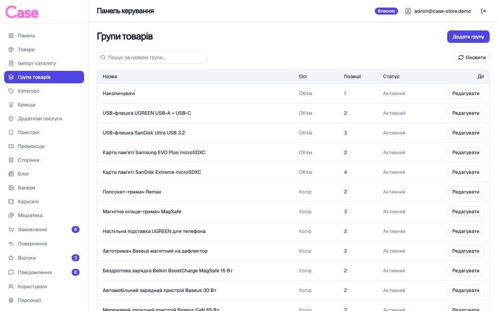

Список груп має пошук за назвою й сторінки, як і решта списків (розділ [25](#25-spysky)).

### Коли робити групу, а коли окремий товар

Питання одне: **чи вибирає покупець між цими варіантами на одній сторінці?**

- **Група**, якщо різниця лише в одній-двох властивостях, а решта однакова: той самий чохол
  у різних кольорах; той самий кабель довжиною 1 м і 2 м; скло «1 шт» і «набір 3 шт».
  Покупець дивиться одну картку й перемикає варіант.
- **Окремі товари**, якщо це різні речі, навіть схожі: чохол для iPhone 15 і для iPhone 16
  (різна сумісність — покупець шукає за своєю моделлю); силіконовий і шкіряний чохол
  (різний опис, фото, характеристики); зарядка 20 Вт і 65 Вт від різних виробників.

Приклад: «Чохол Silicone Case для iPhone 15» — група з осями `колір`; у ній позиції
«чорний», «синій», «пісочний». А «Silicone Case для iPhone 16» — **інша** група, бо це інша
модель.

### Щоб створити групу

1. Відкрийте **Групи товарів** → **Додати групу**.
2. Введіть **Назву** групи (напр. «Чохол Silicone Case»).
3. Додайте **Осі атрибутів** (кнопка **Додати вісь**) — властивості, за якими відрізняються
   варіанти (напр. `колір`, `набір`). Порядок осей = порядок перемикачів на вітрині.
4. Галочка **Активна** — показувати групу.
5. Натисніть **Створити групу**.

### Як наповнити групу позиціями

Позиції **не додаються на екрані групи**. Два способи:

**Швидкий — масово зі списку товарів.** У розділі **Товари** позначте галочками потрібні
товари → **Перемістити до групи (N)** → оберіть групу → **Перемістити**. «Без групи» виводить
товари з групи.

**По одному — у формі товару:**

1. Відкрийте товар-варіант у розділі **Товари**.
2. У полі **Група** оберіть вашу групу.
3. У блоці **Атрибути** впишіть значення осей: **ключ** = назва осі (напр. `колір`),
   **значення** = конкретне (напр. `синій`).
4. Збережіть. Повторіть для кожного варіанта.

На екрані редагування групи знизу є список **«Позиції в цій групі»**. Поки там порожньо,
видно підказку «Позицій ще не призначено…».

⚠️ **Підводні камені**

- **Ключ атрибута в товарі має збігатися з назвою осі в групі.** Якщо в групі вісь
  зветься `набір`, а в товарі ви впишете `комплект` — вітрина не зіставить їх, і перемикач
  працюватиме неправильно. Виняток — колір: `color`, `colour` і `колір` система вважає
  однією віссю, незалежно від великих літер.
- **Колір для фільтра каталогу** задається не лише віссю. Щоб товар знаходився у фільтрі
  «Колір», скористайтеся масовою дією **Задати колір** у списку товарів — вона пише і вісь,
  і характеристику (розділ [8](#8-harakterystyky)).
- Порядок осей у групі задає порядок перемикачів на сторінці товару — розставте
  найважливіше першим.
- Неактивна група не показує варіанти на вітрині.

> Технічні деталі: TASK-142 (варіанти як позиції групи), TASK-423 (масове переміщення),
> TASK-487 (колір як фасет), plan 060.

---

## 6. Бренди

### Що це

**Бренд** — виробник аксесуара (Baseus, Anker, Spigen…). Покупці фільтрують каталог за
брендом і бачать блок «Популярні бренди».

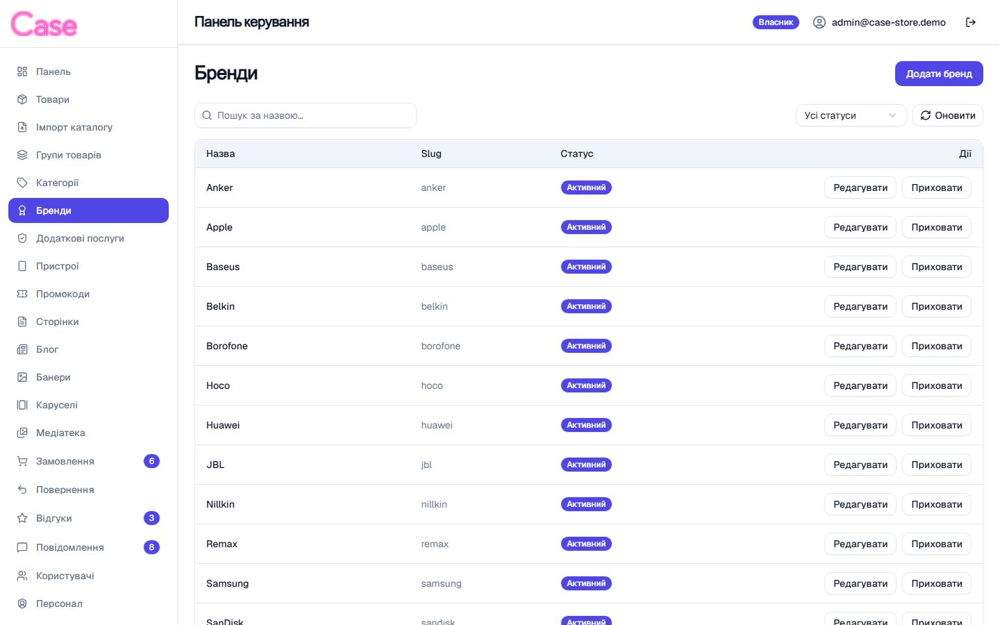

### Щоб створити бренд

1. Відкрийте **Бренди** → **Додати бренд**.
2. Заповніть поля:
   - **Назва** — обов'язкова;
   - **Slug** — порожнє для автогенерації («Буде згенеровано: …»);
   - **Логотип** — **Завантажити файл**, **«З медіатеки»** або посилання в полі «Логотип
     (URL)». Найкраще виглядає логотип на прозорому фоні;
   - **Активний** — показувати в магазині.
3. Натисніть **Створити бренд**.

### Як прив'язати бренд до товару

Бренд обирається **у формі товару** в полі **Бренд** (не тут). Один бренд можна
призначити багатьом товарам.

Список брендів можна шукати за назвою й фільтрувати за статусом (**Усі статуси / Активний /
Прихований**). Приховати чи активувати бренд можна прямо в списку — кнопки **Приховати** /
**Активувати**.

⚠️ **Підводні камені**

- **Бренд — це не пристрій.** Бренд = хто виготовив аксесуар. Сумісність із телефонами
  задається окремо в розділі [Пристрої](#7-prystroi).
- Приховування бренду прибирає його з фільтра на вітрині, але не чіпає товари, яким він
  призначений.
- Бренди **не видаляються** — лише приховуються.

> Технічні деталі: TASK-189, plan 110; завантаження логотипа — TASK-424.

---

## 6а. Додаткові послуги

### Що це

**Додаткові послуги** — те, що покупець може додати до товару **в кошику**: розширена
гарантія, наклеювання захисного скла, налаштування телефона тощо. Кожна послуга має назву,
опис і ціну (може бути 0 — безкоштовна).

Послуга задається **один раз** у довіднику, а **де** її пропонувати — вирішується в двох
місцях:

1. **На категорії** — шаблон: «для всіх товарів цієї категорії та її підкатегорій».
2. **На товарі** — винятки: інша ціна саме для цього товару, прибрати послугу або додати
   ексклюзивну.

Покупець бачить послуги **лише в кошику** — у рядку товару — і окремим рядком «Додаткові
послуги» в підсумку. На сторінці товару їх немає.

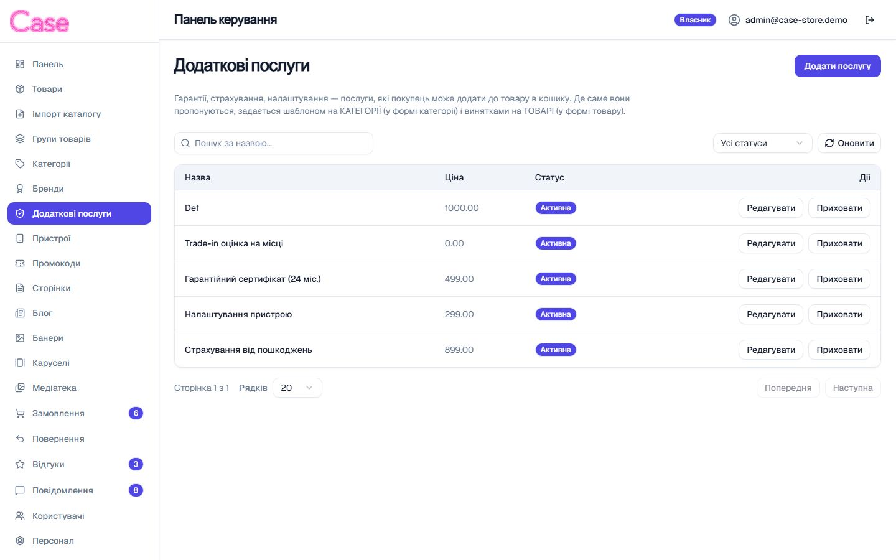

### Щоб створити послугу

1. Відкрийте **Додаткові послуги** → **Додати послугу**.
2. Заповніть:
   - **Назва**;
   - **Опис для покупця** — що саме входить у послугу;
   - **Ціна, ₴** — може бути 0;
   - **Активна (пропонувати у кошику)**.
3. Натисніть **Створити послугу**.

Сама по собі нова послуга ще **ніде не пропонується** — призначте її категорії або товару.

### Щоб пропонувати послугу для категорії

1. **Категорії** → потрібна категорія → **Редагувати**.
2. Унизу, у блоці **«Додаткові послуги цієї категорії»**, позначте послуги.
3. Натисніть **Зберегти послуги категорії**.

Як працює успадкування:

- набір діє на категорію **і всі її підкатегорії**;
- якщо в категорії **нічого не позначено**, вона бере послуги найближчої батьківської (блок
  пише «Власного набору немає — зараз успадковується з «…»»);
- щойно ви позначите хоч одну — власний набір **повністю замінює** успадкований.

### Щоб зробити виняток для одного товару

На сторінці товару, у блоці **«Додаткові послуги цього товару»**, видно, які послуги товар
отримав від категорії (позначка «з шаблону»). Для кожної:

- **Власна ціна** — інша ціна саме для цього товару (позначка «перевизначено»);
- **Прибрати** — не пропонувати для цього товару;
- **Скасувати виняток** — повернутися до того, що задає категорія.

Кнопка **Додати ексклюзивну** додає послугу, якої в категорії немає (позначка «ексклюзив»).
На сторінці створення товару можна одразу підібрати лише ексклюзивні — успадковані від
категорії з'являться після створення.

### Щоб прибрати послугу з продажу

У списку послуг натисніть **Приховати** (або зніміть галочку «Активна» у формі). Послуга
миттєво зникне з усіх категорій і товарів; **уже оформлені замовлення не змінюються**.
Повернути — **Активувати**.

⚠️ **Підводні камені**

- **Створили послугу, а в кошику її немає?** Перевірте, чи призначено її категорії товару
  (або самому товару) і чи вона активна.
- **Власний набір категорії замінює, а не доповнює** батьківський. Якщо хочете «як у
  батьківської + ще одну» — позначте й батьківські послуги теж.
- Кнопки «Видалити» немає — послугу лише приховують, щоб історія замовлень лишалася цілою.

> Технічні деталі: TASK-174 (додаткові послуги), TASK-442 (ексклюзивні на створенні товару).

---

## 7. Пристрої та сумісність

### Що це

Розділ **Пристрої** описує гаджети, до яких підходять ваші аксесуари: **Бренди
пристроїв** (Apple, Samsung, Xiaomi…) і всередині них — **Моделі пристроїв** (iPhone 15,
Galaxy S24…). Це окрема від товарних брендів «вісь сумісності»: вона дає покупцям фільтр
«підбери аксесуар для мого пристрою» і окремі сторінки на кшталт «Чохли для iPhone 15 Pro».

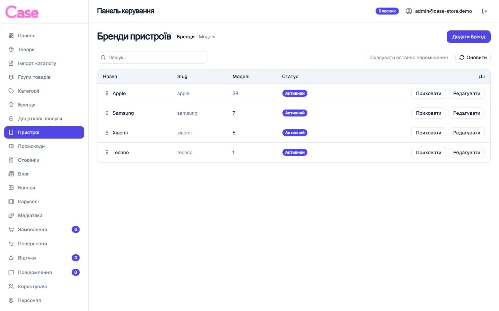

### Бренди пристроїв

**Пристрої** → вкладка **Бренди**. Список має пошук за назвою і колонки «Назва», «Slug»,
«Моделі», «Статус». **Порядок брендів задається перетягуванням** рядків (за значок ліворуч
або клавіатурою); є кнопка «Скасувати останнє переміщення». Поки активний пошук,
перетягувати не можна.

Щоб додати бренд: **Додати бренд** → **Назва бренду**, **Slug** (авто), **Активний** →
**Зберегти бренд**.

### Моделі пристроїв

**Пристрої** → вкладка **Моделі**. Список має пошук за назвою моделі та фільтри **«Усі
бренди»** і **«Усі статуси»**.

Щоб додати модель: **Додати модель** і заповніть:

- **Бренд пристрою** — обов'язково;
- **Назва моделі** (напр. iPhone 15 Pro);
- **Slug** — авто;
- **Серія** (напр. «iPhone 15») — необов'язково, для групування;
- **Рік випуску** — необов'язково;
- **Активна (показувати в магазині)**.

Потім **Зберегти модель**.

#### Тексти сторінок сумісності

У формі моделі є блок **«Тексти сторінок сумісності»**. Магазин сам створює сторінки
«<Категорія> для <Модель>» (напр. «Чохли для iPhone 15 Pro») — їх знаходять у Google за
запитом із назвою телефона. Три необов'язкові поля:

- **SEO-заголовок (meta title)**;
- **SEO-опис (meta description)**;
- **Опис на сторінці** — абзац під заголовком.

Порожнє поле = автоматичний текст. Один набір текстів діє **для всіх категорій** цієї моделі.
Заповнюйте лише для найпопулярніших моделей, де хочеться живішого тексту.

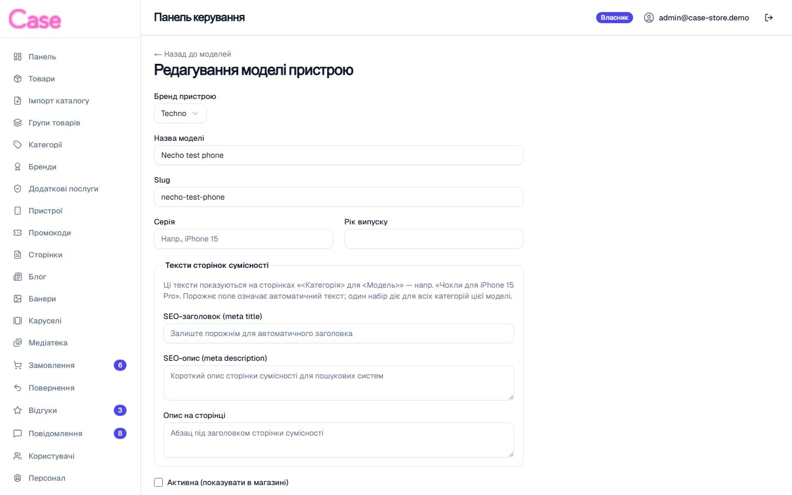

### Щоб задати сумісність товару з пристроями

1. Відкрийте товар (створення або редагування).
2. Знайдіть блок **Сумісні пристрої**.
3. Побачите моделі, згруповані за брендами пристроїв. Поставте галочки навпроти всіх
   моделей, до яких підходить аксесуар.
4. **На сторінці створення** — нічого більше: «Збережеться разом із товаром».
   **На сторінці редагування** — натисніть кнопку під списком (вона підписана так само,
   «Сумісні пристрої»), щоб зберегти.
5. Якщо товар входить у групу, поруч є кнопка **Застосувати до всіх позицій групи** — вона
   скопіює цей самий набір сумісності на всі варіанти групи.

⚠️ **Підводні камені**

- **Спершу створіть бренди й моделі пристроїв, потім проставляйте сумісність.** Якщо
  моделей ще немає, у блоці товару буде напис «Спершу створіть бренди та моделі пристроїв».
- **На редагуванні збереження сумісності — окрема кнопка**, не «Зберегти зміни» товару.
  Натисніть саме її, інакше галочки не збережуться. (Кнопка підписана назвою блоку — це
  відома незграбність, TASK-726.)
- Не плутайте цей розділ із **Брендами** (розділ [6](#6-brendy)): там — виробники
  аксесуарів, тут — гаджети для сумісності.
- Моделі й бренди пристроїв **не видаляються** — лише приховуються.

> Технічні деталі: TASK-190, plan 111; сторінки сумісності — TASK-490, план 182.

---

## 8. Характеристики (структуровані)

### Що це

**Характеристики** — це структуровані параметри товару (матеріал, потужність, довжина
кабелю, колір тощо), однакові для всіх товарів однієї категорії. Вони працюють у два кроки:

1. **Шаблон** створюється **на категорії** — які саме параметри бувають у товарів цієї
   категорії.
2. **Значення** заповнюються **на товарі** — конкретні дані для кожного товару.

Це дає акуратну вкладку «Характеристики» на сторінці товару, а частина характеристик стає
**фільтрами** каталогу.

### Крок 1. Шаблони характеристик (на категорії)

1. Відкрийте **Категорії** → потрібна категорія → **Редагувати**.
2. Внизу знайдіть блок **Характеристики** → **Додати характеристику**.
3. У вікні заповніть:
   - **Ключ (лат.)** — латиницею, напр. `material` (внутрішня назва);
   - **Назва** — як бачитиме покупець, напр. «Матеріал»;
   - **Тип** — **Текст**, **Число**, **Так/Ні** або **Вибір зі списку**;
   - **Одиниця (необовʼязково)** — напр. `Вт`, `мм`;
   - **Значення (кожне з нового рядка)** — лише для типу «Вибір зі списку»;
   - **Використовувати як фільтр каталогу** — за цією характеристикою покупці зможуть
     фільтрувати товари. **Доступно лише для типів «Так/Ні» та «Вибір зі списку»**: у
     фільтрі мають бути готові значення, а не вільний текст.
4. Натисніть **Додати**. Порядок характеристик міняють кнопками **Вгору** / **Вниз**;
   позначка **«Фільтр»** показує, які з них стали фільтрами.

**Навіщо:** заданий один раз на категорії шаблон **успадковується всіма
підкатегоріями** — не треба повторювати його для кожної.

### Як фільтри показуються на вітрині

- У бічній панелі каталогу видно **до 6 фільтрів** за характеристиками, у тому порядку, у
  якому характеристики стоять на категорії.
- Перші 3 розгорнуті, решта сховані під кнопкою **«Ще фільтри (N)»**.
- **Сьомий і далі фільтри не показуються взагалі** — панель про це не попереджає
  (TASK-707). Позначайте «фільтр» лише для справді важливих характеристик і ставте їх
  вище в списку.

### Крок 2. Значення характеристик (на товарі)

1. Відкрийте товар (створення або редагування).
2. Знайдіть блок **Характеристики** — список формується з шаблонів категорії товару та її
   батьківських категорій.
3. Для кожного параметра є відповідне поле (текст, число, галочка «Так» або список).
   Заповніть потрібні.
4. **На створенні** значення збережуться разом із товаром. **На редагуванні** натисніть
   **Зберегти характеристики**.

### Колір для багатьох товарів одразу

Колір — найважливіший фільтр для аксесуарів. Щоб не заповнювати його в кожному товарі:

1. У списку **Товари** позначте потрібні товари.
2. Натисніть **Задати колір (N)**.
3. Впишіть колір так, як його побачить покупець («Чорний», «Темно-синій», «Прозорий») →
   **Записати**.

Колір записується **одночасно у два місця**: у вісь варіанта (кружечки кольорів на картці) і
в характеристику «Колір» (фільтр у каталозі). Порожнє поле або **Прибрати колір** прибирає
колір — товари зникнуть із фільтра за кольором.

⚠️ **Підводні камені**

- **Спочатку шаблони на категорії — потім значення на товарі.** Якщо в категорії товару
  немає жодного шаблону, у блоці товару буде напис «Для категорії цього товару ще не
  задано жодного шаблону характеристик».
- **На редагуванні кнопка «Зберегти характеристики» — окрема** від збереження товару.
- **Не використовуйте кому й крапку з комою у значеннях характеристик** (напр. «Силікон,
  м'який»). Фільтр каталогу розріже таке значення на два, і товар перестане знаходитися.
  Пишіть «Силікон м'який» або заведіть два окремі значення (TASK-514).
- Якщо змінити категорію товару, набір характеристик зміниться на шаблони нової
  категорії (значення зі співпадаючими ключами збережуться).
- Видалення характеристики з категорії **видаляє й усі її значення в товарах** — панель
  перепитає.
- Не плутайте з полем **Атрибути** у формі товару — то значення осей для варіантів
  групи, а не структуровані характеристики.

> Технічні деталі: TASK-191, plan 112; фільтри — TASK-488, план 182; «Задати колір» —
> TASK-487.

---

## 9. Замовлення

### Що це

Розділ **Замовлення** показує всі покупки клієнтів — з сайту, від гостей без реєстрації й
прийняті по телефону. Тут ви ведете замовлення від «нового» до «доставленого», фіксуєте
оплату, номер накладної й домовленості з покупцем.

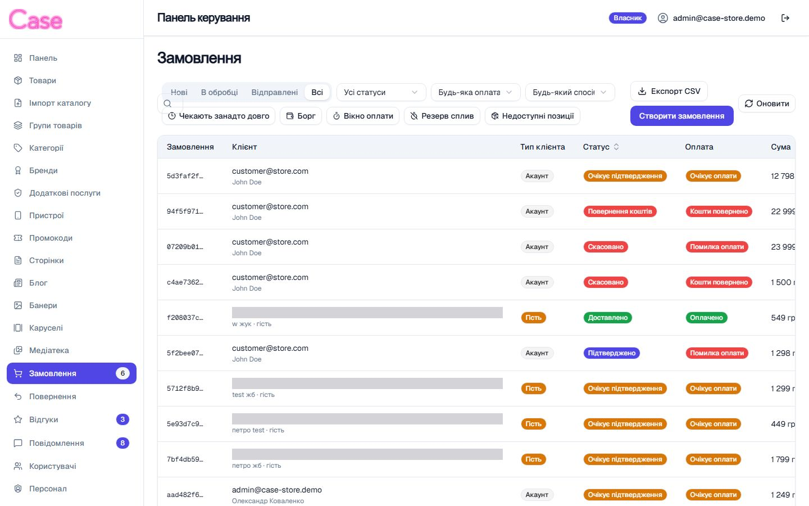

### Список замовлень

**Вкладки** над списком — під робочий процес:

| Вкладка         | Що показує                    |
| --------------- | ----------------------------- |
| **Нові**        | «Очікує підтвердження».       |
| **В обробці**   | «Підтверджено» і «В обробці». |
| **Відправлені** | «Відправлено».                |
| **Всі**         | Усі замовлення.               |

**Пошук** — «Номер замовлення, пошта або телефон…»: клієнт телефонує «де моє замовлення?» —
вводите те, що він назвав.

**Фільтри-списки:** статус замовлення, **«Будь-яка оплата»** (статус оплати) і **«Будь-який
спосіб оплати»** («Оплата при отриманні», «Картка онлайн», «Оплата частинами»).

**Перемикачі-фільтри** (можна вмикати кілька одразу):

- **Чекають занадто довго** — замовлення, які понад 48 годин чекають підтвердження;
- **Борг** — доставлені, але не оплачені;
- **Вікно оплати** — карткові замовлення, у яких ще триває час на оплату;
- **Резерв сплив** — карткові замовлення, у яких час на оплату вичерпано;
- **Недоступні позиції** — у замовленні є товар, якого більше немає в продажу.

**Колонки:** «Замовлення», «Клієнт», «Тип клієнта» (**Акаунт** або **Гість**), «Статус»,
«Оплата», «Сума», «Позиції», «Створено». Сортувати можна за статусом, сумою й датою.

**Експорт CSV** вивантажує **рівно ті рядки, які відповідають поточним фільтрам**. Якщо
замовлень забагато, панель попередить, що файл обмежено, — звузьте фільтри.

### Картка замовлення

Відкрийте замовлення в списку. На картці:

- **шапка** — номер, статус, статус оплати, мітки (див. нижче), бейдж **«Тримає залишок: N
  шт»** (скільки товару зарезервовано під це замовлення) або «Залишок повернуто …»;
- **Змінити статус** — список дозволених переходів (див. нижче);
- **Оплата** — сума, **Статус оплати**, а для частково повернутих — «Повернуто X з Y»;
- **Дані для оператора** — поля **ТТН (Нова Пошта)** і **Внутрішні примітки**, кнопка
  **Зберегти**;
- **позиції** — товари, ціна, кількість, сума; під товаром — його додаткові послуги;
- **Клієнт** — контакти й позначка «Акаунт» / «Гість»;
- **Посилання для покупця** — див. нижче;
- **Адреса доставки** і кнопка **Змінити адресу**;
- **Підсумок** — проміжна сума, **Знижка (КОД)**, додаткові послуги, доставка, податок,
  разом; платіжна адреса — лише якщо відрізняється від адреси доставки;
- **Примітки** — те, що написав покупець при оформленні;
- **Історія змін** — хто, коли і з якого статусу на який змінив замовлення й оплату.

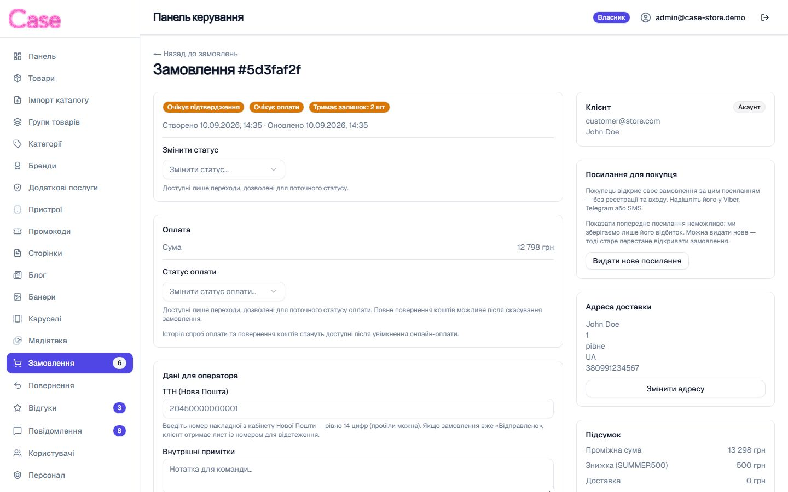

### Статуси замовлення і дозволені переходи

| Статус                   | Значення                                 |
| ------------------------ | ---------------------------------------- |
| **Очікує підтвердження** | Нове, ще не підтверджене замовлення.     |
| **Підтверджено**         | Ви прийняли замовлення в роботу.         |
| **В обробці**            | Комплектується / готується до відправки. |
| **Відправлено**          | Передане службі доставки.                |
| **Доставлено**           | Отримане клієнтом.                       |
| **Скасовано**            | Замовлення скасоване.                    |
| **Повернення коштів**    | Кошти повернено клієнту.                 |

Статус **не можна поставити будь-який**. У списку **«Змінити статус…»** видно лише
дозволені переходи — з підказкою «Доступні лише переходи, дозволені для поточного статусу»:

| З чого                   | Куди можна                                                                            |
| ------------------------ | ------------------------------------------------------------------------------------- |
| **Очікує підтвердження** | Підтверджено, В обробці, Відправлено, Доставлено, Скасовано                           |
| **Підтверджено**         | В обробці, Відправлено, Доставлено, Скасовано                                         |
| **В обробці**            | Відправлено, Доставлено, Скасовано                                                    |
| **Відправлено**          | Доставлено, Скасовано, Повернення коштів                                              |
| **Доставлено**           | Скасовано, Повернення коштів                                                          |
| **Скасовано**            | Очікує підтвердження, Підтверджено, В обробці (повернути в роботу), Повернення коштів |
| **Повернення коштів**    | Скасовано                                                                             |

Логіка проста: **лише вперед** (проскакувати кроки можна — зібрали й відправили за годину,
одразу ставте «Відправлено»), **скасувати — звідусіль**, **повернення коштів** — лише коли
товар поїхав або замовлення скасоване. Назад у «роботу» повертається тільки скасоване
замовлення.

Якщо тим часом замовлення змінив хтось інший (колега, покупець, банк), система не затре
чужу зміну: з'явиться повідомлення «Хтось інший щойно змінив це замовлення, оновіть
сторінку».

### Статус оплати

Окремий список **«Змінити статус оплати…»**:

| Статус оплати          | Значення                                                           |
| ---------------------- | ------------------------------------------------------------------ |
| **Очікує оплати**      | Гроші ще не надійшли.                                              |
| **Оплачено**           | Оплата підтверджена.                                               |
| **Помилка оплати**     | Оплата не пройшла.                                                 |
| **Частково повернуто** | Повернено частину суми — наприклад, гроші за одну позицію з трьох. |
| **Кошти повернено**    | Повернено всю суму замовлення.                                     |

**Навіщо це окремо:** статус замовлення (виконання) і статус оплати — різні речі. Зміна
одного **не змінює** інший.

**Що означає «Оплачено» для оплати при отриманні (післяплати).** Покупець платить Новій Пошті
при отриманні, а гроші приходять вам переказом пізніше. Позначайте **«Оплачено» тоді, коли
гроші справді надійшли на ваш рахунок**, а не коли посилку забрали. До того замовлення
«Доставлено» з оплатою «Очікує оплати» — це нормально, і воно видно під фільтром **«Борг»**.
Для онлайн-оплати карткою статус оплати ставить сама платіжна система.

### Які переходи оплати дозволені

Статус **оплати** теж має жорстку послідовність — бо це розповідь про гроші:

| З чого                 | Куди можна                          |
| ---------------------- | ----------------------------------- |
| **Очікує оплати**      | Оплачено, Помилка оплати            |
| **Помилка оплати**     | Очікує оплати, Оплачено             |
| **Оплачено**           | Частково повернуто, Кошти повернено |
| **Частково повернуто** | Кошти повернено                     |
| **Кошти повернено**    | нікуди — це кінцевий стан           |

У списку ви бачите **лише дозволені** варіанти. Плюс окреме правило: **повне** «Кошти
повернено» можна поставити, лише коли саме замовлення вже «Скасовано» або «Повернення
коштів». «Частково повернуто» на доставленому замовленні — нормальна ситуація.

⚠️ Автоматичні повідомлення від платіжної системи (LiqPay) грають за тими самими правилами,
але тихо: якщо приходить неможливий перехід, система його **ігнорує й записує в лог**.

> Блок «Оплата» також пише: «Історія спроб оплати та повернення коштів стануть доступні після
> увімкнення онлайн-оплати». Поки онлайн-оплата не підключена, рух грошей ви фіксуєте
> статусом оплати вручну.

### Мітки на замовленні: що означає кожна

Крім двох статусів, у списку й у шапці картки з'являються **мітки** — короткі підписи, які
система обчислює сама. Їх **не треба ставити руками** і їх неможливо «зняти» — вони зникають
самі, коли зникає причина. **Жодна з них нічого не блокує**: це підказка, а не заборона.

| Мітка                        | Коли з'являється                                                                                                     | Де видно                       |
| ---------------------------- | -------------------------------------------------------------------------------------------------------------------- | ------------------------------ |
| **Борг N ₴**                 | Замовлення «Доставлено», а оплата не «Оплачено» і не «Кошти повернено» — товар у покупця, гроші ні.                  | рядок списку, шапка картки     |
| **Очікує оплати · N хв**     | Оплата карткою онлайн ще не пройшла, але час на оплату (резерв товару) ще не вичерпано. N — скільки хвилин лишилось. | рядок списку, шапка картки     |
| **Резерв сплив**             | Те саме, але час вичерпано: товар уже повернувся в продаж, і його могли купити інші.                                 | рядок списку, шапка картки     |
| **Позиція недоступна**       | Товар цієї позиції більше не продається: знято з публікації, видалено або перепродано.                               | рядок позиції всередині картки |
| **Частково повернуто X з Y** | Статус оплати — «Частково повернуто». X — сума вже повернутих коштів за всіма заявками, Y — сума замовлення.         | рядок списку, шапка картки     |

> Перемикач-фільтр навмисно названий **«Вікно оплати»**, а не «Очікує оплати»: останнє — це
> підпис статусу оплати, який стоїть на **кожному** неоплаченому замовленні, включно з
> післяплатою.

**Що робити з «Позиція недоступна».** Автоматичного листа покупцеві **немає навмисно** —
вибір «замінити / повернути гроші / зачекати постачання» робить людина. Зателефонуйте або
напишіть покупцеві. Плитка **«Недоступні позиції»** на головному екрані збирає всі такі
замовлення в одному місці.

### Діалоги, які перепитують

- **Відправлення неоплаченого.** Замовлення оплачується карткою онлайн, оплата не
  підтверджена, а ви ставите «Відправлено» — панель спитає **«Оплату не підтверджено —
  відправляти?»** і покаже суму. **«Все одно відправити»** можна: рішення **запишеться в
  історію замовлення**.
- **Перехід у «Повернення коштів» без заявки.** Панель спитає **«Створити заявку на
  повернення?»** із заповненими позиціями й полем «Причина (зі слів клієнта)»:
  - **«Створити заявку»** — правильний шлях: і статус, і запис про те, що саме повернули;
  - **«Лише змінити статус»** — можна, але в магазині лишиться ярлик без жодних деталей.

**Джерело істини про повернення — заявка** (розділ [9а](#9a-povernennya)), а статус
«Повернення коштів» — лише ярлик. Заявку може подати покупець із кабінету на сайті
(«Подати заяву на повернення» на доставленому замовленні) або оператор через діалог вище —
це єдиний спосіб для гостей і телефонних покупців, які не мають акаунта.

### ТТН, примітки, адреса

- **ТТН (Нова Пошта)** — номер накладної з кабінету Нової Пошти, **рівно 14 цифр** (пробіли
  можна). Створювати накладну панель не вміє — ви копіюєте номер із кабінету перевізника. Якщо
  замовлення вже «Відправлено», покупець отримає лист із номером для відстеження.
- **Внутрішні примітки** бачить лише команда, покупцеві — ніколи. Не плутайте з блоком
  **Примітки**, де написане покупцем при оформленні.
- **Змінити адресу** можна лише **до відправлення**. Після — кнопки немає: адреса на
  накладній уже важливіша за запис у панелі.

### Посилання на замовлення для покупця

На картці є блок **«Посилання для покупця»**. За цим посиланням покупець відкриє **своє**
замовлення на сайті — без реєстрації й без входу. Це те саме посилання, яке автоматично їде в
листі, коли він оформлює замовлення гостем.

**Коли воно потрібне:** замовлення прийнято **по телефону**; покупець **загубив лист** або
лист не дійшов; покупець просить кинути посилання в месенджер.

**Що треба знати, перш ніж натискати «Видати нове посилання»:**

1. **Показати чинне посилання неможливо** — у базі лежить лише його відбиток. Можна лише
   **видати нове**.
2. **Нове вимикає старе.** Попереднє посилання перестає відкривати замовлення.
3. **Посилання показується рівно один раз.** Скопіюйте його **одразу** кнопкою
   «Скопіювати» і вставте у Viber, Telegram чи SMS. Після оновлення сторінки блок знову
   покаже лише кнопку.
4. **Строк дії рахується від видачі** (за замовчуванням 60 днів), а не від дати замовлення.

Блок бачать лише ті, хто має право **«Змінювати статуси та ТТН»**. Кожна видача пишеться в
**журнал дій** — без самого посилання.

> Якщо замість посилання показано «Адресу вітрини не налаштовано» — це не ваша помилка, а
> незаповнена настройка сервера; зверніться до розробника.

### Замовлення по телефону

Клієнт телефонує й диктує замовлення — оператор створює його сам.

1. **Замовлення** → **Створити замовлення**.
2. **Клієнт** — оберіть режим:
   - **Існуючий акаунт** — знайдіть клієнта за іменем, прізвищем або поштою → **Вибрати**.
     Порожні поля отримувача заповняться з картки клієнта. На вимкнений акаунт оформити
     замовлення не можна;
   - **Без акаунта (за телефоном)** — **Імʼя**, **Телефон** (номер будь-якої країни) і,
     за бажанням, **Електронна пошта**.
3. **Адреса доставки** — ім'я, прізвище, телефон, **Місто** і **Відділення / адреса**. Поля
   міста й відділення підказують із довідника Нової Пошти; якщо довідник недоступний,
   просто введіть вручну.
4. **Позиції** — «Пошук товару за назвою…» → **Додати**, вкажіть кількість. **Ціни беруться
   з каталогу** — вручну їх не змінюють.
5. **Оплата й примітки** — **Спосіб оплати**, **Примітки для клієнта**, **Внутрішні
   примітки**.
6. Натисніть **Створити замовлення**.

Після створення панель **не переходить** одразу на картку, а показує екран **«Замовлення
створено»** з номером і **посиланням для покупця** — скопіюйте його й надішліть, поки клієнт
на лінії (воно показується один раз). Якщо вказано пошту — лист із посиланням піде й туди.
Далі — **Відкрити замовлення**.

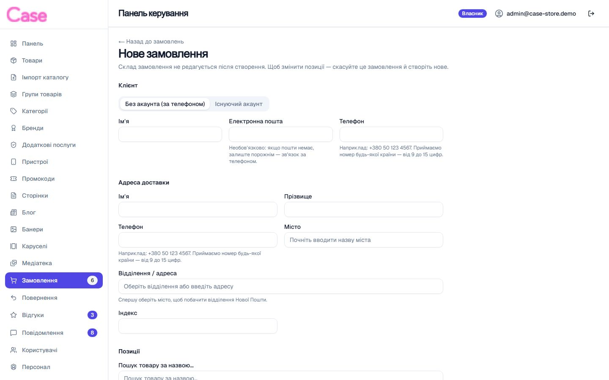

⚠️ **Підводні камені**

- **Позиції замовлення не редагуються** після створення. Щоб змінити склад — скасуйте це
  замовлення й створіть нове.
- **Позначка «Оплачено» важлива для статистики.** Дашборд рахує виручку лише за
  **оплаченими** замовленнями. Якщо забути позначити оплату, звіти занизять показники.
- **Скасування до відправки повертає товар на склад автоматично.** Скасування **після**
  відправки — ні: склад і гроші тоді рухає людина (через заявку на повернення).
- **Обережно з поверненням скасованого в роботу.** Система знову зарезервує товар — і якщо
  за цей час його **розкупили**, повернення буде відхилено. Замовлення, за яким гроші вже
  повернуто, повернути в роботу не можна.
- **Побачили щось дивне — натисніть «Оновити».** Замовлення змінюють не лише люди, а й банк
  та фонові задачі (розділ [25](#25-spysky)).

> Технічні деталі: TASK-332 (машина станів замовлення), TASK-431 (переходи оплати),
> TASK-470/471/472 (мітки й фільтри), TASK-468/469 (обидва діалоги, заявка від оператора),
> TASK-484 (посилання для покупця), TASK-341/426 (телефонне замовлення), TASK-335/336 (ТТН і
> примітки), TASK-425 (фільтри й CSV).

---

## 9а. Повернення

### Що це

**Повернення** — заявки покупців «хочу повернути товар». Заявка несе позиції, кількості,
причину й суму, і саме вона повертає товар на склад, коли ви приймаєте посилку. Це **головний
запис** про повернення; статус замовлення «Повернення коштів» — лише ярлик (розділ
[9](#9-zamovlennya)).

Звідки беруться заявки:

- **покупець** подає її з кабінету на сайті («Подати заяву на повернення» на доставленому
  замовленні);
- **оператор** створює її з картки замовлення — через діалог «Створити заявку на
  повернення?» при переході замовлення в «Повернення коштів». Так роблять для гостей і
  телефонних покупців, які не мають акаунта.

Хто що може: **«Переглядати повернення»** — бачити розділ; **«Опрацьовувати повернення»** —
приймати рішення.

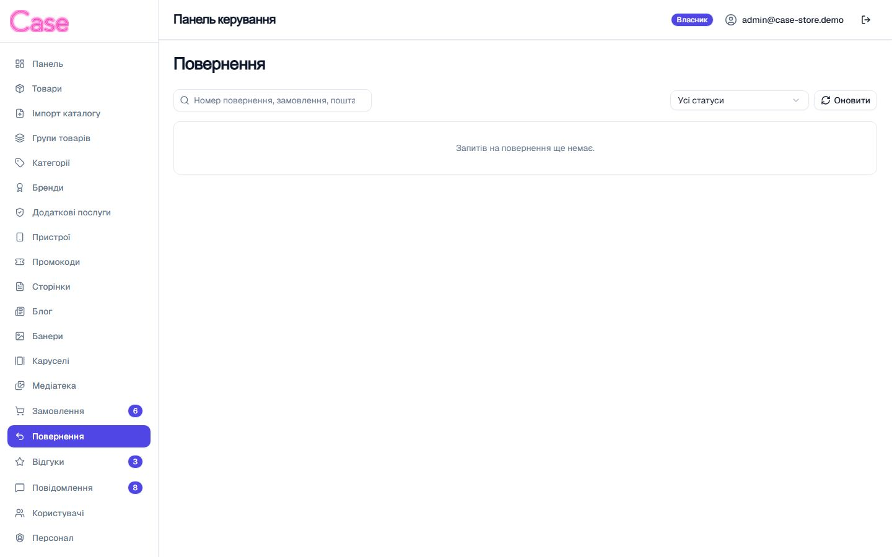

### Список повернень

- **Пошук** — «Номер повернення, замовлення, пошта або телефон…».
- **Фільтр** — «Усі статуси» або конкретний.
- **Колонки** — «Повернення», «Замовлення» (посилання на замовлення), «Статус», «Позиції»,
  «Повернуто» (сума), «Запит» (дата). Сортувати можна за статусом, сумою й датою.
- **Переглянути** — відкрити заявку.

### Статуси й порядок

| Статус              | Значення                                                |
| ------------------- | ------------------------------------------------------- |
| **Запит**           | Покупець (або оператор) подав заявку, рішення ще немає. |
| **Схвалено**        | Ви погодились прийняти товар назад.                     |
| **Відхилено**       | Відмова. Кінцевий стан.                                 |
| **Товар отримано**  | Посилка з товаром прийшла до вас.                       |
| **Гроші повернуто** | Ви повернули покупцеві гроші. Кінцевий стан.            |

Дозволені переходи:

- **Запит** → Схвалено або Відхилено;
- **Схвалено** → Товар отримано або Відхилено (товар може прийти пошкодженим);
- **Товар отримано** → Гроші повернуто;
- **Відхилено** і **Гроші повернуто** — кінцеві: «Це повернення завершене — змінити його
  статус більше не можна».

### Щоб опрацювати заявку

1. Відкрийте заявку. Угорі — посилання на замовлення, **Причина (від клієнта)** і **Позиції
   до повернення**. Праворуч — дати: «Запит створено», «Рішення прийнято», «Повернуто на
   склад», «Повернуто коштів».
2. У блоці **Рішення** оберіть **Новий статус** (у списку лише дозволені).
3. За потреби заповніть:
   - **Сума повернення** — скільки фактично повернули клієнтові. Може бути меншою за суму
     позицій: доставка повертається не завжди;
   - **Внутрішні примітки** — бачить лише команда;
   - галочку **Повернути товар у продаж** — з'являється лише для статусу **«Товар
     отримано»**. Ставте, коли товар справді придатний до продажу.
4. Натисніть **Зберегти рішення**.

⚠️ **Підводні камені**

- **Товар повертається на склад на кроці «Товар отримано»**, а не коли ви пообіцяли гроші — і
  лише якщо поставити галочку. Повторно повернути той самий товар на склад не можна.
- **Кнопки «повернути гроші» тут немає.** Сума в заявці — це **запис**, що гроші повернуто;
  самі гроші ви повертаєте окремо (переказом або в кабінеті платіжної системи). Не забудьте
  потім змінити статус оплати замовлення на «Частково повернуто» або «Кошти повернено»
  (розділ [9](#9-zamovlennya)).
- **«Відхилено» і «Гроші повернуто» змінити вже не можна.** Перш ніж зберегти таке рішення,
  переконайтеся, що воно остаточне.
- **Діалог створення заявки з'являється лише тоді, коли по замовленню ще немає жодної
  заявки.** Окремої кнопки «створити заявку» на картці замовлення немає.
- На головному екрані **немає плитки** для нових заявок — заглядайте в розділ
  «Повернення» самі.

> Технічні деталі: TASK-340 (повернення), TASK-469 (заявка від оператора), TASK-370 (пункт
> меню й права).

---

## 9б. Відгуки (модерація)

### Що це

Покупці залишають на сторінці товару **оцінку** (зірки) і, за бажанням, **текст**. Текст
з'являється на сайті лише після того, як ви його **схвалите**. Оцінка й текст живуть окремо:
можна зняти з сайту текст, а оцінку лишити в рейтингу.

Хто що може:

- **«Модерувати відгуки»** — відкривати розділ, схвалювати, відхиляти, ховати внесок автора;
- **«Відповідати на відгуки»** — публікувати відповідь магазину (працює разом із правом
  модерації).

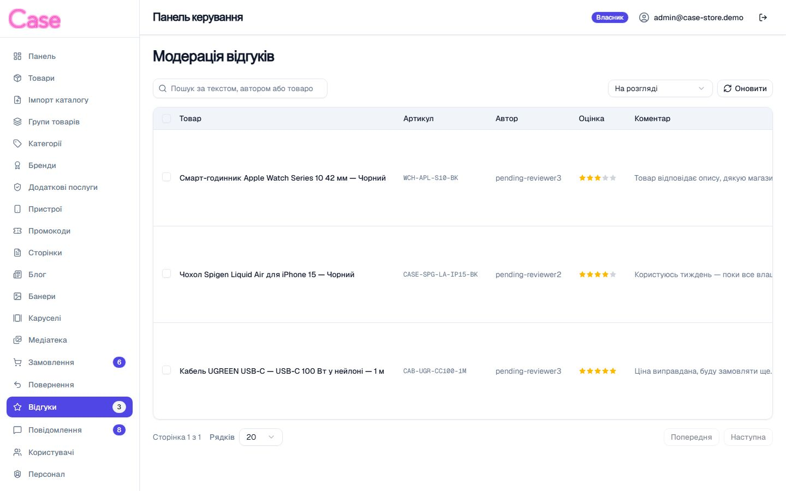

### Список відгуків

- **Фільтр:** **На розгляді** (відкривається за замовчуванням), **Опубліковані**,
  **Відхилені**.
- **Пошук** — «Пошук за текстом, автором або товаром…».
- **Колонки:** «Товар» (посилання на картку товару), «Артикул», «Автор», «Оцінка»,
  «Коментар», «Надіслано».
- **Бейджі:** **«Є відповідь»** — магазин уже відповів; **«Оцінка не враховується»** — оцінка
  цього відгуку зараз не входить у рейтинг товару (автора приховано або його пошту не
  підтверджено).

### Дії з відгуком

- **Схвалити** — текст з'являється на сторінці товару.
- **Відхилити текст** — текст зникає з сайту, **оцінка й далі враховується**, а автор може
  переписати свій відгук. Відхилений відгук лишається на вкладці «Відхилені».
- **Відповісти** / **Змінити відповідь** — вікно «Відповідь магазину» → **Опублікувати
  відповідь**. Відповідь **публічна**: її бачать усі відвідувачі. Нова відповідь **замінює**
  попередню.
- **Приховати всі оцінки автора** → **Приховати все** — ховає **ВСІ** відгуки й оцінки цього
  акаунта **на всіх товарах**, не лише на цьому. Для накрутки чи спаму.
  **Повернути оцінки автора** → **Повернути все** — скасовує (оцінки знову рахуються, лише якщо
  пошту автора підтверджено).

**Масові дії:** позначте рядки галочками → **Схвалити (N)** або **Відхилити текст (N)**. Перед
масовим відхиленням панель перепитає й назве кількість.

### Сигнали накрутки

На головному екрані є плитка **«Сигнали накрутки оцінок»** — вона рахує **ситуації**, які
варто перевірити (напр. товар за годину отримав сплеск оцінок), а не кількість відгуків.
Клік відкриває розділ відгуків без фільтра за статусом.

⚠️ **Підводні камені**

- **«Відхилити текст» не прибирає оцінку.** Якщо хочете, щоб одиниця перестала тягнути рейтинг
  униз, — це не спосіб; оцінки прибирає лише «Приховати всі оцінки автора», і лише для
  зловживань.
- **Відповідь магазину — публічна** й підписана від імені магазину. Пишіть її так, ніби її
  читатиме кожен покупець.
- Сортування в цьому списку немає.

> Технічні деталі: TASK-446 (оцінка окремо від тексту, відповідь, внесок автора), TASK-356
> (масові дії), план 183.

---

## 10. Користувачі (клієнти)

### Що це

Пункт меню **Користувачі** відкриває екран **«Клієнти»** — це ваші **покупці** з акаунтом на
сайті. Тут можна знайти клієнта, переглянути його дані, історію покупок, залишити службову
нотатку і за потреби **заблокувати (деактивувати)** акаунт.

> **Ваших працівників тут немає.** Службові акаунти живуть в окремому розділі **Персонал** —
> див. [10а](#10a-hto-shcho-mozhe). Гості, які купували без реєстрації, теж сюди не
> потрапляють — їх видно лише в замовленнях.

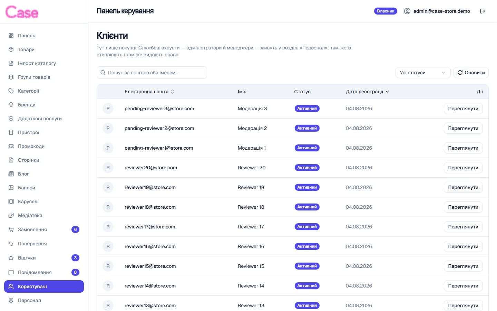

Список можна:

- шукати за поштою або іменем;
- фільтрувати за статусом (активні / неактивні);
- сортувати за поштою й датою реєстрації.

### Картка клієнта

Натисніть на рядок, щоб відкрити картку. Що на ній:

- **контакти** — пошта, ім'я, телефон, бейдж **«Пошта підтверджена»** / **«Пошта не
  підтверджена»**. Якщо клієнт не отримує листів — перевіряйте адресу саме тут;
- **повна картка** — **Сума покупок (LTV)**, **Кількість замовлень**, **Останні замовлення**,
  **Відгуки**, **Використані купони**, **Звернення (за email)**. Цей блок відкривається лише з
  окремим правом «Повна картка»; без нього на його місці — пояснення, як це право отримати;
- **Нотатки** — службовий журнал для команди, клієнт його не бачить. Нотатки лише
  **додаються** («Додати нотатку»): щоб уточнити попередню, напишіть нову;
- **Статус акаунта** — кнопка **Деактивувати** / **Активувати**;
- **Метадані акаунта** — ID, дати створення й оновлення.

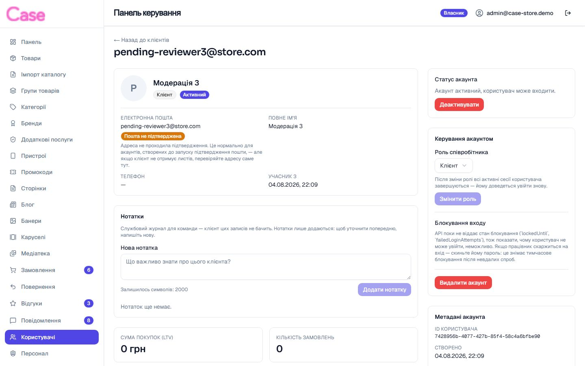

### Щоб заблокувати чи розблокувати клієнта

1. Відкрийте картку клієнта.
2. У блоці **Статус акаунта** натисніть **Деактивувати** (заблокувати вхід) або
   **Активувати** (відновити).

**Навіщо:** деактивація миттєво позбавляє клієнта змоги увійти (напр. при зловживаннях),
але **зберігає всі його дані та історію замовлень**.

### Керування акаунтом (для власника й адміністраторів)

На картці клієнта є блок **«Керування акаунтом»** — його бачать лише ті, хто керує
персоналом:

- **Роль співробітника** → **Змінити роль** — зробити покупця **менеджером** (а власник — і
  адміністратором). Після зміни панель відкриє людину в розділі «Персонал», де їй видають
  права (розділ [10а](#10a-hto-shcho-mozhe)). Активні сесії людини при цьому завершуються;
- **Видалити акаунт** — **лише власник**. Акаунт позначається видаленим: людина більше не
  ввійде, але її замовлення та історія лишаться. Скасувати з панелі не можна.

⚠️ **Підводні камені**

- **Деактивація — це не видалення.** Для більшості випадків достатньо деактивації: її можна
  скасувати.
- **Контакти і повна картка — різні права.** «Картки клієнтів» дає список і контакти, щоб
  передзвонити. Сума покупок, замовлення, відгуки й тексти звернень — окрема галочка «Повна
  картка»: це найбільша купа особистих даних у системі.
- **Блокування після невдалих спроб входу панель не показує** (так написано й на картці).
  Клієнт, який не може увійти, відновлює пароль сам на сайті.
- **Заголовок у меню «Користувачі», а на екрані — «Клієнти».** Це той самий розділ.

> Технічні деталі: TASK-252 (картка клієнта), TASK-430 (нотатки, підтвердження пошти),
> TASK-479 (право «Повна картка»); розділення «клієнти vs персонал» — план
> [181](plans/181-access-model.md).

---

## 10а. Хто що може: рівні доступу і розділ «Персонал»

### Що це

Магазином рідко керує одна людина. Хтось веде замовлення, хтось пише в блог, хтось
відповідає на дзвінки — і кожному потрібно рівно стільки доступу, скільки треба для його
роботи. Цим керує розділ **Персонал**: там живуть службові акаунти, там їх створюють, там
видають і забирають права.

Головна думка, з якої виросло все інше: **делегується робота; не делегується те, що
змінює, хто керує магазином.** Ви можете віддати комусь замовлення, ціни, контент, навіть
повернення. Ви не можете віддати нікому право змінити пароль вашому акаунту.

### Три рівні

| Рівень                                           | Що може                                                                                                                                            | Хто може чіпати його акаунт       |
| ------------------------------------------------ | -------------------------------------------------------------------------------------------------------------------------------------------------- | --------------------------------- |
| **Власник** — рівно один, завжди                 | усе; призначає й знімає адміністраторів; передає власність; видаляє клієнтів                                                                       | **ніхто**, включно з ним самим    |
| **Адміністратор** (заступник) — скільки завгодно | усю щоденну роботу магазину; повністю керує менеджерами та їхніми правами; читає журнал дій. Але **не** чіпає інших адміністраторів і не чіпає вас | тільки власник                    |
| **Менеджер** — скільки завгодно                  | рівно те, що йому видали галочками, і нічого понад те                                                                                              | власник і будь-який адміністратор |

**Навіщо потрібен адміністратор, якщо є ви.** Він ваш заступник — існує, щоб магазин
працював, поки вас немає. Якщо створити людині акаунт, скинути забутий пароль чи
подивитись, хто змінив ціну, може тільки власник, то кожна відпустка — це дзвінки вам.

**Менеджер за замовчуванням не може нічого.** Створений без галочок акаунт входить у панель
і бачить у меню лише **Панель** — доки ви не видасте права. Так само працює і майбутнє: коли в
панелі з'явиться новий розділ, він **не** дістанеться наявним менеджерам сам собою.

### Правило, з якого випливає решта: керуєш лише тими, хто нижче

Одне речення, і воно діє однаково на **всіх чотирьох дверях**, які ведуть до одного
результату — «людина більше не керує магазином»:

1. змінити роль (понизити = звільнити);
2. встановити чужий пароль (після цього можна увійти як ця людина);
3. вимкнути акаунт;
4. видалити акаунт.

Адміністратор проходить у ці двері до менеджерів і покупців — і отримує відмову на іншому
адміністраторі й на вас. Правило одне: **рівень має бути строго нижчим за твій.** На картці
людини вищого чи того самого рівня панель прямо пише: «Цей акаунт на вашому рівні або вище,
тож змінювати його ви не можете».

З того самого правила випливає, що **власника не можна ні понизити, ні вимкнути, ні
видалити — навіть самому власнику.** Магазин без власника — це магазин, у якому нікому
призначити нового, і полагодити це можна лише руками розробника в базі. Тому власник завжди
рівно один, і змінюється він лише передачею власності (див. нижче).

**Адміністратора призначає тільки власник.** Адміністратор може створити менеджера, але не
другого адміністратора.

### Розділ «Персонал»

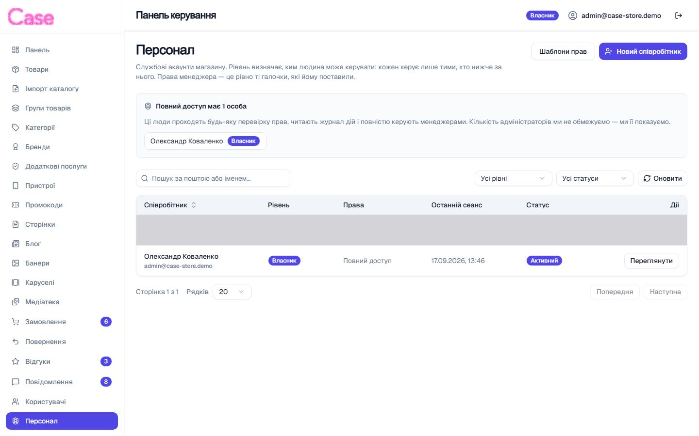

- **Рядок «Повний доступ мають N осіб»** з іменами — постійно на видноті. Кількість
  адміністраторів не обмежена, але й не прихована: якщо там четверо, а ви пам'ятаєте двох —
  це видно одразу.
- **Таблиця службових акаунтів** — колонки «Співробітник», «Рівень», «Права» (скільки
  видано), «Останній сеанс», «Статус». Пошук за поштою або іменем, фільтри **«Усі рівні»** і
  **«Усі статуси»**. Покупці лишились у «Користувачах» ([розділ 10](#10-korystuvachi)).
- Кнопка **Новий співробітник** — майстер найму.
- Кнопка **Шаблони прав** — окремий екран із шаблонами.

Сам розділ бачать лише власник і адміністратори. Видати доступ до нього менеджеру не можна
**ніяк** — такої галочки не існує. Той, хто може видавати права, може видати їх собі, і тоді
решта галочок у панелі — декорація.

### Щоб найняти працівника

1. Відкрийте **Персонал** → **Новий співробітник**. Майстер має три кроки.
2. **1. Акаунт** — **Електронна пошта**, **Початковий пароль** (мінімум 8 символів, з великою
   й малою літерою та цифрою; передайте його людині особисто — вона змінить його у своєму
   профілі), **Ім'я**, **Прізвище**, **Рівень доступу**:
   - **Менеджер — лише те, що йому видали** — для звичайного працівника;
   - **Адміністратор — повний доступ до всього** — лише для заступника. Цей варіант бачить
     тільки власник; адміністраторові панель пише «Призначати адміністраторів може лише
     власник магазину».
3. **2. Шаблон** — оберіть шаблон прав (галочки проставляться самі) або «Без шаблону —
   поставлю галочки сам».
4. **3. Права** — за потреби допоставте або зніміть окремі галочки.
5. **Створити співробітника**. Людина може входити одразу.

Рівень уже наявного працівника змінюють на картці, вкладка **Акаунт** → **Роль
співробітника** → **Змінити роль**. Якщо підвищуєте до адміністратора, панель відкриє вікно
**«Призначити адміністратора?»** і перелічить, що людина отримує (усі права, журнал дій,
керування менеджерами, персональні дані клієнтів і фінансові показники). Підтвердження —
**«Так, призначити адміністратором»**. Після зміни ролі всі сесії людини завершуються.

### Картка працівника

Клік по людині в таблиці відкриває картку з двома вкладками:

**Права** — сітка галочок, згрупованих за зонами. Біля зони видно «усі» / «немає» / «N з M»;
галочка на зоні видає всі права зони. Внизу — **Зберегти права** / **Скасувати зміни**. Є
також **Застосувати шаблон** (див. нижче). В адміністратора сітка порожня з поясненням
«Повний доступ за рівнем» — йому галочки не потрібні.

**Акаунт** — **Роль співробітника**, **Вимкнути доступ** / **Увімкнути доступ**, **Скинути пароль** (задає новий
пароль, завершує всі сесії людини й знімає тимчасове блокування після невдалих спроб входу),
**Видалити службовий акаунт** (людина більше не ввійде, її дії в журналі лишаються). У
власника на картці адміністратора тут же — **Передати власність**.

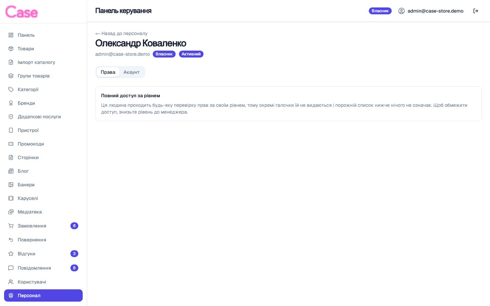

### Що таке шаблон і чому це копія

Шаблон — це збережений набір галочок під типову роботу, напр. «Оператор замовлень» чи
«Контент-менеджер». Він потрібен, щоб не проставляти 15 галочок щоразу. Шаблони створюють і
редагують на екрані **Персонал → Шаблони прав** (**Створити шаблон**: назва, «Для чого цей
шаблон», галочки).

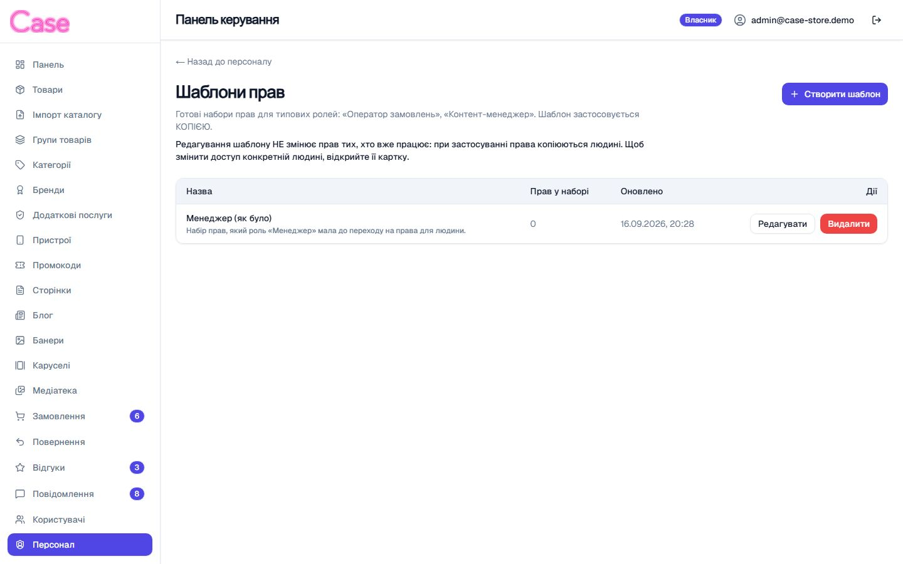

**Найважливіше про шаблони — і це єдине, що справді легко зрозуміти неправильно:**

> **Шаблон копіюється, а не прив'язується.** Коли ви застосовуєте шаблон до людини, її
> галочки стають такими, як у шаблоні, **у цю мить**. Далі зв'язку немає. Відредагуєте
> шаблон завтра — у тих, кому ви його вже застосували, **не зміниться нічого**.

Це зроблено навмисно. Правка шаблону не повинна мовчки роздавати нові доступи людям, які
вже працюють. Якщо потрібно змінити права наявним працівникам — відкрийте кожного і змініть
(або застосуйте оновлений шаблон ще раз — це знову буде копія).

**«Застосувати шаблон» на картці працівника ЗАМІНЮЄ** його поточний набір прав копією шаблону
(не додає до наявних). Після цього галочки можна доналаштувати. Якщо набір людини збігається з
якимось шаблоном, панель так і пише: «Набір збігається з шаблоном «…»».

**Які шаблони є з коробки.** Готових «Оператор замовлень» і «Контент-менеджер» **немає** —
їх створюєте ви. Під час переходу на нову модель прав міг з'явитися шаблон **«Менеджер (як
було)»** — набір, який раніше мав будь-який менеджер. На свіжій установці він **може бути
порожнім**: застосування порожнього шаблону забере в людини всі права. Перш ніж застосувати,
подивіться в колонці «Прав у наборі», скільки там галочок.

### Скільки взагалі буває галочок

**36**, згруповані за 8 зонами: **Замовлення**, **Каталог і ціни**, **Контент і блог**,
**Знижки та маркетинг**, **Клієнти (персональні дані)**, **Звернення**, **Налаштування
сайту**, **Аналітика**.

| Зона                       | Галочки                                                                                                                                                                      |
| -------------------------- | ---------------------------------------------------------------------------------------------------------------------------------------------------------------------------- |
| Замовлення                 | Переглядати замовлення · Змінювати статуси та ТТН · Бачити платежі · Повертати гроші · Переглядати повернення · Опрацьовувати повернення                                     |
| Каталог і ціни             | Переглядати товари · Редагувати товари й ціни · Видаляти товари · Категорії · Бренди · Пристрої та сумісність · Характеристики · Додаткові послуги · Імпорт каталогу з файлу |
| Контент і блог             | Блог · Сторінки · Банери · Каруселі головної · FAQ · Модерувати відгуки · Відповідати на відгуки · Переглядати медіатеку · Завантажувати та видаляти медіа                   |
| Знижки та маркетинг        | Промокоди та знижки · Підписники розсилки                                                                                                                                    |
| Клієнти (персональні дані) | Картки клієнтів · Блокувати / розблоковувати, нотатки · Повна картка: сума покупок, замовлення, відгуки, звернення                                                           |
| Звернення                  | Читати звернення · Опрацьовувати звернення                                                                                                                                   |
| Налаштування сайту         | SEO · Контакти · Доставка · Переіндексація пошуку                                                                                                                            |
| Аналітика                  | Дашборд і показники                                                                                                                                                          |

Є ще три речі, які **не видаються нікому і не показані серед галочок**: переглядати
службові акаунти, створювати їх і видавати права, читати журнал дій. Їх має власник і
адміністратор — за рівнем.

### Щоб передати власність

Знадобиться, якщо ви продаєте магазин, передаєте його партнерові або хочете, щоб власником
був інший акаунт.

1. Спершу **зробіть цю людину адміністратором** — власність передається тільки чинному
   адміністраторові з увімкненим доступом.
2. Відкрийте його картку в «Персоналі» → вкладка **Акаунт** → **Передати власність**.
3. Панель попросить **ваш власний поточний пароль** — саме ваш, а не його.
4. Підтвердьте.

**Чого це коштує — прочитайте до того, як натиснете:**

- **Обидві сесії завершуються.** І ваша, і його: вам обом доведеться увійти заново.
- **Ви стаєте звичайним адміністратором.** Не втрачаєте доступу до роботи, але більше не
  можете призначати адміністраторів, чіпати акаунти інших адміністраторів і — головне —
  **не можете забрати власність назад.** Повернути її може тільки новий власник.
- Власників не буває двоє й не буває нуль: прапорець переїжджає однією неподільною дією.

⚠️ **Підводні камені**

- **Роль і галочки — різні речі.** Роль каже, на якому ви рівні (і ким можете керувати);
  галочки кажуть, які розділи вам відкриті. Адміністраторові галочки не ставлять взагалі.
- **Права — на людину, не на роль.** Змінити щось «усім менеджерам одразу» не можна:
  відкриваєте людину і змінюєте людину.
- **Забрана галочка діє негайно** — з наступної ж дії працівника, а не після перевходу.
- **Вимкнений працівник не входить, але нічого не втрачає.** Його дії лишаються в журналі,
  а доступ можна ввімкнути назад.
- **Деякі галочки поки нічого не відкривають у панелі:** «Бачити платежі», «Повертати гроші»
  (екрана платежів ще немає — онлайн-оплата не підключена) і «Доставка» (екрана налаштувань
  доставки ще немає). Ставити їх можна, але в меню від цього нічого не з'явиться.
- **Лічильники нових замовлень і відгуків у меню** з'являються лише з галочкою «Дашборд і
  показники». Операторові замовлень без неї варто дивитися вкладку «Нові» у списку.
- **Якщо працівник каже «у мене зникла кнопка»** — спершу подивіться його галочки, а не
  пишіть розробнику: 9 випадків з 10 це права.

> Технічні деталі: план [181](plans/181-access-model.md); рішення, з яких він виріс, —
> [178](plans/178-brainstorms.md), розділ «Рішення 2026-09-11 (B-3)».

---

## 10б. Журнал дій

### Що це

**Журнал дій** відповідає на питання «хто це зробив?»: хто, що і коли змінив у панелі — і
**що було до й після** зміни. Записи **не редагуються й не видаляються**: журнал, який можна
підчистити, не є журналом.

Журнал бачать **власник і адміністратори**. Менеджеру він не видається ніколи — з тієї ж
причини, з якої касир не веде власну касову книгу: людина, чиї дії записує журнал, не
повинна бути його читачем.

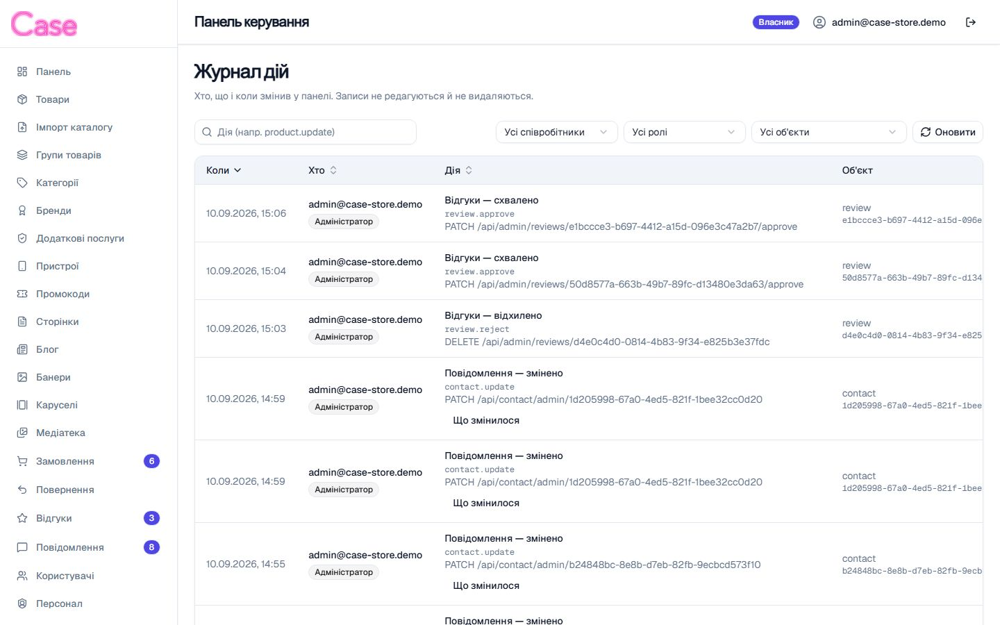

### Як читати журнал

Колонки:

- **Коли** — дата й час;
- **Хто** — пошта співробітника; «Система» — дії, які виконала сама система; якщо акаунт уже видалено — «пошта (акаунт видалено)»;
- **Дія** — українською, напр. «Замовлення — змінено статус», «Товари — змінено
  характеристики»;
- **Об'єкт** — що саме змінили.

Натисніть **«Що змінилося»** в рядку, щоб побачити таблицю **Було / Стало** — лише змінені
поля.

### Фільтри

- **«Усі співробітники» / «Мої дії»** — чиї дії показати;
- **«Усі ролі»** / Адміністратор / Менеджер;
- **«Усі об'єкти»** — тип: Банери, Блог, Бренди, Відгуки, Замовлення, Категорії, Медіатека,
  Персонал, Промокоди, Товари, SEO-налаштування тощо;
- поле **«Дія (напр. product.update)»** — шукає лише **точний** технічний ключ дії; для
  звичайного пошуку зручніше фільтр за об'єктом.

Сортувати можна за часом, автором і дією. Фільтри потрапляють в адресу сторінки — посилання
на відфільтрований журнал можна переслати колезі.

### Де ще видно журнал

На **картці товару** (розділ [3](#3-tovary)) є блок **«Історія змін»** — той самий журнал,
але лише для цього товару. Його теж бачать тільки власник і адміністратори.

⚠️ **Підводні камені**

- **У журнал не потрапляють секрети**: паролі й одноразові посилання для покупців там не
  записуються — лише факт дії.
- **Порожній результат** при фільтрі за полем «Дія» найчастіше означає неточний ключ, а не
  відсутність записів.

> Технічні деталі: TASK-318 (журнал), TASK-423 (фільтр за об'єктом), TASK-430 (українські
> назви дій, «Мої дії»).

---

## 10в. Мій профіль

### Що це

**Мій профіль** — ваш власний акаунт. Відкривається з **меню акаунта** в правому верхньому
куті (розділ [1](#1-vhid)); окремого права для цього не потрібно.

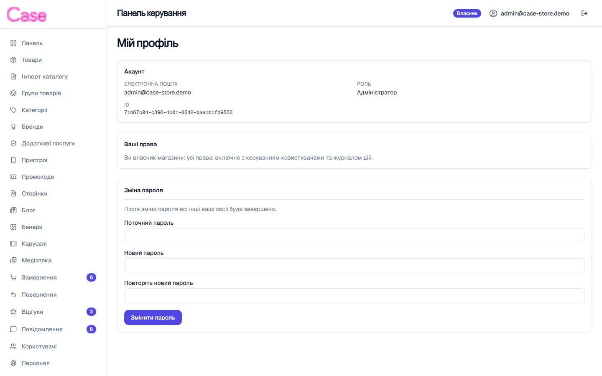

На екрані три блоки:

- **Акаунт** — ваша пошта, роль і ID.
- **Ваші права** — які права вам видано. Власник бачить напис «Ви власник магазину: усі
  права…». Якщо прав немає — «Вам поки не видано жодного права. Зверніться до власника
  магазину.»
- **Зміна пароля** — **Поточний пароль**, **Новий пароль**, **Повторіть новий пароль** →
  **Змінити пароль**. Новий пароль: щонайменше 8 символів, велика й мала літери та цифра.

### Щоб змінити свій пароль

1. Меню акаунта → **Мій профіль**.
2. Заповніть три поля в блоці **Зміна пароля**.
3. Натисніть **Змінити пароль**.

Після зміни пароля **всі інші ваші сесії завершуються** (наприклад, на іншому комп'ютері чи
телефоні доведеться увійти знову).

⚠️ **Підводні камені**

- **Змінити ім'я чи пошту тут не можна** — лише пароль. Для зміни пошти зверніться до
  власника або розробника.
- **Двофакторного входу (2FA) у панелі поки немає.** Тому використовуйте складний пароль і
  не передавайте його нікому.
- **Права показані технічними ключами** (напр. `orders:read`), а не назвами галочок — це
  відома незручність (TASK-725). Назви галочок — у таблиці розділу
  [10а](#10a-hto-shcho-mozhe).
- **Забули пароль?** Попросіть власника або адміністратора скинути його у «Персоналі»
  (вкладка «Акаунт» → «Скинути пароль»).

> Технічні деталі: TASK-317 (профіль і меню акаунта).

---

## 11. Промокоди

### Що це

**Промокоди** (купони) — коди на знижку, які покупець вводить у кошику (напр. `SUMMER10`).

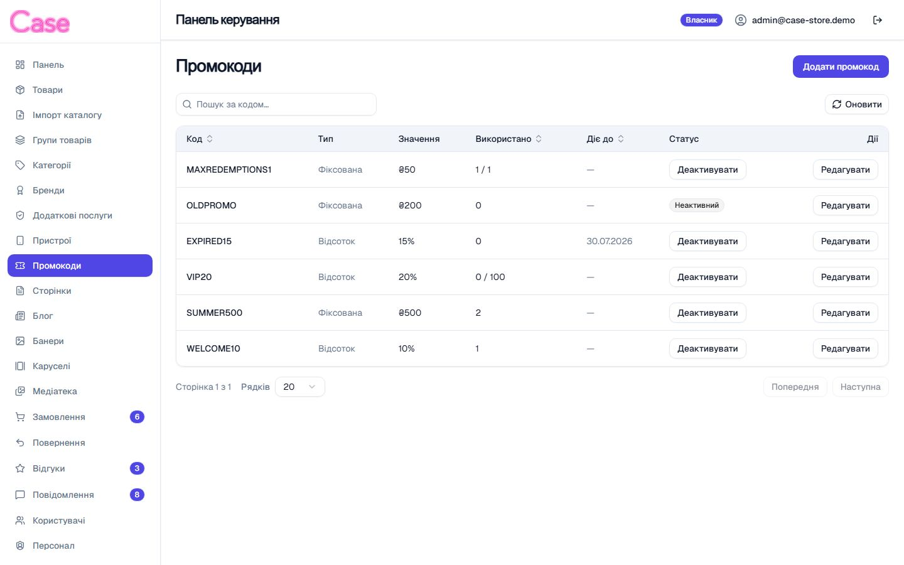

Список показує, скільки разів кожен код використано (`використано / ліміт`) і до якої
дати він діє. Є пошук за кодом. У колонці «Статус» активного коду стоїть кнопка
**Деактивувати** (у неактивного — позначка «Неактивний»), праворуч — **Редагувати**.

### Щоб створити промокод

1. Відкрийте **Промокоди** → **Додати промокод**.
2. Заповніть форму (нижче) і натисніть **Створити промокод**.

### Ключові поля

| Поле                             | Що вводити                                                     |
| -------------------------------- | -------------------------------------------------------------- |
| **Код**                          | Сам купон (напр. `SUMMER10`). Зберігається великими літерами.  |
| **Тип знижки**                   | **Відсоток (%)** або **Фіксована сума (₴)**.                   |
| **Значення**                     | Для відсотка — число 1–100; для фіксованої — сума у гривнях.   |
| **Мінімальна сума замовлення**   | Необов'язково. Купон спрацює лише від цієї суми.               |
| **Глобальний ліміт використань** | Необов'язково. Скільки разів усього можна застосувати код.     |
| **Ліміт на користувача**         | Необов'язково. Скільки разів код може використати один клієнт. |
| **Активний від**                 | Необов'язково. Дата початку дії.                               |
| **Діє до**                       | Необов'язково. Дата завершення.                                |
| **Активний**                     | Чи діє код зараз.                                              |

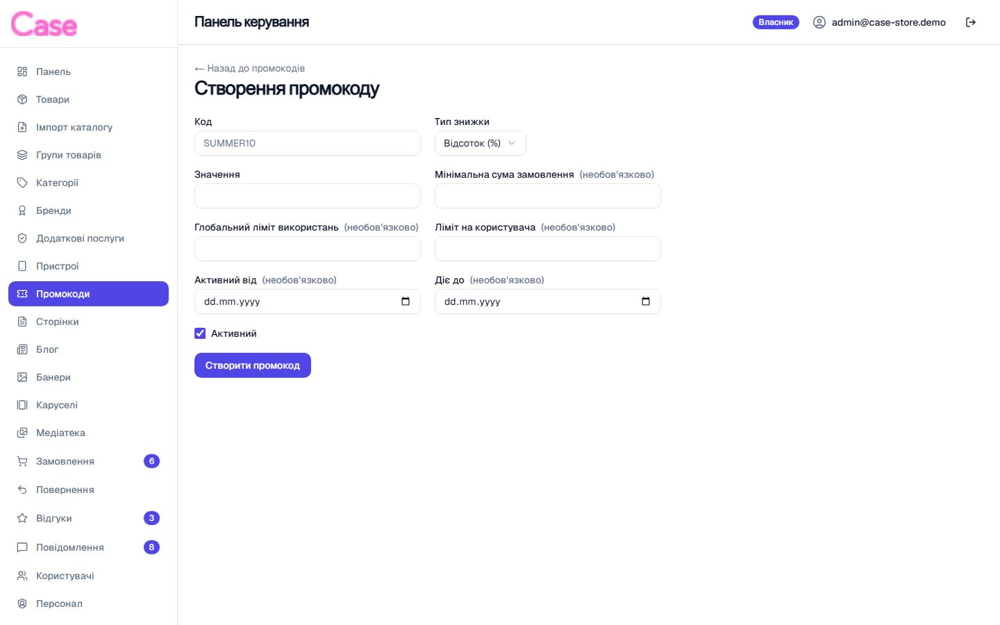

### Де покупці бачать промокоди

**Кожен активний промокод автоматично показується на сторінці «Акції» сайту** (блок
«Промокоди тижня» з кнопкою копіювання) — якщо сьогоднішня дата в межах «Активний від» / «Діє
до» і глобальний ліміт ще не вичерпано. **Окремого перемикача «показувати на сайті» немає**
(TASK-731).

Тобто промокод «тільки для одного клієнта» чи «тільки для партнера» зараз зробити не можна:
його побачать усі відвідувачі сторінки «Акції». Щоб обмежити, використовуйте **Ліміт на
користувача** і **Глобальний ліміт використань** — або не створюйте код, доки він не
потрібен.

### Щоб вимкнути промокод

У списку натисніть **Деактивувати** в колонці «Статус» (або зніміть галочку «Активний» у
формі). Код перестане працювати й зникне зі сторінки «Акції», але залишиться в історії.
Увімкнути знову — через **Редагувати** → галочка «Активний».

⚠️ **Підводні камені**

- **Код не можна змінити після створення** — у режимі редагування поле коду заблоковане.
  Якщо потрібен інший код, створіть новий.
- **Відсоток має бути в межах 1–100.** Для великих знижок використовуйте тип «Фіксована
  сума (₴)».
- **Дата початку має передувати даті завершення** — інакше форма покаже помилку.
- Промокоди **деактивують, а не видаляють** — так зберігається статистика використань.
- **Активний код = публічний код.** Див. вище.

> Технічні деталі: TASK-079 (промокоди), plan 041/042; TASK-179 (показ на сторінці «Акції»);
> TASK-219 / plan 097 (пропозиція купонів v2).

---

# Частина 2. Контент, комунікації та налаштування

> Ця частина продовжує посібник розділами про **контент** (службові сторінки, блог, банери,
> каруселі, карта контенту), **комунікації** (повідомлення, підписники, контакти) та
> **налаштування** (SEO, FAQ, дашборд, пошук, назва магазину). Структура й тон ті самі, що й
> у частині 1: спершу «що це», далі покрокові інструкції, а наприкінці кожного розділу —
> «⚠️ Підводні камені».

---

## 12. Службові сторінки

### Що це

Розділ **Сторінки** (на екрані — «Службові сторінки») — текстові сторінки сайту: оферта,
політика конфіденційності, «Доставка», «Гарантія», «Про нас» тощо. На відміну від товарів,
тут немає ціни чи залишку — лише **заголовок і текст**.

Сторінки бувають **трьох видів**:

| Вид           | Що це                                                                                                                           | Адреса на сайті |
| ------------- | ------------------------------------------------------------------------------------------------------------------------------- | --------------- |
| **Юридична**  | Документ у розділі «Правова інформація»: оферта, політика конфіденційності, умови використання, доставка, повернення, гарантія. | `/legal/…`      |
| **Довідкова** | Сторінка в розділі «Інформація та підтримка», напр. «Про нас».                                                                  | `/info/…`       |
| **Хаб**       | **Не окрема сторінка**, а заголовок і опис для Google для розділу, який на сайті вже є (напр. «Блог», «Акції»).                 | адреса розділу  |

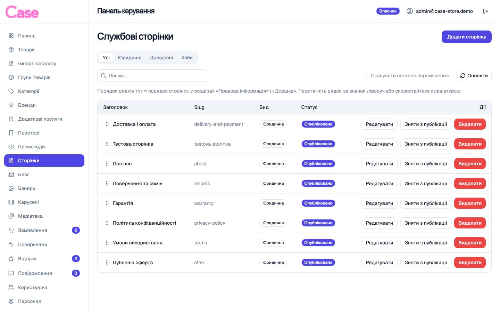

### Список сторінок

- **Вкладки** «Усі» / «Юридичні» / «Довідкові» / «Хаби».
- **Пошук** за заголовком або slug.
- **Колонки** «Заголовок», «Slug», «Вид», «Статус» («Опубліковано», «Чернетка» або
  «Заплановано на …»).
- У рядку — **Редагувати**, **Опублікувати** / **Зняти з публікації**, **Видалити**.
- **Порядок** сторінок у розділах «Правова інформація» і «Довідка» = порядок рядків тут.
  Перетягніть рядок за значок ліворуч (або клавіатурою). Перетягувати можна **лише на вкладці
  «Усі»** і без пошуку: список один спільний, а на вкладці видно лише його частину.

### Щоб створити сторінку

1. Відкрийте **Сторінки** → **Додати сторінку**.
2. Оберіть **Вид сторінки**.
3. Заповніть **Заголовок** і **Вміст** (текстовий редактор — див. нижче).
4. Оберіть **Статус публікації** (за замовчуванням «Чернетка»).
5. Натисніть **Створити сторінку**.

### Щоб відредагувати сторінку

1. У списку натисніть **Редагувати**.
2. Змініть потрібні поля.
3. Натисніть **Зберегти сторінку**.

### Ключові поля

| Поле                            | Що вводити                                                                                                                                                                                               |
| ------------------------------- | -------------------------------------------------------------------------------------------------------------------------------------------------------------------------------------------------------- |
| **Вид сторінки**                | «Юридична — адреса /legal/…», «Довідкова — адреса /info/…» або «Хаб — мета-теги наявного розділу».                                                                                                       |
| **Розділ сайту**                | Лише для хаба: оберіть розділ зі списку (категорії, блог, правова інформація, контакти, інформація, акції). Адресу хаба не вигадують.                                                                    |
| **Заголовок**                   | Обов'язковий. Назва сторінки (напр. «Умови доставки»).                                                                                                                                                   |
| **Slug**                        | Частина адреси; порожнє — згенерується із заголовка.                                                                                                                                                     |
| **Вміст**                       | Основний текст. Редагується в **текстовому редакторі**; вкладка **Перегляд** показує результат. Для хаба цей текст на сайті не показується — опишіть, за що відповідає розділ, для наступного редактора. |
| **Короткий опис**               | Необов'язковий підсумок.                                                                                                                                                                                 |
| **SEO заголовок / SEO опис**    | Необов'язкові. Під ними — прев'ю «Перегляд у результатах пошуку Google».                                                                                                                                 |
| **Теги, картинка для соцмереж** | Необов'язкові (див. глосарій).                                                                                                                                                                           |
| **Статус публікації**           | **Чернетка** / **Заплановано** / **Опубліковано**.                                                                                                                                                       |
| **Дата публікації**             | Для статусу «Заплановано» — коли сторінку опублікувати автоматично.                                                                                                                                      |

Поля «Порядок сортування» у формі **немає** — порядок задається перетягуванням у списку.

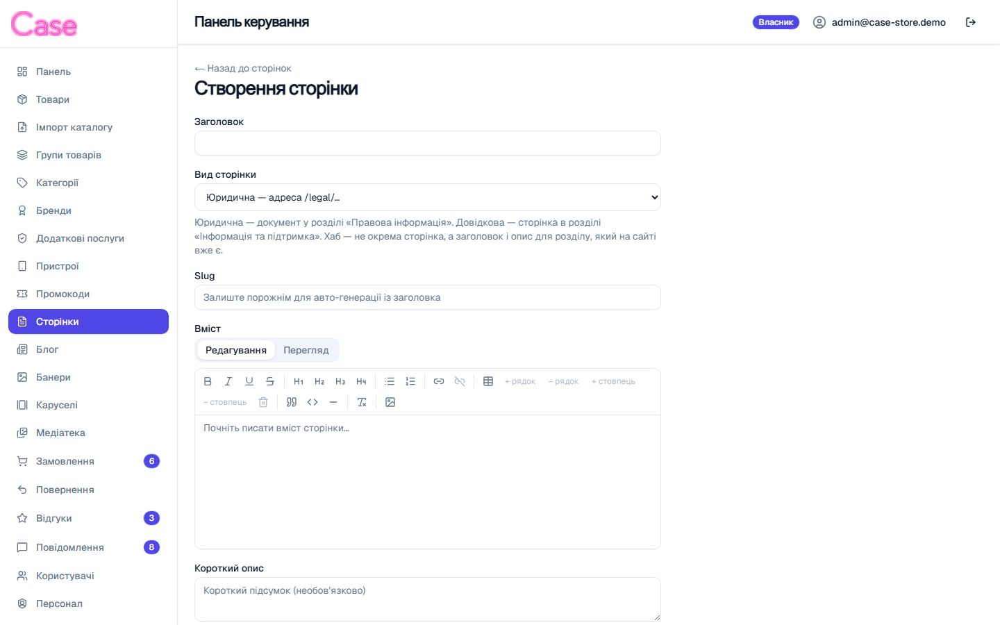

### Текстовий редактор (як форматувати вміст)

Поле **Вміст** — візуальний редактор із панеллю кнопок угорі. **HTML знати не потрібно**:

- **Жирний**, **Курсив**, **Підкреслення**, **Закреслення**;
- **Заголовок 1–4** — підзаголовки всередині сторінки (H1…H4);
- **Маркований / Нумерований список**;
- **Посилання** / **Зняти посилання**;
- **Вставити таблицю**, а для наявної — додати/видалити рядок чи стовпець, видалити таблицю;
- **Цитата**, **Блок коду**, **Горизонтальна лінія**;
- **Зображення** — вставити картинку з медіатеки (розділ [3б](#3b-mediateka));
- **Очистити форматування**.

**Навіщо про це знати:** коли ви **копіюєте текст із Word чи іншого сайту**, система
**очищує його від небезпечного й зайвого коду** — зберігається лише текст і базове
форматування. Якщо вставлене «з'їло» частину оформлення, відформатуйте текст заново кнопками
редактора.

### Публікація і планування

- **Чернетка** — сторінку бачите тільки ви в панелі.
- **Заплановано** — оберіть дату й час у полі **Дата публікації**; сторінка з'явиться на сайті
  сама.
- **Опубліковано** — видно всім прямо зараз.

Швидко змінити статус можна й зі списку — **Опублікувати** / **Зняти з публікації**.

⚠️ **Підводні камені**

- **«Видалити» — остаточне.** Для опублікованої сторінки панель попередить, що адреса
  поверне помилку 404 без переадресації (а в Google вона могла вже потрапити). Якщо сторінка
  просто не потрібна зараз — **зніміть з публікації**.
- **Зміна slug опублікованої сторінки** — панель перепитає й налаштує переадресацію зі старої
  адреси на нову.
- **Для статусу «Заплановано» обов'язково вкажіть дату** — інакше форма покаже помилку.
- **Хаб без обраного розділу не збережеться** — «Оберіть розділ, для якого задаються
  мета-теги».
- Де на сайті що показується — наочно в розділі **Де що на сайті** ([14б](#14b-karta)).

> Технічні деталі: публікаційна платформа — plan 104; види сторінок і вкладки — TASK-435;
> перетягування — TASK-428; переадресація slug — TASK-285.

---

## 13. Блог

### Що це

Розділ **Блог** — статті для контент-маркетингу (новини, гайди, огляди). Складається з
двох частин: **Статті блогу** та **Категорії блогу** (кнопка **Категорії** вгорі).

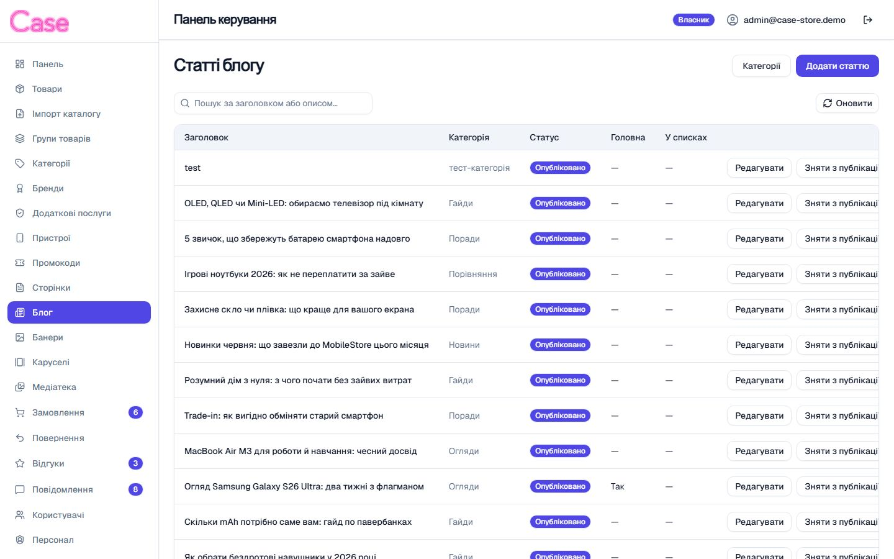

Список статей має пошук за заголовком або описом, колонки «Заголовок», «Категорія»,
«Статус», «Головна», «У списках», а в рядку — **Опублікувати** / **Зняти з публікації** і
**Видалити**.

### Спершу — категорії блогу

Кожна стаття має належати до **категорії блогу** (напр. «Новини», «Поради»). Тому спершу
створіть хоча б одну:

1. **Блог** → **Категорії** → **Додати категорію**.
2. Заповніть **Назву** і за потреби **Slug** (авто).
3. Натисніть **Створити категорію**.

**Порядок категорій** задається **перетягуванням** рядків у списку категорій (поля «Порядок»
немає).

### Щоб створити статтю

1. Відкрийте **Блог** → **Додати статтю**.
2. Заповніть поля (нижче) і натисніть **Створити статтю**.

### Ключові поля статті

| Поле                            | Що вводити                                                                                                                                                 |
| ------------------------------- | ---------------------------------------------------------------------------------------------------------------------------------------------------------- |
| **Заголовок**                   | Обов'язковий. Назва статті.                                                                                                                                |
| **Slug**                        | Частина адреси; порожнє — згенерується автоматично.                                                                                                        |
| **Категорія**                   | Обов'язкова. Оберіть зі створених категорій блогу.                                                                                                         |
| **Короткий опис**               | Обов'язковий. Показується на картці статті.                                                                                                                |
| **Вміст**                       | Текст статті в тому ж **текстовому редакторі**, що й у сторінок (розділ [12](#12-storinky)), з кнопкою «Зображення».                                       |
| **Автор**                       | Обов'язковий. Ім'я автора.                                                                                                                                 |
| **Обкладинка**                  | **Завантажити файл**, **«З медіатеки»** або посилання в полі «Обкладинка (URL)».                                                                           |
| **Час читання (хв)**            | Необов'язково. Показується як «X хв читання».                                                                                                              |
| **Головна стаття тижня**        | Стаття показується великим блоком угорі сторінки «Блог». **Такою може бути лише одна.**                                                                    |
| **Показувати у списках**        | Вимкніть, щоб прибрати статтю зі списку блогу, з підказок пошуку і з блоку «Читайте також». Вона лишається опублікованою й доступною за прямим посиланням. |
| **SEO-заголовок / SEO-опис**    | Необов'язкові. Порожні — беруться заголовок і короткий опис. Є прев'ю Google.                                                                              |
| **Теги, картинка для соцмереж** | Необов'язкові (див. глосарій).                                                                                                                             |
| **Статус публікації**           | **Чернетка** / **Заплановано** / **Опубліковано**.                                                                                                         |
| **Дата публікації**             | Для статусу «Заплановано» — коли статтю опублікувати автоматично.                                                                                          |

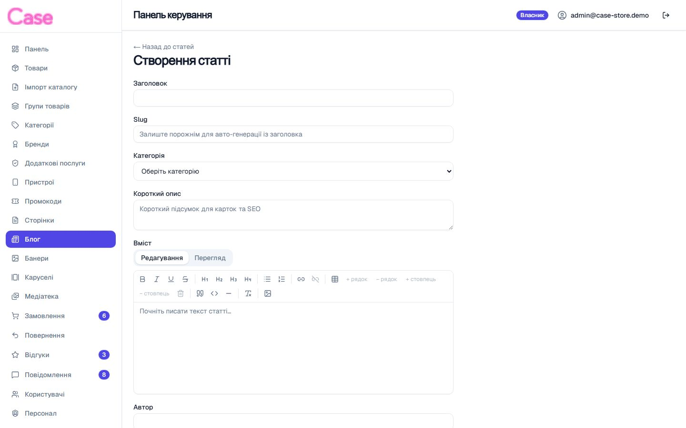

⚠️ **Підводні камені**

- **Без категорії статтю не створити** — спершу створіть хоча б одну категорію блогу.
- **Категорію, у якій є статті, видалити не можна** — панель покаже «можливо, у ній ще є
  статті». Спершу перенесіть або видаліть статті.
- **«Головна стаття тижня» — лише одна.** Увімкнувши її на новій статті, зніміть у
  попередньої.
- **«Не в списках» ≠ чернетка.** Прихована зі списків стаття лишається опублікованою: за
  прямим посиланням і в карті сайту для Google вона є.
- **«Видалити» — остаточне**; для опублікованої статті адреса поверне 404. Зміна slug
  опублікованої статті — з автоматичною переадресацією.
- **Час читання** — додатне ціле число; лишіть порожнім, якщо не потрібно.

> Технічні деталі: TASK-172 (блог), TASK-436 («Показувати у списках», «Головна»), TASK-437
> (SEO-поля статті), TASK-424 (завантаження обкладинки).

---

## 14. Банери головної сторінки

### Що це

**Банери** — рекламні блоки на **головній сторінці** магазину: великий слайдер, промо-плитки,
широкий промо-банер і тонка смуга оголошень угорі кожної сторінки. Кожен банер прив'язаний до
конкретного **розташування (слоту)**.

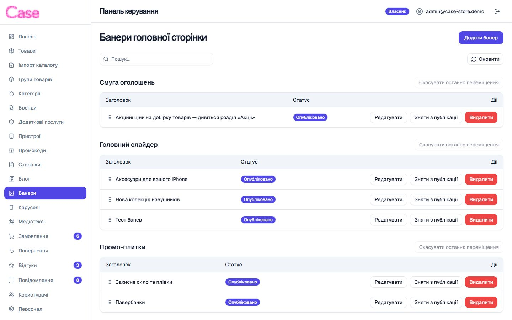

### Розташування (слоти) — куди потрапить банер

| Розташування         | Де показується                                                                            |
| -------------------- | ----------------------------------------------------------------------------------------- |
| **Головний слайдер** | Великий блок угорі головної, що прокручує кілька слайдів по черзі.                        |
| **Промо-плитки**     | Невеликі рекламні плитки — по три в рядку.                                                |
| **Промо-банер**      | Один широкий банер-смуга з акцією.                                                        |
| **Смуга оголошень**  | Тонка смужка над шапкою **на кожній сторінці** (напр. «Безкоштовна доставка від 1000 ₴»). |

> На екрані «Де що на сайті» ці ж слоти підписані трохи інакше: «Hero-слайдер», «Широкий
> промо-банер», «Стрічка оголошень зверху». Це ті самі місця (TASK-720).

### Список банерів

Банери показані **окремим списком для кожного розташування**. Порядок у списку = порядок на
сайті (для слайдера — черга слайдів). Щоб змінити порядок, **перетягніть рядок** за значок
ліворуч або скористайтеся клавіатурою; є кнопка «Скасувати останнє переміщення». Поки
активний пошук, перетягувати не можна.

У рядку — **Редагувати**, **Опублікувати** / **Зняти з публікації**, **Видалити**.

### Щоб створити банер

1. Відкрийте **Банери** → **Додати банер**.
2. Оберіть **Розташування** і заповніть поля (нижче).
3. Оберіть **Статус публікації** та натисніть **Створити банер**.

### Ключові поля

| Поле                  | Що вводити                                                                                                                                                         |
| --------------------- | ------------------------------------------------------------------------------------------------------------------------------------------------------------------ |
| **Розташування**      | Обов'язкове. Один зі слотів вище.                                                                                                                                  |
| **Заголовок**         | Обов'язковий. Головний текст банера.                                                                                                                               |
| **Підзаголовок**      | Додатковий рядок під заголовком (необов'язково).                                                                                                                   |
| **Зображення**        | **Завантажити файл**, **«З медіатеки»** або посилання в полі «Зображення (URL)».                                                                                   |
| **Текст кнопки**      | Напис на кнопці (напр. «Купити»).                                                                                                                                  |
| **Посилання кнопки**  | Куди веде кнопка (напр. `/catalog`).                                                                                                                               |
| **Тема / акцент**     | Кольорове оформлення (напр. `accent`) — за потреби, узгоджуйте з розробником.                                                                                      |
| **Статус публікації** | **Чернетка** / **Заплановано** / **Опубліковано**.                                                                                                                 |
| **Вікно публікації**  | **Публікувати з** — коли банер з'явиться (для «Заплановано»). **Знімати з публікації** — необов'язково: у вказаний час банер сам стане чернеткою і зникне з сайту. |

Поля «Порядок сортування» у формі **немає** — порядок задається в списку.

### Прев'ю

Праворуч від форми — **Попередній перегляд** (на вузькому екрані — вкладки **Форма** / **Прев'ю**).
У ньому видно банер у двох варіантах — **Десктоп** і **Мобільний** — у пропорціях, як на сайті (зменшено), з підказкою про розмір конкретного
слоту: напр. для головного слайдера ≈968×440, на мобільному — на всю ширину, висота 420 px.

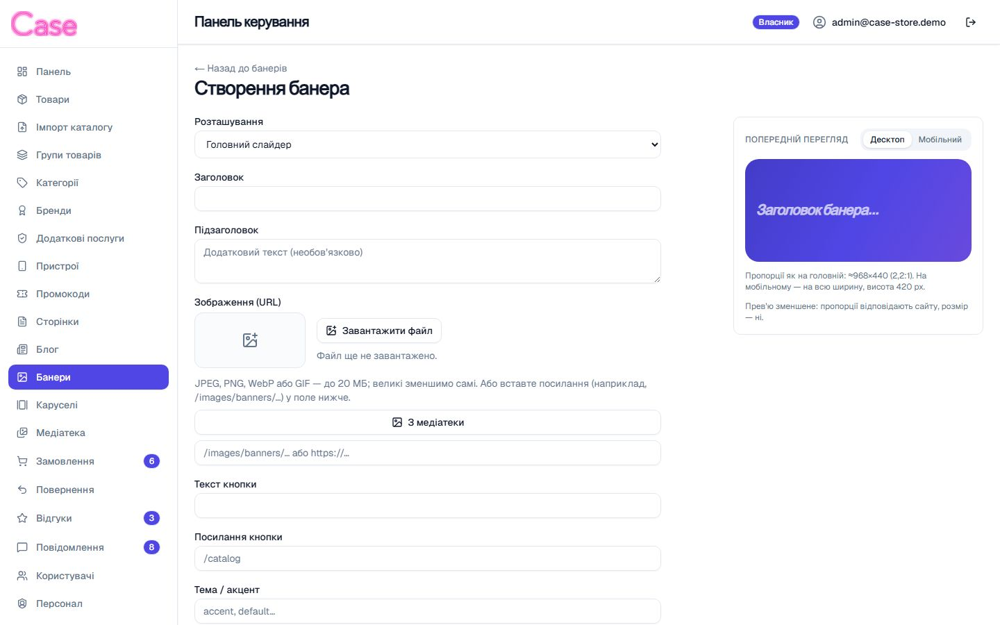

### Що буде, якщо слот порожній

Якщо в слоті **немає жодного опублікованого банера**, сайт **не залишиться порожнім** — там
автоматично показується стандартний вбудований (запасний) банер.

⚠️ **Підводні камені**

- **Розташування визначає, де банер з'явиться.** Не бачите банер там, де очікували —
  перевірте слот.
- **Для «Смуги оголошень» використовуються лише заголовок і посилання кнопки** — решта полів
  ігнорується.
- **Акція до певної дати** — заповніть «Знімати з публікації», і банер зникне сам, навіть
  уночі.
- **Посилання кнопки** зазвичай внутрішнє (`/catalog`, `/products/…`).
- Поки банер у статусі «Чернетка», покупці бачать у цьому слоті **запасний** банер (або інші
  опубліковані), а не ваш.
- **«Видалити» — остаточне.**

> Технічні деталі: TASK-186 (банери), TASK-265 (прев'ю), TASK-295 (перетягування), TASK-429
> (вікно публікації, пропорції прев'ю), TASK-424 (завантаження зображення).

---

## 14а. Каруселі товарів на головній

### Що це

**Каруселі** — стрічки товарів на головній сторінці: «Хіти продажів», «Новинки», «Акційні»,
товари певної категорії або ваш власний добір. Кожна карусель живе в одному з двох місць:

- **Таб у секції «Популярне»** — карусель стає **вкладкою** у блоці «Популярне» вгорі
  головної, покупець перемикає вкладки. Заголовок каруселі = назва вкладки;
- **Окремий рейл нижче** — окремий рядок товарів нижче на головній.

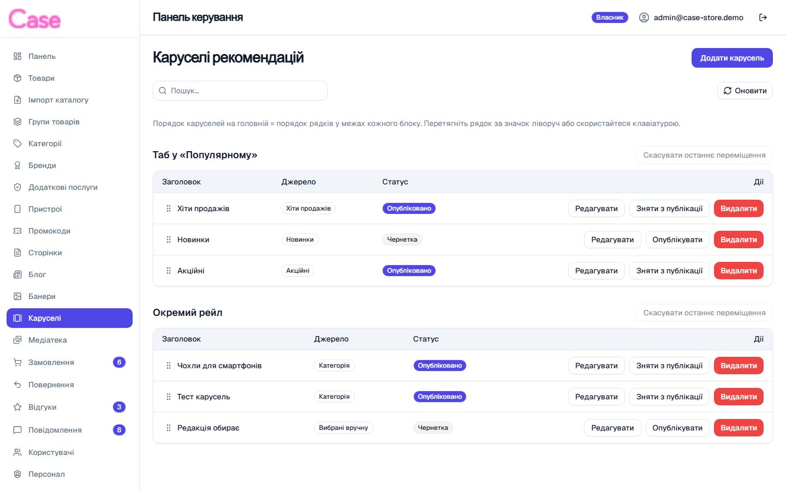

### Список каруселей

- Пошук «Пошук за заголовком…».
- Колонки «Заголовок», «Джерело», «Місце на сайті», «Статус».
- **Окремий список для кожного місця**; порядок рядків = порядок вкладок / рейлів на головній.
  Змінюється **перетягуванням**.
- У рядку — **Редагувати**, **Опублікувати** / **Зняти з публікації**, **Видалити**.

### Щоб створити карусель

1. Відкрийте **Каруселі** → **Додати карусель**.
2. Заповніть:
   - **Заголовок** — те, що побачить покупець;
   - **Джерело товарів**:
     - **Хіти продажів**, **Новинки**, **Акційні** — сайт сам обирає товари;
     - **Категорія** — товари обраної категорії (тоді з'являється обов'язкове поле
       **Категорія**);
     - **Вибрані вручну** — ви самі додаєте товари (див. нижче);
   - **Місце на головній сторінці** — «Таб у секції «Популярне»» або «Окремий рейл нижче»;
   - **Кількість товарів** — від 1 до 24 (для «Вибрані вручну» ігнорується — показуються всі
     додані);
   - **Статус публікації** і за потреби **Дата публікації**.
3. Натисніть **Створити карусель**.

### Щоб вибрати товари вручну

Список товарів для джерела **«Вибрані вручну»** з'являється **лише на сторінці редагування**:

1. Створіть карусель із джерелом «Вибрані вручну».
2. Відкрийте її на **Редагувати** — внизу блок **Товари каруселі**.
3. Знайдіть товар через пошук → **Додати**. Порядок у списку = порядок на сайті; стрілками
   вгору/вниз переставте, хрестиком приберіть.
4. Неактивні товари позначені бейджем **«Неактивний»** — на сайті їх не буде.

Для автоматичних джерел на цьому місці написано **«Порядок задає сайт автоматично»** — вручну
там переставляти нічого.

⚠️ **Підводні камені**

- **Створили карусель «Вибрані вручну», а на головній її немає?** Швидше за все, у ній ще немає
  товарів або вона не опублікована.
- **Щоб самому обрати товари автоматичної каруселі**, змініть «Джерело товарів» на «Вибрані
  вручну» і збережіть — після цього з'явиться список.
- У списку й у формі місця підписані трохи по-різному («Окремий рейл» / «Окремий рейл нижче»)
  — це одне й те саме (TASK-720).
- **«Видалити» — остаточне.**

> Технічні деталі: TASK-139 (каруселі), TASK-288 (вкладки й рейли), TASK-428 (перетягування),
> TASK-429 («Порядок задає сайт автоматично»).

---

## 14б. Де що на сайті (карта контенту)

### Що це

Пункт меню **Де що на сайті** відкриває екран **«Карта контенту»** — відповідь на найчастіше
питання новачка: «а де саме на сайті з'явиться те, що я щойно створив, і де це редагувати?».
Тут нічого не редагується — лише схема з переходами.

Пункт видно тим, у кого є всі чотири контентні права: **Сторінки**, **Банери**, **FAQ** і
**Блог**.

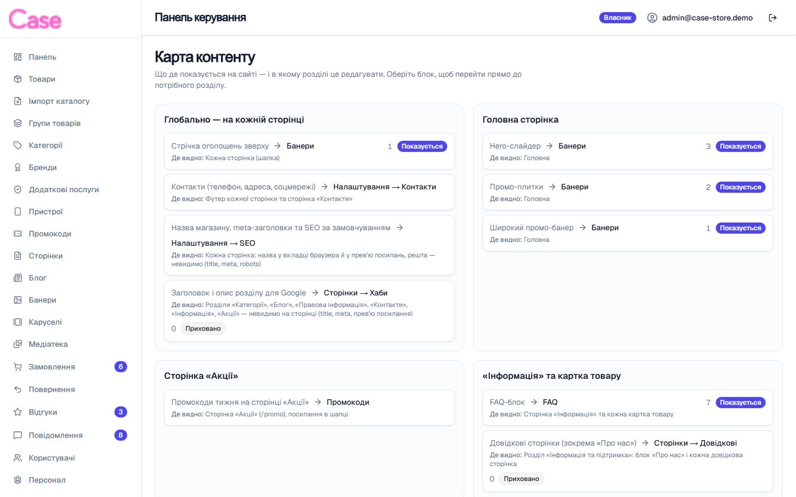

### Як читати карту

Зони згруповані за місцем на сайті:

| Група                              | Зони                                                                                                                                                                                          |
| ---------------------------------- | --------------------------------------------------------------------------------------------------------------------------------------------------------------------------------------------- |
| **Глобально — на кожній сторінці** | Стрічка оголошень зверху (Банери); Контакти (розділ «Контакти»); Назва магазину, meta-заголовки та SEO за замовчуванням (розділ «SEO»); Заголовок і опис розділу для Google (Сторінки → Хаби) |
| **Головна сторінка**               | Hero-слайдер, Промо-плитки, Широкий промо-банер (Банери)                                                                                                                                      |
| **Сторінка «Акції»**               | Промокоди тижня (Промокоди)                                                                                                                                                                   |
| **«Інформація» та картка товару**  | FAQ-блок (FAQ); Довідкові сторінки, зокрема «Про нас» (Сторінки → Довідкові)                                                                                                                  |
| **Блог**                           | Стрічка блогу (Блог)                                                                                                                                                                          |
| **Правові та інші сторінки**       | Правові документи (Сторінки → Юридичні)                                                                                                                                                       |

Для кожної зони видно: що це, **«Де видно:»**, **лічильник активних елементів** і позначку
**«Показується»** / **«Приховано»**. **Клік по зоні** веде прямо в потрібний розділ — одразу з
фільтром (напр. у «Банери» на потрібне розташування або в «Сторінки» на потрібну вкладку).

Назви й ціни товарів тут не показані — вони редагуються в розділах «Товари» і «Категорії».

⚠️ **Підводні камені**

- **«Приховано» з лічильником 0** — у зоні немає жодного опублікованого елемента. Для банерів
  це означає, що покупці бачать запасний банер.
- У зонах «Контакти» і «SEO» написано «Налаштування → …» — у меню це просто пункти **Контакти**
  і **SEO** в нижній частині (окремого пункту «Налаштування» немає, TASK-719).
- Зона «Промокоди» веде в розділ **Промокоди**; якщо у вас немає права «Промокоди та знижки»,
  панель відповість відмовою в доступі.

> Технічні деталі: TASK-264 (карта контенту), TASK-435 (три види сторінок), TASK-429 (зона
> «Акції»).

---

## 15. Повідомлення (звернення)

### Що це

Розділ **Повідомлення** (на екрані — «Вхідні повідомлення») — це **звернення** від
відвідувачів, залишені через форму контактів на сайті: питання, скарги, запити щодо
замовлень.

Хто що може: **«Читати звернення»** — бачити розділ; **«Опрацьовувати звернення»** — міняти
статуси й писати примітки.

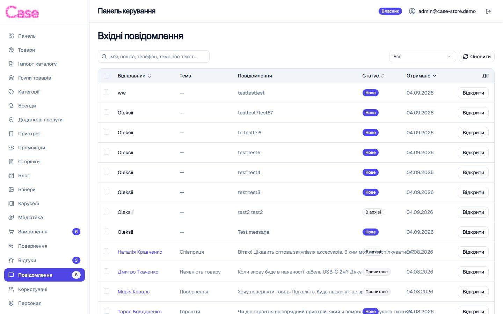

Біля пункту **Повідомлення** в бічному меню — **лічильник нових** (непрочитаних) звернень.

### Статуси звернення

| Статус        | Значення                                                  |
| ------------- | --------------------------------------------------------- |
| **Нове**      | Щойно надійшло, ніхто не брався (рахується в лічильнику). |
| **В роботі**  | Хтось із команди займається зверненням.                   |
| **Прочитане** | Опрацьоване.                                              |
| **В архіві**  | Прибране з активного списку, але збережене.               |

Список можна відфільтрувати: **Усі / Нові / В роботі / Прочитані / В архіві** і шукати за
«Імʼя, пошта, телефон, тема або текст…».

### Щоб опрацювати звернення

1. Відкрийте **Повідомлення** і натисніть **Відкрити** напроти потрібного.
2. У вікні побачите: **Імʼя**, **Телефон**, **Email**, **Тему**, номер **Замовлення** (якщо
   клієнт вказав), сам текст і поточний **Статус**. Якщо звернення від зареєстрованого
   клієнта — є посилання **Профіль клієнта**.
3. Змініть статус кнопками **Взяти в роботу**, **Позначити прочитаним**, **В архів** або
   **Повернути в нові**.
4. За потреби додайте **Внутрішню примітку** й натисніть **Зберегти примітку**.

**Внутрішню примітку** бачить лише команда — клієнт ніколи. Використовуйте для нотаток на
кшталт «передзвонити після 18:00» чи «передано на склад».

**Масові дії:** позначте рядки галочками → **В роботу (N)**, **Прочитано (N)** або **В архів
(N)**. «Повернути в нові» — лише по одному, щоб випадково не повернути в лічильник уже
опрацьовані розмови.

⚠️ **Підводні камені**

- **Відповісти клієнту прямо з панелі НЕ можна.** Панель тільки **показує** звернення. Щоб
  відповісти — зателефонуйте або напишіть на **Email/телефон**, які клієнт вказав (звичайним
  листом чи дзвінком поза панеллю).
- **«В архів» — це не видалення.** Звернення зберігається; знайти його можна фільтром
  «В архіві».
- **Лічильник рахує лише «Нові».** Щойно звернення взяли в роботу, позначили прочитаним чи
  архівували — лічильник у меню зменшується.
- **Беріть звернення «В роботу»**, якщо в команді кілька людей: так колега бачить, що ним уже
  займаються.

> Технічні деталі: TASK-177 (інбокс звернень), TASK-256 («В роботі», посилання на профіль),
> TASK-354 (масові дії), TASK-423 (пошук).

---

## 16. Підписники розсилки

### Що це

Розділ **Підписники** — база **email-адрес**, які відвідувачі залишили для розсилки (напр.
через форму підписки у футері сайту).

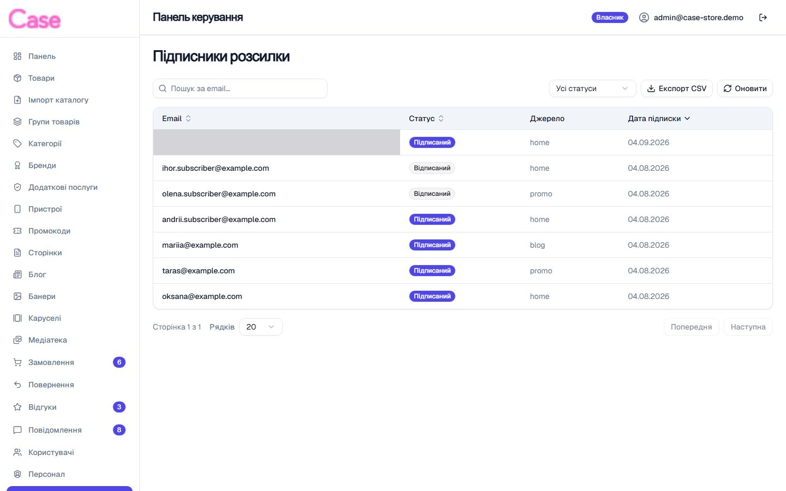

### Статуси

- **Підписаний** — погодився отримувати листи.
- **Відписаний** — відмовився від розсилки (не надсилайте йому листи).

Список можна шукати за email і фільтрувати за статусом. **Джерело** показує, звідки людина
підписалася.

### Щоб вивантажити базу (CSV-експорт)

1. Натисніть **Експорт CSV** (угорі списку).
2. Завантажиться файл `.csv` з адресами — його можна відкрити в Excel/Google Таблицях або
   завантажити у сервіс розсилок (Mailchimp, SendPulse тощо).

⚠️ **Підводні камені**

- **Панель сама листи не розсилає** — вона лише **збирає базу** й дає **експорт**. Самі
  листи ви відправляєте через зовнішній сервіс.
- **Не надсилайте листи «Відписаним»** — це база тих, хто відмовився.
- Підписники додаються **самі** (через сайт); ручного додавання адрес у панелі немає.

> Технічні деталі: TASK-188 (підписники розсилки).

---

## 17. Контакти магазину

### Що це

Розділ **Контакти** (нижня частина меню, на екрані — «Налаштування контактів») — телефон,
пошта, графік роботи й посилання на месенджери магазину. **Ці дані показуються у футері
сайту та на сторінці контактів.**

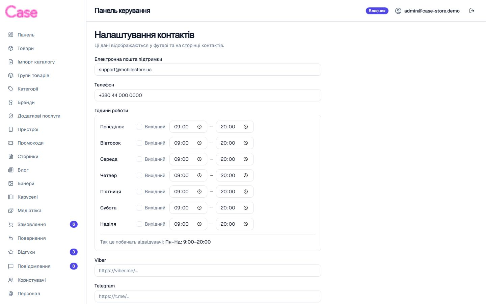

### Ключові поля

| Поле                             | Що вводити                                       |
| -------------------------------- | ------------------------------------------------ |
| **Електронна пошта підтримки**   | Пошта, на яку писатимуть клієнти.                |
| **Телефон**                      | Контактний номер магазину.                       |
| **Години роботи**                | Розклад по днях (див. нижче).                    |
| **Viber / Telegram / Instagram** | Посилання на ваші сторінки/канали в цих мережах. |

Кнопка — **Зберегти контакти**.

### Графік роботи

Години роботи заповнюються **по днях тижня**: для кожного дня вкажіть час відкриття й
закриття або позначте день як **Вихідний**. Унизу є **живий попередній перегляд** — «Так це
побачать відвідувачі:». Якщо позначити вихідними всі дні, панель попередить, що відвідувачі
побачать, що магазин не працює жодного дня.

Якщо графік колись був записаний довільним текстом, панель покаже його як текст і запропонує
**«Перейти на структурований редактор»**.

### Навіщо соцмережі — не лише футер, а й довіра в Google

Посилання на Viber/Telegram/Instagram не тільки показуються у футері. Вони також
**повідомляють пошуковим системам (Google), що це офіційні сторінки вашого магазину**. Це
підвищує довіру до бренду й допомагає Google правильно пов'язувати ваш магазин із його
профілями в соцмережах.

> **Ширші профілі бренду** (Facebook, YouTube, LinkedIn тощо) додаються **не тут**, а в
> **SEO-налаштуваннях** (розділ [18](#18-seo), поле «Додаткові посилання на профілі
> бренду»). Тут — лише месенджери для зв'язку з клієнтом.

⚠️ **Підводні камені**

- **Час закриття має бути пізніше часу відкриття** — інакше форма покаже помилку.
- **Усі дні як вихідні** — панель попередить; зазвичай це помилка.
- Посилання мають бути коректними адресами (`https://…`), пошта — валідною.
- **Поля «Адреса» тут немає**, хоча карта контенту згадує адресу (TASK-721). Якщо потрібна
  фізична адреса магазину на сайті — напишіть її, наприклад, на довідковій сторінці «Про нас»
  (розділ [12](#12-storinky)).

> Технічні деталі: TASK-154, plan 086 (налаштування контактів магазину).

---

## 18. SEO-налаштування

### Що це

Розділ **SEO** (нижня частина меню, на екрані — «SEO-налаштування») — назва магазину,
логотип і глобальні параметри того, як магазин виглядає в **Google** та при поширенні
посилань у **соцмережах**.

> **Найголовніше: SEO працює автоматично.** Навіть якщо ви **нічого тут не заповните**,
> кожен товар, категорія й сторінка вже отримують нормальний заголовок, опис і прев'ю для
> Google — система бере їх із назв та описів, які ви й так вводите. **Ці поля — лише
> необов'язкові уточнення** для тих, хто хоче точніший текст.

Екран складається з трьох блоків (зверху вниз): **SEO-здоров'я**, **Логотип магазину** і
форма налаштувань.

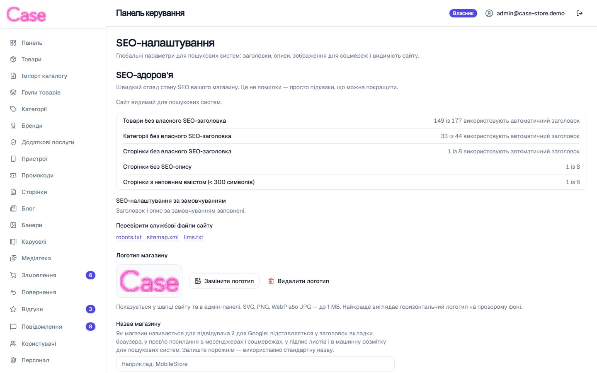

### Блок «SEO-здоров'я»

Швидкий огляд — «це не помилки, просто підказки»:

- **Товари / Категорії / Сторінки без власного SEO-заголовка** — «N із M використовують
  автоматичний заголовок». Це нормально;
- **Сторінки без SEO-опису** і **Сторінки з неповним вмістом (< 300 символів)** — кандидати
  на доопрацювання;
- **SEO-налаштування за замовчуванням** — чи заповнені заголовок і опис сайту;
- **«Сайт видимий для пошукових систем.»** — має бути саме так;
- посилання **robots.txt**, **sitemap.xml**, **llms.txt** — відкрити службові файли сайту й
  переконатися, що вони є.

### Логотип магазину

Показується в шапці сайту та в адмін-панелі. **SVG, PNG, WebP або JPG — до 1 МБ**; найкраще
виглядає горизонтальний логотип на прозорому фоні. Кнопки **Завантажити логотип** /
**Замінити логотип** / **Видалити логотип**. Поки логотипа немає, показується текстова назва.

### Поля форми — по одному, простими словами

| Поле                                        | Що це і навіщо                                                                                                                                        |
| ------------------------------------------- | ----------------------------------------------------------------------------------------------------------------------------------------------------- |
| **Назва магазину**                          | Як магазин називається для відвідувача й для Google: вкладка браузера, прев'ю посилань, машинна розмітка. Докладно — розділ [27](#27-nazva-magazynu). |
| **Заголовок сайту за замовчуванням**        | Заголовок для сторінок, які не мають власного (напр. головна). Порожнє — згенерується з назви сторінки.                                               |
| **Опис сайту за замовчуванням**             | 1–2 речення про магазин, які Google показує під заголовком, коли у сторінки нема власного опису.                                                      |
| **Шаблон заголовка сторінки**               | Як «обрамляти» заголовок. `%s` заміниться назвою сторінки. Напр. `%s \| Ваш магазин` дасть «Чохли \| Ваш магазин».                                    |
| **Зображення для соцмереж (OG-картинка)**   | Прев'ю-картинка, коли посилання на магазин поширюють у Facebook/Telegram/Viber. Повне посилання `https://…`.                                          |
| **Код підтвердження Google Search Console** | Код, який підтверджує Google, що сайт ваш. Покроково — розділ [23](#23-search-console).                                                               |
| **Код підтвердження Bing Webmaster Tools**  | Те саме для пошуковика Bing. Необов'язково; див. розділ [23](#23-search-console).                                                                     |
| **Опис для AI-асистентів (llms.txt)**       | Короткий опис бізнесу для AI-асистентів (див. нижче). Замінює вступний абзац файлу `/llms.txt`.                                                       |
| **Додаткові посилання на профілі бренду**   | Офіційні сторінки в інших мережах (Facebook, YouTube, LinkedIn…), **по одному в рядку**. Показує Google, що це ваші профілі.                          |

Під полями заголовка й опису — прев'ю **«Перегляд у результатах пошуку Google»**: приклад
того, як виглядатиме сторінка без власного заголовка. Кнопка внизу — **Зберегти
SEO-налаштування**.

**Про «Шаблон заголовка».** Якщо лишити порожнім, назва магазину додаватиметься до заголовків
автоматично. Якщо заповнюєте — у шаблоні має бути **рівно один** символ `%s`; інакше форма
покаже помилку й не збереже.

**Про «llms.txt».** `llms.txt` — це спеціальний файл-візитівка вашого сайту **для
AI-асистентів на кшталт ChatGPT**: він коротко пояснює їм, що це за магазин. Тут ви задаєте
лише вступний опис бізнесу; решту файлу система формує сама.

### ℹ️ Куди подівся перемикач «Приховати сайт від пошукових систем»

Раніше тут був перемикач noindex — «рубильник» видимості всього магазину в Google. **Його
прибрано, і це хороша новина: тепер ви фізично не можете зробити цю помилку.**

Чому прибрали:

- **Один випадковий клік прибирав ЖИВИЙ магазин із Google** — і повертався він тижнями.
- **Захист він давав слабкий.** Усе, що він робив, — запис у `robots.txt`. А це **прохання**,
  а не паркан: чемні пошуковики послухаються, решта — ні, і **вже проіндексовані сторінки він
  не прибирає**.

Що замість нього: тестовий сервер закритий **паролем на рівні сервера**. Пароль зупиняє
**всіх** — і пошуковики, і людей. Це властивість середовища, а не перемикач у базі.

**Від вас не потрібно нічого.** Робочий магазин індексується, тестовий — ні. Автоматично.

> Якщо в блоці «SEO-здоров'я» раптом з'явиться червоне «Сайт прихований від пошукових
> систем!» з порадою вимкнути перемикач нижче — перемикача вже немає, **зверніться до
> розробника** (TASK-718).

### А що з FAQ?

Часті запитання (**FAQ**, розділ [19](#19-faq)) теж працюють на SEO: відповіді оформлюються
так, що можуть з'явитися **прямо в результатах Google**. Окремо в SEO-налаштуваннях їх
вмикати не треба.

### А товари у вкладці «Покупки» Google?

Щоб картки товарів (фото + ціна) з'явилися у вкладці **«Покупки» (Shopping)** пошуку
Google — безплатно, без реклами, — сайт автоматично формує спеціальний файл-фід. Його треба
один раз подати в **Google Merchant Center** — покроково в розділі [24](#24-merchant-center).

⚠️ **Підводні камені**

- **Шаблон заголовка без `%s`** (або з кількома `%`) не збережеться — форма покаже помилку.
- **OG-картинка — це повне посилання** `https://…`, а не завантаження файлу.
- **Логотип — до 1 МБ**, на відміну від інших зображень (там до 20 МБ).
- **Усі поля необов'язкові.** Порожня форма — це нормально: SEO вже працює автоматично.

> Технічні деталі: TASK-239 (SEO-налаштування), TASK-240 (авто-SEO), TASK-268 (прев'ю Google),
> TASK-269/285 (SEO-здоров'я), TASK-299 (логотип), TASK-433 (назва магазину), plan 116.

---

## 19. FAQ (часті запитання)

### Що це

Розділ **FAQ** (нижня частина меню, на екрані — «Часті запитання (FAQ)») — глобальний список
**запитань і відповідей**, який допомагає клієнтам (та пошуковим системам) швидко знайти
відповідь.

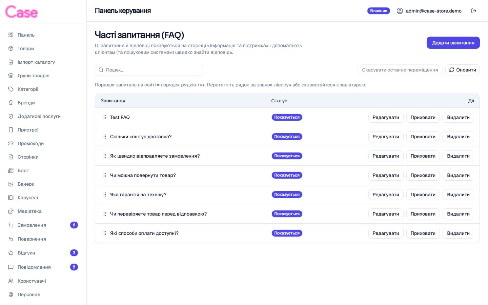

### Щоб додати запитання

1. Відкрийте **FAQ** → **Додати запитання**.
2. Заповніть:
   - **Запитання** — коротко, як його поставив би клієнт (напр. «Скільки коштує доставка?»);
   - **Відповідь** — повна відповідь простою мовою;
   - **Показувати на сайті** — галочка видимості.
3. Натисніть **Додати запитання**.

### Щоб змінити порядок, приховати або видалити

- **Порядок:** **перетягніть рядок** у списку за значок ліворуч (або клавіатурою). Порядок
  запитань на сайті = порядок рядків тут. Поки активний пошук, перетягувати не можна.
- **Приховати/показати:** у списку натисніть **Приховати** або **Показати** (статус
  «Показується» / «Приховано»). Приховане запитання лишається в панелі й будь-коли вмикається
  знову.
- **Видалити:** кнопка **Видалити** прибирає запитання остаточно (з підтвердженням).

Список має пошук «Пошук за текстом запитання…».

### Де це показується

- На сторінці **«Інформація та підтримка»** (`/info`) — списком, що розгортається;
- **на кожній картці товару**;
- пошуковим системам — як структуровані дані, тож відповіді можуть з'явитися прямо в
  результатах Google і у відповідях AI-асистентів.

⚠️ **Підводні камені**

- **Порядок міняють перетягуванням**, числового поля «Порядок» немає.
- **Приховане ≠ видалене.** Щоб тимчасово прибрати запитання — ховайте, а не видаляйте.
- **Відповіді бачать і покупці на кожному товарі, і Google** — стежте, щоб вони відповідали
  реальним умовам (доставка, гарантія, повернення).

> Технічні деталі: TASK-242 (глобальний FAQ + структуровані дані), TASK-428 (перетягування),
> plan 116.

---

## 20. Дашборд (головний екран)

### Що це

**Панель** (перший пункт меню, екран «Огляд») — те, що ви відкриваєте зранку: що потребує
дії, як іде продаж, що закінчується на складі, останні замовлення й відвідуваність.

Що саме видно, залежить від прав: показники й «Потребує дії» — з правом **«Дашборд і
показники»**, «Останні замовлення» — з правом **«Переглядати замовлення»**. Без цих прав на
екрані лишаються лише доступні швидкі дії.

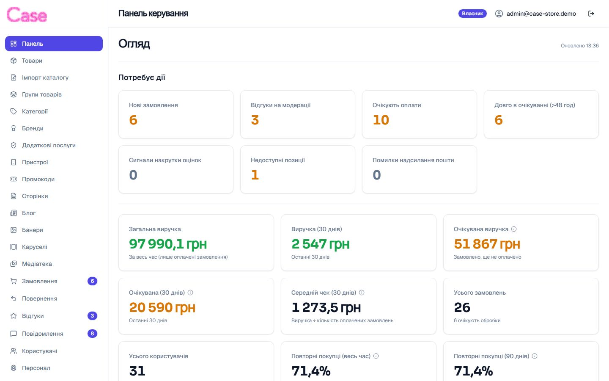

### Блок «Потребує дії»

Сім плиток — ваш список справ на сьогодні. **Кожна плитка — посилання** у вже відфільтрований
список.

| Плитка                           | Що рахує                                                                                                  | Куди веде                                  |
| -------------------------------- | --------------------------------------------------------------------------------------------------------- | ------------------------------------------ |
| **Нові замовлення**              | Замовлення «Очікує підтвердження».                                                                        | Замовлення → нові                          |
| **Відгуки на модерації**         | Відгуки, які ще ніхто не схвалив і не відхилив.                                                           | Відгуки → «На розгляді»                    |
| **Очікують оплати**              | Відправлені, але ще не оплачені замовлення.                                                               | Замовлення з цим фільтром                  |
| **Довго в очікуванні (>48 год)** | Нові замовлення, які чекають підтвердження понад 48 годин.                                                | Список нових замовлень (див. нижче)        |
| **Сигнали накрутки оцінок**      | Ситуації, які варто перевірити (напр. сплеск оцінок на товарі за годину).                                 | Відгуки                                    |
| **Недоступні позиції**           | Замовлення, у яких є товар, якого більше немає в продажу. Покупцю автоматично нічого не йде — подзвоніть. | Замовлення з фільтром «Недоступні позиції» |
| **Помилки надсилання пошти**     | Листи покупцям, які не вдалося надіслати. Якщо не 0 — повідомте розробника.                               | —                                          |

Якщо всі нулі — «Все під контролем — нічого не очікує на дію.»

### Картки показників

| Картка                          | Що означає                                                                                |
| ------------------------------- | ----------------------------------------------------------------------------------------- |
| **Загальна виручка** 🟢         | Зароблені гроші за весь час — **лише за оплаченими** замовленнями.                        |
| **Виручка (30 днів)** 🟢        | Оплачена виручка за останні 30 днів.                                                      |
| **Очікувана виручка** 🟡        | Сума активних замовлень, які ще **не оплачено** (напр. післяплата, яку ще не інкасовано). |
| **Очікувана (30 днів)** 🟡      | Те саме за останні 30 днів.                                                               |
| **Середній чек (30 днів)**      | Виручка ÷ кількість оплачених замовлень за 30 днів.                                       |
| **Усього замовлень**            | Кількість замовлень; під нею — скільки **очікують обробки**.                              |
| **Усього користувачів**         | Кількість зареєстрованих клієнтів.                                                        |
| **Повторні покупці (весь час)** | Частка клієнтів із 2+ замовленнями — чи повертаються покупці.                             |
| **Повторні покупці (90 днів)**  | Те саме, але лише серед замовлень за 90 днів — свіжа динаміка.                            |
| **Середній час обробки**        | Скільки в середньому минає від оформлення до відправки (за 30 днів).                      |

Біля назви кожної картки є значок ⓘ з поясненням. **Колір має значення:** 🟢 зелений — гроші
вже зароблені; 🟡 жовтий — ще очікуються.

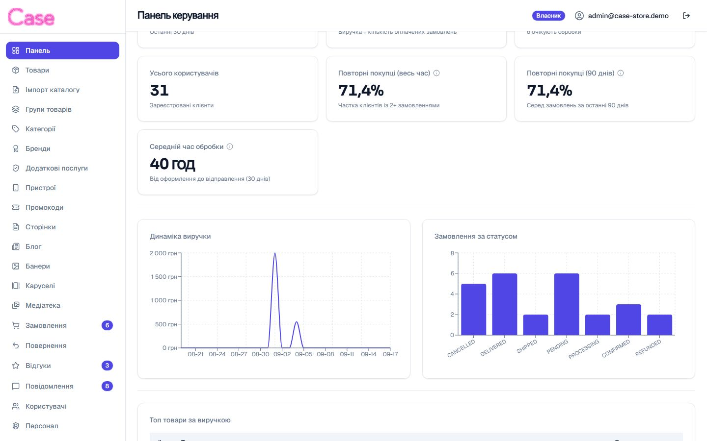

### Графіки й таблиці

- **Динаміка виручки** — як змінювалася виручка по днях.
- **Замовлення за статусом** — скільки замовлень у кожному статусі.
- **Топ товари за виручкою** — що найкраще продається; клік відкриває картку товару.
- **Низький запас** — товари, що закінчуються (колонки «Товар», «Варіант», «Артикул», «Вільний
  залишок»). **«Розпродано»** — першими; ≤ 2 шт — червоний бейдж, ≤ 5 — жовтий.
- **Останні замовлення** — свіжі замовлення з переходом на картку.
- **Відвідуваність** — цифри за 7 днів із сервісу аналітики Umami: «Відвідувачі», «Перегляди
  сторінок», «Пішли одразу», «Середній візит», із порівнянням до попередніх 7 днів, і посилання
  **Відкрити Umami**. «Ще не підключено» — аналітику не налаштовано; «Дані аналітики зараз
  недоступні» — Umami не відповідає. Як читати ці цифри — розділ [22](#22-analityka).

Унизу — **Швидкі дії**: «Додати товар», «Переглянути замовлення», «Керувати користувачами»
(кожна — якщо є відповідне право). Час останнього оновлення показано вгорі.

### Що перевіряти

- **Щодня:** блок **«Потребує дії»**, нові **повідомлення** (лічильник у меню, розділ
  [15](#15-povidomlennya)) і розділ **Повернення** (для нових заявок плитки немає — розділ
  [9а](#9a-povernennya)).
- **Щотижня:** динаміку виручки, топ-товари й **низький запас** (що замовити на склад).

⚠️ **Підводні камені**

- **Виручка рахується лише за ОПЛАЧЕНИМИ замовленнями.** Якщо забувати позначати оплату
  (розділ [9](#9-zamovlennya)), дашборд занижуватиме доходи, а «зароблене» опиниться в
  «Очікуваній виручці».
- **«Очікувана виручка» — це ще не гроші в касі.**
- **Плитка «Довго в очікуванні» веде на всі нові замовлення**, а не лише на прострочені, тож
  у списку рядків буде більше, ніж на плитці. Щоб побачити саме прострочені, увімкніть у списку
  перемикач **«Чекають занадто довго»** (TASK-723).
- **Плитка «Очікують оплати»** вмикає фільтр, якого в списку замовлень не видно; щоб
  повернутися до повного списку, відкрийте «Замовлення» з меню.

> Технічні деталі: TASK-137 (оплачена й очікувана виручка), TASK-248/251 («Потребує дії»),
> TASK-249 (середній чек, повторні покупці), TASK-253 (низький запас), TASK-380 (цифри
> відвідуваності), TASK-446/470 (плитки накрутки й недоступних позицій).

---

## 21. Порядок дій перед запуском

Цей короткий чек-лист власник (без програміста) проходить **перед відкриттям магазину** — і
окремо **перед тестовим розгортанням**. Пройдіть пункти згори вниз.

1. **Адреса сайту (просіть розробника).** Розробник має вказати правильну адресу вашого
   сайту в налаштуваннях сервера. Без цього посилання, карта сайту, посилання для покупців і
   прев'ю в соцмережах працюватимуть неправильно. Це технічний крок — ви лише переконайтеся,
   що його зроблено.
2. **Назва магазину й логотип.** Впишіть **Назву магазину** й завантажте **логотип** у розділі
   **SEO** (розділи [18](#18-seo), [27](#27-nazva-magazynu)).
3. **Наповніть каталог.** Створіть **категорії** (розділ [4](#4-kategorii)) і **товари** з
   фото, ціною та залишком (розділ [3](#3-tovary)) — або імпортуйте прайс
   ([3а](#3a-import)). Не забудьте **опублікувати** товари.
4. **Заповніть контакти.** Телефон, пошту, графік і месенджери (розділ [17](#17-kontakty)) —
   вони показуються у футері й на сторінці контактів.
5. **Опублікуйте сторінки.** Юридичні — оферта, політика конфіденційності, умови повернення;
   довідкові — «Доставка», «Оплата», «Гарантія», «Про нас» (розділ [12](#12-storinky)).
   Юридичні тексти готує юрист — див. [legal-checklist.md](legal-checklist.md).
6. **Перевірте FAQ.** Додайте/відредагуйте кілька частих запитань (розділ [19](#19-faq)) —
   вони видно й на кожній картці товару.
7. **Головна сторінка.** Додайте свої **банери** (розділ [14](#14-banery)) і **каруселі**
   («Хіти», «Новинки» — розділ [14а](#14a-karuseli)). Порожні слоти банерів покажуть запасний
   варіант, але краще — ваш.
8. **SEO за замовчуванням (необов'язково).** За бажанням заповніть опис сайту й шаблон
   заголовка (розділ [18](#18-seo)). Можна пропустити — SEO працює й без цього.
9. **Персонал.** Якщо з вами працюватимуть люди — створіть їм акаунти й видайте права
   (розділ [10а](#10a-hto-shcho-mozhe)).
10. **Тестове замовлення.** Оформіть одне пробне замовлення від імені покупця, проведіть його
    через статуси й **позначте оплату** (розділ [9](#9-zamovlennya)) — і перевірте, що
    **дашборд** (розділ [20](#20-dashbord)) відреагував.
11. **Перевірте заголовок сторінки.** Відкрийте на сайті будь-який товар і гляньте на вкладку
    браузера — там має бути назва вашого магазину (напр. «Чохол для iPhone 15 | Ваша назва»).
12. **Промокод (за бажанням).** Створіть стартовий промокод для відкриття (розділ
    [11](#11-promokody)) — пам'ятайте, що активний код видно всім на сторінці «Акції».

> **Готово.** Після цих кроків магазином можна користуватися. Якщо десь застрягли або
> побачили незрозумілу помилку — не «лагодьте» через базу даних, а зверніться до розробника
> й опишіть, що саме робили.
>
> **Це чек-лист по наповненню.** Технічна частина запуску (бекапи, моніторинг, доступи) —
> окремо, у [deploy/09-pre-launch.md](deploy/09-pre-launch.md). Ви робите цей список,
> розробник — той.

---

## 22. Аналітика

Відвідуваність вітрини та поведінку покупців збирає окремий сервіс **Umami** (він має свій
власний інтерфейс — не плутати з дашбордом адмінки). Магазин надсилає до нього шість подій:
`view_product`, `add_to_cart`, `begin_checkout`, `purchase`, `search`, `newsletter_subscribe`.

Швидкий перехід до Umami є прямо з дашборда адмінки — картка **«Відвідуваність»** (розділ
[20](#20-dashbord)). Якщо на картці написано «Ще не підключено» — посилання ще не налаштоване,
зверніться до розробника. Логін і пароль до самого Umami також надає розробник.

### Що таке візит і унікальний відвідувач

- **Унікальний відвідувач** — одна людина, яка заходила на сайт (точніше — один браузер на
  одному пристрої; про цю тонкість нижче).
- **Візит** — один «прихід» на сайт. Та сама людина зайшла зранку і ще раз увечері — це **один
  відвідувач**, але **два візити**. Тому візитів завжди щонайменше стільки ж, скільки
  відвідувачів, зазвичай — більше.
- **Перегляди сторінок** — скільки сторінок відкрили за всі візити разом. Одна людина, що
  подивилася п'ять товарів, дає п'ять переглядів.

### Що таке конверсія

**Конверсія** — це частка відвідувачів, які дійшли до потрібної дії. Для магазину головна дія —
оформлене замовлення (подія `purchase`). Приклад: за тиждень сайт відвідали 200 людей, з них 6
оформили замовлення — конверсія 3 %. Для інтернет-магазинів нормальні значення — **одиниці
відсотків**; конверсія 1–3 % — не «зламаний сайт», а звичайна картина. Важливіше стежити, чи
вона росте або падає з часом, ніж за самим числом.

### Як читати воронку

Воронка (як її налаштувати — у підрозділі «Налаштування воронки» нижче) показує шлях покупця за
чотирма кроками: **перегляд товару → додавання в кошик → початок оформлення → замовлення**. На
кожному наступному кроці людей менше — це нормально, так виглядає будь-який магазин.

Дивитися треба на те, **де найбільший «обрив»** між сусідніми кроками:

- багато переглядають товари, але мало додають у кошик — питання до ціни, фото чи опису товару;
- додають у кошик, але не починають оформлення — можливо, відлякує вартість доставки або щось у
  кошику незрозуміло;
- починають оформлення і кидають — придивіться до форми оформлення: чи не задовга, чи все
  зрозуміло.

Починайте з кроку, де втрачається найбільше людей, — там найбільший резерв для покращення.

### Які події надсилає магазин

| Подія                  | Коли спрацьовує                                                  |
| ---------------------- | ---------------------------------------------------------------- |
| `view_product`         | Покупець відкрив сторінку товару.                                |
| `add_to_cart`          | Додав товар у кошик (кнопка «Додати в кошик»).                   |
| `begin_checkout`       | Відкрив сторінку оформлення замовлення з товарами в кошику.      |
| `purchase`             | Оформив замовлення (сторінка підтвердження; передається і сума). |
| `search`               | Скористався пошуком на сайті (передається пошуковий запит).      |
| `newsletter_subscribe` | Підписався на розсилку новин.                                    |

Перші чотири — це і є кроки воронки; `search` і `newsletter_subscribe` — додаткові сигнали
інтересу, у воронку вони не входять.

### Чому цифри Umami не збігаються з дашбордом адмінки

Кількість подій `purchase` в Umami **ніколи точно не збігатиметься** з кількістю замовлень у
дашборді адмінки — і це не помилка. Причини:

- **Блокувальники реклами.** Частина покупців користується блокувальниками, які вирізають
  лічильник Umami. Такі люди для аналітики невидимі, але їхні замовлення в адмінці справжні —
  тому замовлень в адмінці може бути навіть **більше**, ніж подій `purchase` в Umami.
- **Боти й пошукові роботи.** Сайт постійно обходять роботи; Umami намагається їх відсіювати,
  але ідеально це не виходить — тому «сирі» візити можуть бути трохи завищені.
- **Кілька пристроїв — кілька «відвідувачів».** Одна людина з телефона і з ноутбука — це два
  різні відвідувачі для Umami (вона не знає, що це та сама людина). Замовлення ж в адмінці
  прив'язане до конкретного покупця.

Висновок простий: **Umami — про тенденції** (більше чи менше людей, де вони «відвалюються»),
а **точні гроші й замовлення — у дашборді адмінки** (розділ [20](#20-dashbord)). Розбіжність у
межах десятків відсотків — нормальна і очікувана, «лагодити» її не треба.

### Налаштування воронки

Воронка показує, на якому кроці покупці «відвалюються» між переглядом товару й оплатою.
Налаштовується один раз в інтерфейсі Umami:

1. Відкрийте Umami й увійдіть.
2. Перейдіть у **Reports** (Звіти) → **Create report** (Створити звіт) → **Funnel** (Воронка).
3. Оберіть свій сайт (website) угорі.
4. Додайте **чотири кроки** типу **Event**, саме в такому порядку:
   1. `view_product` — перегляд картки товару;
   2. `add_to_cart` — додавання в кошик;
   3. `begin_checkout` — початок оформлення;
   4. `purchase` — оформлене замовлення.
5. Збережіть звіт (**Save**). Далі Umami сам рахує, скільки відвідувачів дійшло до кожного кроку.

---

_На цьому посібник завершено: частини 1 (каталог і продажі) та 2 (контент, комунікації й
налаштування) разом охоплюють усю адмін-панель — від першого входу до відкриття магазину._

---

## 23. Підтвердження сайту в Google (Search Console)

### Навіщо це потрібно

**Google Search Console** — безплатний кабінет від Google для власників сайтів. Без
підтвердження власності ви не бачите, **як Google бачить ваш магазин**: скільки сторінок
потрапило в пошук, за якими запитами люди вас знаходять, скільки переходів із пошуку і чи є
помилки. Підтвердження робиться один раз і займає 10–15 хвилин; нічого «зламати» тут не можна.

### Крок 1 — реєстрація в Search Console

1. Відкрийте `search.google.com/search-console` і увійдіть у Google-акаунт (підійде звичайний
   Gmail; краще той, до якого ви маєте постійний доступ).
2. Натисніть **«Додати ресурс»** (Add property).
3. Google запропонує два типи. Оберіть **«Префікс URL-адреси»** (URL prefix) — **не «Домен»**:
   тип «Домен» вимагає налаштувань DNS у реєстратора домену, а це складніший шлях, який тут не
   потрібен.
4. Введіть повну адресу магазину (наприклад, `https://casestore.ua/`) і натисніть «Далі».

### Крок 2 — спосіб підтвердження «HTML-тег»

1. У списку способів підтвердження оберіть **«Тег HTML»** (HTML tag).
2. Google покаже рядок на кшталт
   `<meta name="google-site-verification" content="AbCdEf…" />`. Скопіюйте **весь цей рядок
   або лише значення `content`** (довгий код між лапками) — **обидва варіанти працюють**:
   форма сама виріже з тегу потрібну частину.
3. В адмінці відкрийте **SEO-налаштування** (розділ [18](#18-seo), адреса `/settings/seo`),
   вставте скопійоване в поле **«Код підтвердження Google Search Console»** і натисніть
   **Зберегти SEO-налаштування**.
4. Поверніться в Search Console і натисніть **«Підтвердити»** (Verify). Якщо Google пише, що
   тег не знайдено, — зачекайте 5–10 хвилин і спробуйте ще раз (сайту треба час оновитися).

**Не видаляйте код після підтвердження** — Google періодично переперевіряє його. Поле має
лишатися заповненим постійно.

### Крок 3 — надіслати sitemap.xml

`sitemap.xml` — це «мапа» всіх сторінок магазину, за якою Google швидше знаходить нові товари
й категорії. Вона вже формується автоматично — треба лише повідомити Google, де вона:

1. У Search Console зліва відкрийте **Індексування → Файли Sitemap**.
2. У полі «Додати файл Sitemap» введіть `sitemap.xml` і натисніть **«Надіслати»**.
3. Статус має стати «Оброблено» (Success) — інколи через кілька годин, це нормально.

Перевірити, що мапа працює, можна й самостійно: посилання на живий `/sitemap.xml` є на
сторінці SEO-налаштувань у блоці «SEO-здоров'я» (розділ [18](#18-seo)).

### Що перевіряти перші 4 тижні

- **Індексування → Сторінки (Покриття):** кількість «Проіндексованих» сторінок має поступово
  рости. Окремі «недопущені» сторінки (кошик, оформлення) — це нормально, вони й не мають бути
  в пошуку.
- **Ефективність:** тут з'являться покази і кліки з пошуку Google. **Не панікуйте через нулі в
  перший тиждень** — Google потрібен час (зазвичай 2–4 тижні), щоб просканувати й почати
  показувати магазин.
- **Помилки:** якщо Search Console пише про помилки сканування на багатьох сторінках —
  перешліть повідомлення розробнику.

### Bing (опційно)

Те саме можна зробити для **Bing Webmaster Tools** — пошукової системи Microsoft
(альтернатива Google): зайдіть на `www.bing.com/webmasters`, додайте сайт, оберіть
метатег-спосіб підтвердження і вставте код у поле **«Код підтвердження Bing Webmaster
Tools»** на тій самій формі SEO-налаштувань. Пріоритет нижчий, ніж Google, — робіть, коли
буде час.

⚠️ **Підводні камені**

- **Оберіть саме «Префікс URL-адреси», а не «Домен».** Інструкції з інтернету часто описують
  DNS-спосіб (TXT-запис у реєстратора домену) — він теж існує, але потребує доступу до
  налаштувань домену; наш спосіб через адмінку простіший.
- **Не переплутайте поля:** код із Google — у поле Google, код із Bing — у поле Bing. Якщо
  вставити не туди, нічого не зламається — просто підтвердження не спрацює; виправте і
  збережіть ще раз.
- **Код — не секрет,** але й не видаляйте його з форми після підтвердження.

> Технічні деталі: TASK-280 (верифікація пошукових консолей), plan 146.

---

## 24. Google Merchant Center (безплатні товарні оголошення)

### Навіщо це потрібно

**Google Merchant Center** — безплатний кабінет від Google, через який ваші товари
потрапляють у вкладку **«Покупки» (Shopping)** пошуку Google — з фото, ціною та наявністю.
Це **не реклама і не потребує оплати**: Google показує такі картки у «безплатних товарних
оголошеннях» (free listings). Для нового магазину це зазвичай **найшвидше джерело
відвідувачів** — картки товарів з'являються за днів, тоді як звичайне «підняття» в пошуку
займає тижні й місяці.

Сайт уже все підготував автоматично: за адресою `https://<адреса вашого магазину>/merchant-feed.xml`
постійно доступний **фід** — спеціальний файл зі списком усіх активних товарів (назва, опис,
фото, ціна, наявність, бренд). Вам треба лише один раз зареєструватися і дати Google це
посилання.

### Крок 1 — реєстрація в Merchant Center

1. Відкрийте `merchants.google.com` і увійдіть у **той самий Google-акаунт**, яким ви
   підтверджували сайт у Search Console (розділ [23](#23-search-console)) — так буде менше
   зайвих кроків.
2. Натисніть **«Зареєструватися» / «Почати»** і дайте відповіді на запитання майстра: назва
   бізнесу, країна — **Україна**, адреса сайту магазину (повна, з `https://`).
3. Якщо майстер питає, **де ви продаєте** — оберіть «на своєму сайті» (On my website);
   онлайн-оплата чи самовивіз тут ні на що не впливають.

### Крок 2 — підтвердження права власності на сайт

Merchant Center має пересвідчитися, що сайт справді ваш. Якщо ви вже пройшли підтвердження в
**Search Console** (розділ [23](#23-search-console)) **з того самого Google-акаунта**,
Merchant Center зазвичай підхоплює його автоматично — сайт одразу показується як
підтверджений, і цей крок можна пропустити.

Якщо ж Merchant Center просить підтвердження окремо — оберіть спосіб **«HTML-тег»** і зробіть
точно ті самі дії, що описані в кроці 2 розділу [23](#23-search-console): скопіювати код,
вставити в поле на сторінці SEO-налаштувань адмінки, зберегти, натиснути «Підтвердити». Одне
й те саме підтвердження працює і для Search Console, і для Merchant Center.

### Крок 3 — подати фід із товарами

1. У Merchant Center зліва відкрийте **Товари → Фіди** (Products → Feeds) і натисніть
   **«Додати фід»** (кнопка «+»).
2. Країна — **Україна**, мова — **українська**.
3. Як спосіб додавання оберіть **«Запланована вибірка» (Scheduled fetch)** — тобто «Google сам
   періодично забирає файл за посиланням». **Не** обирайте «Google Таблиці» чи завантаження
   файлу вручну.
4. У поле адреси файлу вставте: `https://<адреса вашого магазину>/merchant-feed.xml`
   (наприклад, `https://casestore.ua/merchant-feed.xml`). Періодичність — раз на день,
   час — будь-який.
5. Збережіть і натисніть **«Отримати зараз» / «Fetch now»**, щоб не чекати першого
   розкладу. За кілька хвилин у вкладці фіду з'явиться кількість оброблених товарів.

### Як це оновлюється далі

- **Нічого робити вручну не треба.** Фід формується з каталогу автоматично: додали чи змінили
  товар в адмінці — за годину-другу оновлений список уже доступний Google (файл кешується
  приблизно на 1 годину), а Merchant Center сам перечитує його за своїм розкладом (зазвичай
  щодня).
- До фіду потрапляють лише **активні** товари, у яких є **фото і коректна ціна**. Товар без
  фото у фід не включається — це захист, щоб Google не відхилив увесь список; додайте фото, і
  товар з'явиться при наступному оновленні.
- Час від часу (раз на 1–2 тижні) заглядайте в Merchant Center у розділ **Товари**: якщо
  біля якихось позицій статус «Відхилено» (Disapproved) — відкрийте причину. Найчастіше це
  якість фото або невідповідність ціни на сайті; якщо причина незрозуміла — перешліть текст
  помилки розробнику.

⚠️ **Підводні камені**

- **Не плутайте з рекламою.** Merchant Center сам по собі безплатний; платні кампанії
  (Performance Max / Shopping ads) — окрема необов'язкова надбудова, яку тут вмикати не треба.
- **Фід дивитися в браузері не обов'язково.** Якщо відкриєте `/merchant-feed.xml` — побачите
  «технічний» текст із тегами; це нормально, він призначений для Google, а не для людей.
- **Порожній фід** (0 товарів) означає, що в каталозі немає активних товарів із фото та
  ціною, — або що сайт тимчасово недоступний; спробуйте пізніше й перевірте каталог.
- **Перші дні можливий статус «На розгляді» (Pending)** — Google перевіряє новий магазин до
  кількох робочих днів; це нормально, просто зачекайте.

> Технічні деталі: TASK-281 (фід Merchant Center), plan 148.

---

## 25. Робота зі списками: пошук, сортування, оновлення, масові дії

Товари, замовлення, звернення, відгуки, статті, банери — усе це списки, і всі вони
влаштовані однаково. Розберіться один раз тут, і далі будь-який розділ панелі буде
зрозумілий без окремих пояснень.

### Рядок над таблицею

Над кожним списком є один рядок, у якому зліва направо: **поле пошуку**, **фільтри**
(де вони доречні) і кнопка **«Оновити»** справа. Активні фільтри видно чипами — кожен можна
прибрати хрестиком, усі одразу — **«Скинути фільтри»**. Клавіша **Escape** очищає пошук.

### Кнопка «Оновити» — навіщо вона

Панель не перезапитує дані щоразу: відкритий список якийсь час показує те, що завантажив.
Це зроблено навмисно, щоб не смикати сервер, але має наслідок — якщо **хтось інший**
щойно змінив дані, ви цього не побачите.

«Хтось інший» — це не лише другий оператор. Це і покупець, який щойно оформив замовлення,
і банк, який підтвердив оплату, і фонова задача, яка скасувала неоплачене замовлення.

Тому: **побачили щось дивне — спершу натисніть «Оновити», а вже потім розбирайтесь.**
Половина «зниклих» замовлень виявляється просто застарілим екраном. Найважливіші списки
(замовлення, звернення, відгуки, повернення) до того ж підтягуються самі, коли ви
повертаєтесь у вкладку.

### Сортування

Якщо заголовок колонки — **клікабельний**, за нею можна сортувати: перший клік дає
спадання, другий — зростання, поруч зʼявляється стрілка. Сортують не всі списки, а ті,
де це має сенс: **товари, замовлення, повернення, клієнти, персонал, промокоди, звернення,
підписники, журнал дій**.

Вибране сортування **потрапляє в адресу сторінки**. Отже: воно переживає перезавантаження,
і посилання можна просто скинути колезі — він побачить той самий екран. Це ж стосується
пошуку, фільтрів і номера сторінки.

### Сторінки

Унизу списку — «Сторінка N з M» і кнопки **«Попередня»** / **«Наступна»**. Поруч — перемикач
**«Рядків»**: 20, 50 або 100 на сторінці. Зміна пошуку чи фільтра завжди повертає вас на першу
сторінку: інакше ви б дивились на пусту пʼяту сторінку нового пошуку й вирішили, що нічого не
знайшлось.

### Масові дії

У списках **товарів**, **відгуків** і **звернень** зліва від кожного рядка є галочка (у
**дереві категорій** — теж, зі своїми кнопками «Активувати (N)» / «Деактивувати (N)»).

- Галочка в шапці вибирає **всі рядки на поточній сторінці**.
- Щоб вибрати діапазон, поставте галочку на першому рядку й **із затиснутим Shift**
  клацніть на останньому.
- Коли щось вибрано, унизу зʼявляється смуга з кнопками дій і кількістю вибраного.
- Усе це працює і з клавіатури: `Tab` до галочки, `Пробіл`, `Shift`+`↑`/`↓` для діапазону.

Які дії де:

| Список    | Масові дії                                                      |
| --------- | --------------------------------------------------------------- |
| Товари    | Активувати · Деактивувати · Перемістити до групи · Задати колір |
| Відгуки   | Схвалити · Відхилити текст                                      |
| Звернення | В роботу · Прочитано · В архів                                  |
| Категорії | Активувати · Деактивувати                                       |

### Списки з перетягуванням

У семи місцях порядок рядків = порядок на сайті, і змінюється він **перетягуванням** (за
значок ліворуч) або з клавіатури (`Пробіл` — узяти, стрілки — перемістити, `Enter` —
підтвердити, `Escape` — скасувати):

- **дерево категорій** (ще й рівень вкладеності — розділ [4](#4-kategorii));
- **бренди пристроїв**;
- **службові сторінки**;
- **категорії блогу**;
- **банери** (окремо в кожному розташуванні);
- **каруселі** (окремо в кожному місці);
- **FAQ**.

Після переміщення є кнопка **«Скасувати останнє переміщення»**. Якщо поки ви тягнули, список
змінив хтось інший, панель скасує переміщення й попросить повторити.

⚠️ **Підводні камені**

- **Відхилення відгуку НЕ видаляє його.** Текст зникає з сайту, оцінка лишається в рейтингу,
  відгук переходить на вкладку «Відхилені» (розділ [9б](#9b-vidguky)). Перед масовим
  відхиленням панель однаково перепитує й називає кількість.
- **Дія застосовується лише до рядків на видимій сторінці.** Якщо ви вибрали рядки,
  перегорнули сторінку й натиснули кнопку — спрацює те, що видно зараз. Так зроблено
  навмисно: масова дія над тим, чого ви не бачите на екрані, — це те, про що потім шкодують.
- **Банери, категорії блогу, бренди пристроїв, каруселі, FAQ і службові сторінки не мають
  сторінок — і це не помилка.** Перетягувати можна лише повний список: якби він був розбитий на
  сторінки, порядок зіпсувався б. З тієї ж причини, **поки активний пошук** (а для сторінок —
  ще й вкладка з видом), перетягування **тимчасово блокується** — приберіть пошук.

> Технічні деталі: епік TASK-292 (TASK-353…358), plan 168; TASK-423 (єдиний пошук і розмір
> сторінки); TASK-428 (перетягування сторінок, FAQ, каруселей).

---

## 26. Пошук по магазину

### Що це

Пошук, яким користуються покупці (поле в шапці сайту й сторінка результатів), працює не
прямо по базі, а через **окремий швидкий покажчик товарів**. Зазвичай він оновлюється
сам: щоразу, коли ви зберігаєте товар, переносите категорію або магазин перезапускається.
У панелі для нього є один екран — **Пошук** у нижній групі бічного меню, поряд із **SEO**
і **FAQ**. На ньому одна кнопка: **«Перебудувати покажчик»**.

Натискайте її, коли покупці не знаходять товар, який точно є в каталозі; одразу після
імпорту великого списку товарів; після переїзду на інший сервер або відновлення бази з
резервної копії. Це безпечно й доступно будь-коли: поки триває перебудова, пошук
продовжує працювати на старих даних, а для великого каталогу вона може зайняти до
хвилини. Успіх видно з повідомлення **«Покажчик оновлено: N товарів»**.

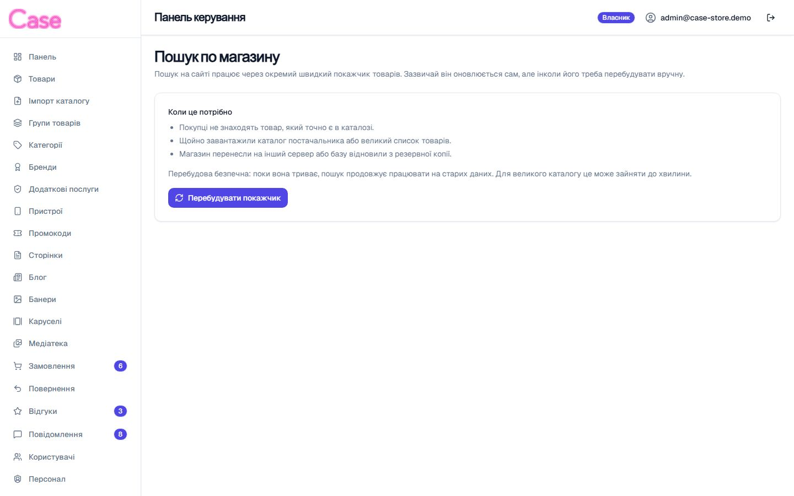

### Що важливо знати

Усе інше про пошук — що саме потрапляє в покажчик (лише товари, без блогу й артикулів),
чому він прощає помилки в словах, як працюють синоніми «чохол ↔ case», чому один товар
стоїть вище за інший і покроковий чекліст **«чому товар не знаходиться»** — зібрано в
окремому посібнику: **[search-guide.md](search-guide.md)**.

> Технічні деталі: TASK-075 (пошук і покажчик), TASK-376 (перебудова не очищує покажчик),
> TASK-377 (екран у панелі), TASK-438 (посібник).

---

## 27. Де міняти назву магазину

Назва магазину з'являється в багатьох місцях, і не всі вони змінюються з панелі. Нижче —
повний і чесний перелік: що ви міняєте самі за одну хвилину, а що доведеться попросити в
розробника.

### Одне поле в панелі: **SEO → «Назва магазину»**

Відкрийте **SEO** в нижній частині меню. «Назва магазину» — перше поле форми (під блоками
«SEO-здоров'я» і «Логотип магазину»). Введіть назву, натисніть **«Зберегти SEO-налаштування»**
— і зміни видно на сайті **одразу**, без перезапуску. Саме звідси назва потрапляє:

- у **заголовок вкладки браузера** на кожній сторінці (`Чохол для iPhone | Ваша назва`);
- у **прев'ю посилання**, коли магазин поширюють у Facebook, Telegram, Viber тощо;
- у **машинну розмітку** для Google і AI-асистентів (ChatGPT, Perplexity) — те, за якою
  назвою вони цитують ваш магазин;
- у файл **`/llms.txt`** — коротку «візитівку» магазину для AI-асистентів;
- у **товарний фід Google Merchant Center** — назву джерела фіда і виробника для товарів,
  у яких не вказано бренд;
- у назву застосунку, якщо покупець додає сайт на головний екран телефона.

Порожнє поле — не помилка: тоді магазин показує стандартну назву, вбудовану в код. Тобто
безпечно спершу подивитись, що є, і лише потім щось змінювати.

### Що **не** змінюється цим полем

| Де                                            | Хто змінює                                                                                                                              |
| --------------------------------------------- | --------------------------------------------------------------------------------------------------------------------------------------- |
| **Напис у логотипі** (шапка й підвал сайту)   | Поки що **розробник, у коді**. Якщо ви завантажили логотип-картинку (**SEO → Логотип магазину**), напис у ній теж не залежить від поля. |
| **Адреса й підпис відправника листів**        | Змінна оточення `MAIL_FROM` **на сервері** — не поле в панелі. Просіть розробника або того, хто адмініструє сервер.                     |
| **Текст самих листів**                        | Шаблони листів написані нейтрально («у нашому магазині»), назви в них немає — міняти нічого не треба.                                   |
| **Доменне ім'я** (адреса сайту)               | Налаштування домену в реєстратора й на сервері — див. `docs/deploy/02-domain-dns.md`.                                                   |
| **Юридична назва ФОП/ТОВ у правових текстах** | Ви самі, але в іншому місці: **Сторінки → Юридичні** (оферта, політика конфіденційності) — це реквізити продавця, а не назва бренду.    |

### Порада

Якщо ви перейменовуєте магазин повністю, пройдіть цим списком по порядку: поле в панелі →
логотип (розробник) → `MAIL_FROM` (сервер) → правові сторінки. Інакше покупець побачить
одну назву у вкладці браузера, іншу в логотипі й третю в листі — і це виглядає як чужий
сайт.

> Технічні деталі: TASK-433 (`SeoSettings.siteName` як єдине джерело для серверних
> поверхонь; напис у логотипі — окрема задача), plan 176.
