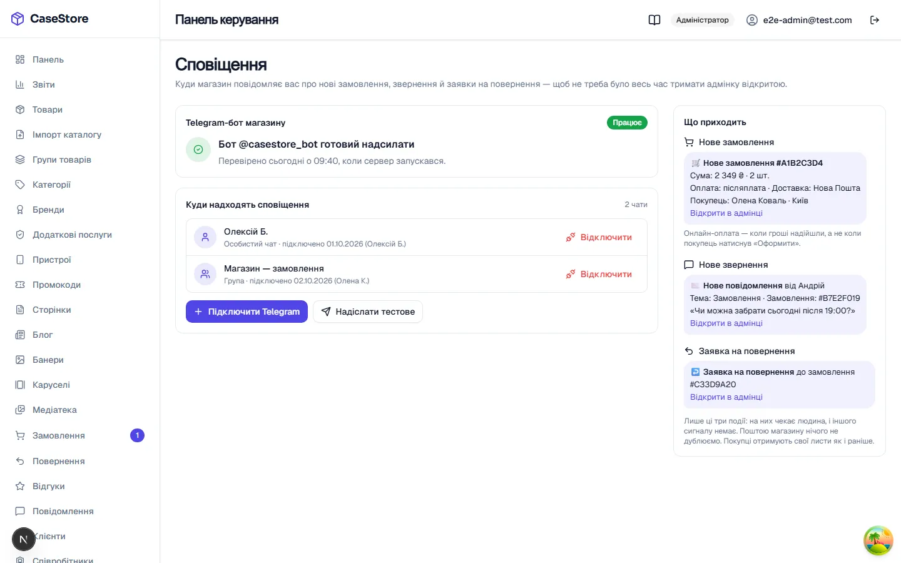
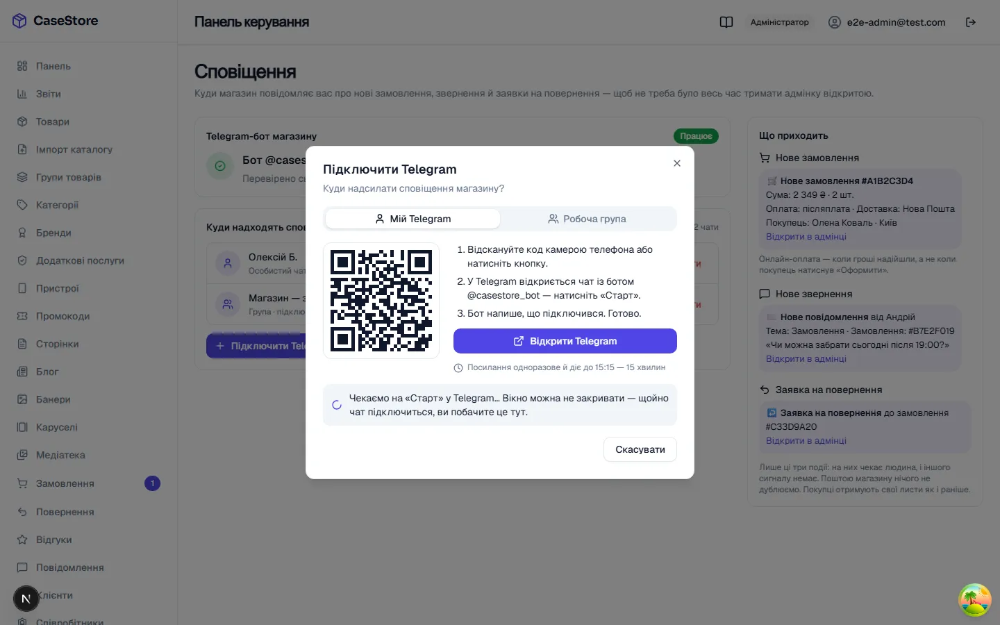
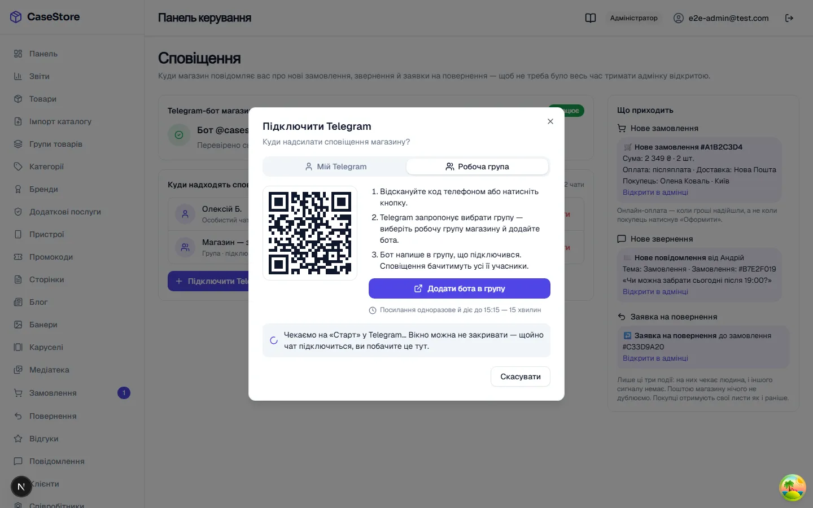
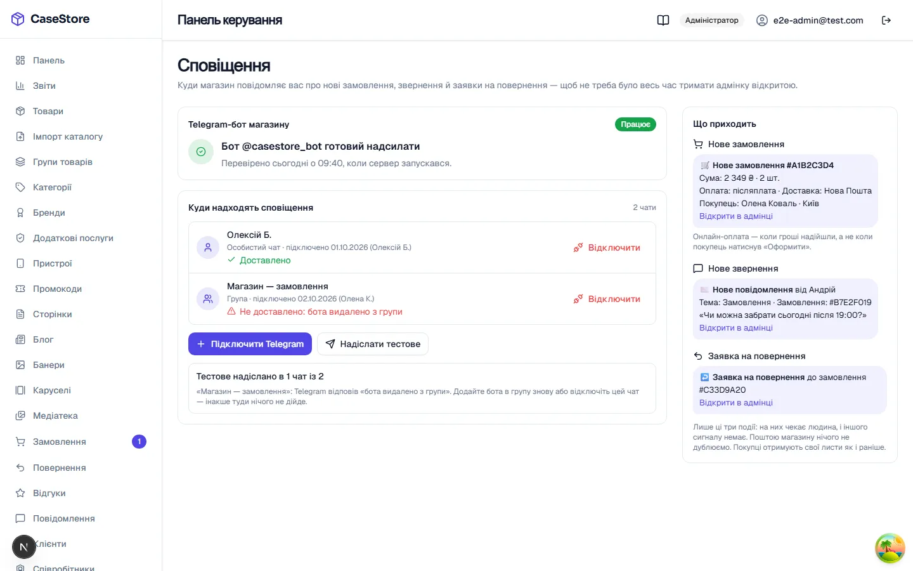
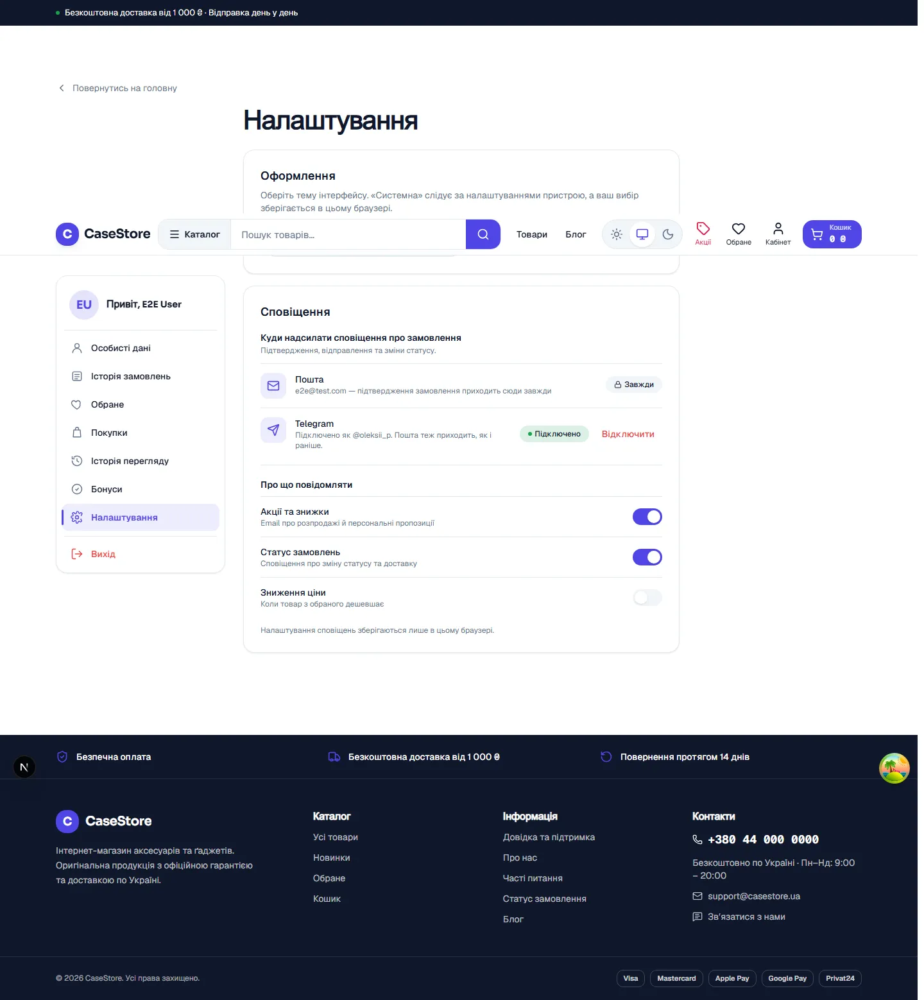
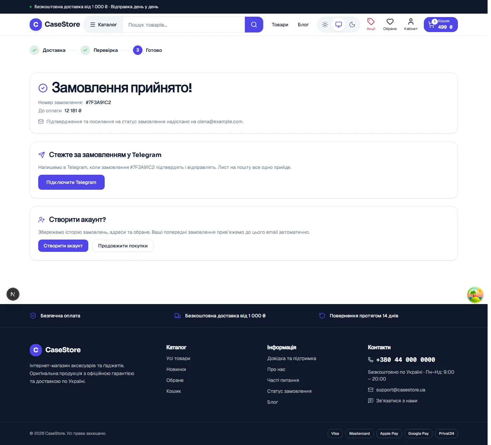

# 5b. Сповіщення в Telegram: бот магазину (TASK-674…681)

**Коли робити:** після першого вдалого деплою (крок 5). Спершу на **staging** із тестовим
ботом, потім на проді з бойовим.
**Скільки часу:** ~20 хвилин. Половина з них іде на те, щоб натиснути «Старт» у двох чатах і
переконатися, що повідомлення дійшли.
**Що буде, якщо пропустити:** магазин працює, покупці отримують листи, а **ви про нове
замовлення не дізнаєтесь, доки самі не відкриєте адмінку**. Покупець у кабінеті бачить замість кнопки
Telegram «Тимчасово недоступно», а гостю картку Telegram не показують зовсім. Нічого не
падає, але й нічого не нагадує.

> **Хто що робить.** Кроки 1 і 3–9 — власник: телефон із Telegram і браузер. Крок 2 —
> розробник (позначено 🔧): токен — це секрет, і він лягає на сервер разом з іншими
> секретами.

---

## 0. Як це влаштовано, за хвилину

- **Один бот на весь магазин.** Він пише **вам** про три події: нове замовлення, нове
  звернення з форми «Контакти» і нову заявку на повернення. **Покупцям**, які його
  підключили, він пише, що замовлення прийнято і що його відправлено.
- **Пошта лишається.** Лист-підтвердження покупцю йде **завжди**, хоч би що відбувалося з
  Telegram. Telegram — це додатковий канал, він нічого не заміняє. Вам поштою магазин нічого
  не дублює: для вас лише Telegram.
- **Чати підключаються в адмінці, а не на сервері.** На сервері лежить лише токен бота. Які
  чати отримують сповіщення, ви вирішуєте самі на екрані **«Сповіщення»**, кнопкою й QR-кодом.
- **Бот сам питає Telegram, чи є нові «Старт»**, кожні 10 секунд. Окремий домен, вебхук чи
  відкритий порт для цього не потрібні.

> ⚠ **Один бот — один сервер.** Staging, прод і ноутбук розробника мусять мати **різних**
> ботів. Якщо два сервери працюють з одним токеном, вони по черзі «перехоплюють» натискання
> «Старт». Той, кому посилання не належить, відповідає «Посилання недійсне або прострочене»,
> і чат не підключається. Помилки при цьому ніде не видно: кожен сервер вважає себе правим.

---

## 1. Створіть бота в @BotFather

**@BotFather** — офіційний бот Telegram, який створює інших ботів. Спершу зробіть **тестового**
бота для staging. Бойового для проду зробите так само в кроці 10.

1. У Telegram знайдіть **@BotFather**: біля імені має бути синя галочка. Натисніть «Старт».
2. Надішліть `/newbot`.
3. **Ім'я** (його бачать люди в заголовку чату). Для тестового — напр. `CaseStore TEST`. Для
   бойового — назва магазину, напр. `CaseStore — сповіщення`: його бачитимуть **покупці**.
4. **Username** — латиницею, **закінчується на `bot`**, напр. `casestore_test_bot`. Якщо ім'я
   зайняте, BotFather попросить інше.
5. BotFather відповість повідомленням з **токеном** виду `123456789:AAH…`. Скопіюйте його в
   менеджер паролів (див. [01-accounts-access.md](01-accounts-access.md)) як запис
   «Telegram-бот staging».

**Перевірка:** посилання `t.me/<username>` з відповіді BotFather відкриває чат із ботом, і
внизу кнопка «Старт». **Не натискайте її зараз.** Без сервера бот ще нічого не відповість.

### Необов'язково, але корисно

Надсилайте ці команди в @BotFather. Кожна спершу питає, якого бота змінювати.

| Команда           | Що робить                                                                                                                              | Що поставити                    |
| ----------------- | -------------------------------------------------------------------------------------------------------------------------------------- | ------------------------------- |
| `/setuserpic`     | аватар бота. Покупець бачить його поруч із повідомленнями                                                                              | логотип магазину                |
| `/setdescription` | текст у порожньому чаті **до** «Старт»                                                                                                 | «Сповіщення магазину CaseStore» |
| `/setjoingroups`  | чи можна додати бота в групу. Потрібно для кроку 5                                                                                     | **Enable** (так і є спочатку)   |
| `/setprivacy`     | чи читає бот усі розмови групи. **Не вимикайте.** Боту не треба читати вашу групу, а команду підключення Telegram доставляє йому й так | **Enable** (так і є спочатку)   |

**Перевірка:** `/mybots` → ваш бот → **Bot Settings** → **Allow Groups?** показує «Groups are
currently enabled», а **Group Privacy** — «Privacy mode is enabled».

---

## 2. 🔧 Покладіть токен на сервер

Змінна одна: **`TELEGRAM_BOT_TOKEN`**. Довідка про неї — у
[04a-env-matrix.md](04a-env-matrix.md), розділ «Сповіщення в Telegram». Вона читається
**під час роботи**, тож перезбирати образи не треба, досить перезапуску. Це той самий клас, що
й ключі Нової Пошти та LiqPay.

**Звичайний шлях — через секрет GitHub** (так само, як у [04-secrets-ci.md](04-secrets-ci.md)
§7):

1. GitHub → репозиторій → **Settings → Environments → `staging` → Secrets**.
2. Відкрийте **`STAGING_ENV_FILE`** і додайте або виправте рядок:

   ```bash
   TELEGRAM_BOT_TOKEN=123456789:AAH…
   ```

   Секрет можна лише перезаписати, прочитати його не можна. Тому тримайте повну копію вмісту
   в менеджері паролів і правте її, а потім вставляйте цілком.

3. Деплой staging запускається пушем у `develop` (або **Actions → CI → Run workflow**).
   Пайплайн перезапише env-файл на сервері й зробить `up -d`.

> **Правити файл прямо на сервері можна, але ненадовго.** Наступний деплой перезапише його
> з секрету, і токен зникне. Якщо все ж правите на сервері — `up -d`, а не `restart`:
> `restart` перезапускає процес зі **старими** змінними.
>
> ```bash
> cd /opt/case-store
> COMPOSE="docker compose -f docker-compose.prod.yml -f docker-compose.staging.yml --env-file .env.production"
> $COMPOSE up -d store-api
> ```

**Перевірка (лог старту):**

```bash
$COMPOSE logs store-api --since 5m | grep telegram
```

| Що в лозі                                | Що це означає                                                                                            |
| ---------------------------------------- | -------------------------------------------------------------------------------------------------------- |
| `telegram.getMe.ok` з іменем бота        | усе гаразд, переходьте до кроку 3                                                                        |
| `telegram.getMe.failed` з `Unauthorized` | токен хибний: зайвий пробіл, обрізаний при копіюванні, або його відкликали в BotFather. Скопіюйте ще раз |
| `telegram.getMe.failed` з іншою причиною | сервер не достукався до Telegram (мережа, фаєрвол хостера). API сам перевірить ще раз через 5 хвилин     |
| `telegram.notConfigured`                 | змінна порожня: рядка немає в секреті, або контейнер піднятий `restart`, а не `up -d`                    |

Магазин стартує в усіх чотирьох випадках. Тому дивитися треба саме в лог або в адмінку.

Ще дві змінні мають бути задані (на проді без них API не стартує, тож зазвичай вони вже є).
`STORE_ADMIN_URL` береться з `NEXT_PUBLIC_ADMIN_URL`: з неї посилання «Відкрити в адмінці» у
ваших сповіщеннях. `STORE_CLIENT_URL` береться з `NEXT_PUBLIC_APP_URL`: з неї посилання
«Статус замовлення» в повідомленнях покупцям. Якщо котроїсь немає, рядок із посиланням просто
випадає з повідомлення.

---

## 3. Перевірте стан бота в адмінці

Увійдіть в адмінку власником. У нижній частині меню, одразу після «Доставка», відкрийте
**«Сповіщення»** (значок дзвоника).

Розділ бачать ті, кому видано право **«Сповіщення»** (`settings:notifications`). Власник і
адмін мають його завжди. Менеджеру його треба видати окремо в «Співробітники».

**Перевірка:** у картці «Telegram-бот магазину» зелений бейдж **«Працює»** і рядок «Бот
@<username> готовий надсилати».



| Бейдж               | Що бачите                                                                                  | Що робити                                                                                                                                                                                                                                    |
| ------------------- | ------------------------------------------------------------------------------------------ | -------------------------------------------------------------------------------------------------------------------------------------------------------------------------------------------------------------------------------------------- |
| **Працює**          | «Бот @… готовий надсилати. Перевірено … , коли сервер запускався.»                         | нічого, переходьте до кроку 4                                                                                                                                                                                                                |
| **Не відповідає**   | червоний блок «Бот не відповідає — сповіщення не надходять» і нижче «Що відповів Telegram» | перешліть розробнику текст із сірого блоку. `Unauthorized` — токен хибний або відкликаний (крок 2 заново). Одразу після перезапуску там буває `getMe has not answered yet`: це означає «ще не встиг перевірити», оновіть сторінку за хвилину |
| **Не налаштований** | «Бота ще не налаштовано. На сервері не задано токен бота…»                                 | токена на сервері немає: крок 2                                                                                                                                                                                                              |

Поки бот не «Працює», кнопки «Підключити Telegram» і «Надіслати тестове» вимкнені, а під ними
пояснення чому. Це навмисно: підключати чат до бота, який мовчить, немає сенсу.

(знімки інших станів: [не відповідає](../images/187/676/dn7-10-failed-page-1440.webp),
[не налаштований](../images/187/676/dn7-11-unconfigured-page-1440.webp))

---

## 4. Підключіть свій Telegram (особистий чат)

1. На екрані «Сповіщення» натисніть **«Підключити Telegram»**.
2. У вікні лишіть вкладку **«Мій Telegram»**. З'явиться QR-код і рядок «Посилання одноразове й
   діє до HH:MM — 15 хвилин».
3. Відскануйте QR камерою телефона. Якщо адмінка відкрита на самому телефоні, натисніть
   **«Відкрити Telegram»**.
4. У Telegram відкриється чат із ботом. Натисніть **«Старт»**.
5. Вікно в адмінці закривати не треба: воно саме перевіряє, чи ви натиснули «Старт».



**Перевірка:**

- за ~10 секунд бот пише в чат «✅ Готово: цей чат отримуватиме сповіщення магазину.»;
- вікно в адмінці саме перемикається на «Підключено: <ваше ім'я> (особистий чат)» з кнопкою
  **«Готово»**;
- після «Готово» у списку «Куди надходять сповіщення» є рядок «Особистий чат · підключено:
  <ім'я>, <дата>».

Посилання прострочилось (минуло 15 хвилин) або ви натиснули «Старт» удруге? Бот відповість
«Посилання недійсне або прострочене…». Закрийте вікно й натисніть «Підключити Telegram» ще раз.

Кожен співробітник з правом «Сповіщення» може підключити **свій** чат так само. Сповіщення
йдуть в **усі** підключені чати одночасно.

---

## 5. Підключіть робочу групу

Корисно, коли замовлення обробляє кілька людей: усі бачать одне повідомлення в спільній групі.

**Перед кроком:** група в Telegram уже існує, і ви в ній можете додавати учасників.

1. «Підключити Telegram» → вкладка **«Робоча група»**.
2. Відскануйте QR або натисніть **«Додати бота в групу»**.
3. Telegram запропонує вибрати групу. Виберіть робочу групу магазину й підтвердьте
   додавання бота.



**Перевірка:**

- у групі з'являється бот і пише «✅ Готово: цей чат отримуватиме сповіщення магазину.»;
- вікно в адмінці показує «Підключено: <назва групи> (група)»;
- у списку з'явився рядок «Група · підключено: …».

> Telegram іноді переробляє звичайну групу на «супергрупу»: коли вмикаєте теми, робите групу
> публічною чи змінюєте історію для нових учасників. Після цього в групи інший номер, і
> сповіщення туди більше не доходять. Тестове повідомлення (крок 6) це покаже. Тоді
> відключіть групу й підключіть її знову.

---

## 6. Надішліть тестове

На екрані «Сповіщення» натисніть **«Надіслати тестове»**.



**Перевірка:**

- у **кожен** підключений чат прийшло «🔔 Тестове повідомлення магазину»;
- біля кожного рядка в адмінці зелене **«Доставлено»**;
- під кнопками «Тестове надіслано в 2 чати із 2» (або скільки у вас чатів).

Червоне «Не доставлено: …» біля чату означає, що Telegram відмовив саме в цей чат. Під
кнопками буде порада. Зазвичай причина в тому, що бота видалили з групи або людина
заблокувала бота. Якщо Telegram відповів, що чату більше немає, адмінка сама відключає чат і
пише «… — чат відключено». Підключіть його знову (крок 4 або 5).

---

## 7. Справжня перевірка: тестове замовлення

Тестове повідомлення доводить, що бот може писати. Тепер перевірте, що магазин справді пише
про події.

1. На вітрині оформіть замовлення з оплатою **«При отриманні»**.
2. Надішліть форму на сторінці «Контакти».

**Перевірка:** у кожному підключеному чаті протягом хвилини:

- «🛒 Нове замовлення #XXXXXXXX» із сумою, способом оплати й доставки, ім'ям покупця і
  посиланням **«Відкрити в адмінці»**. Посилання відкриває саме це замовлення;
- «Нове повідомлення від …» з темою й текстом звернення.

> **Замовлення з онлайн-оплатою** приходить у Telegram лише **після того, як гроші
> надійшли**, а не в момент оформлення. Так ви не збираєте замовлення, яке може не
> оплатитись. Замовлення, які ви самі створили в адмінці (по телефону), сповіщення не дають:
> про них ви й так знаєте.

---

## 8. Що бачать покупці

Покупцям нічого налаштовувати не треба: кнопка з'являється сама, щойно бот «Працює».

**Покупець з акаунтом:** «Мій кабінет» → **«Налаштування»** → картка «Сповіщення».
Там рядок «Пошта · Завжди» з його адресою і рядок **Telegram** з кнопкою «Підключити». Після
«Старт» у боті рядок стає «Підключено як @<нік>. Пошта теж приходить, як і раніше.», поруч
кнопка «Відключити».



**Гість (купує без акаунта):** одразу після оформлення на сторінці «Замовлення прийнято!»
картка **«Стежте за замовленням у Telegram»** з кнопкою «Підключити Telegram». Після «Старт»
картка каже «Підключено. Повідомлення про це замовлення прийдуть у Telegram і на <пошта>.».
Відключити звідти не можна, і це навмисно. Гість, який платить карткою онлайн, іде на сторінку
оплати й цієї картки не бачить. Він отримує лише листи (TASK-1881).



**Що пише бот покупцю:**

| Коли                                  | Повідомлення                                                                                              |
| ------------------------------------- | --------------------------------------------------------------------------------------------------------- |
| замовлення оформлено (акаунт)         | «✅ Замовлення #… прийнято», сума, «Ми повідомимо, коли посилка вирушить.», посилання «Статус замовлення» |
| гість щойно підключив Telegram        | той самий підсумок, **один раз**, одразу після «Старт»                                                    |
| замовлення переведено у «Відправлено» | «🚚 Замовлення #… відправлено» з ТТН. Для самовивозу: «📦 Замовлення #… готове до видачі»                 |

Ні адреси, ні імені, ні складу замовлення в повідомленні немає: лише номер, сума й посилання.

**Перевірка (на staging, зі свого другого телефона чи акаунта):**

1. Увійдіть на вітрину покупцем, підключіть Telegram у кабінеті, натисніть «Старт».
   Рядок сам стає «Підключено як …».
2. Оформіть замовлення. У чаті «✅ Замовлення #… прийнято», на пошті звичайний лист.
3. В адмінці переведіть це замовлення у «Відправлено» з ТТН. У чаті «🚚 … відправлено» з ТТН,
   на пошті лист «відправлено».
4. Вийдіть, оформіть замовлення гостем із післяплатою, на сторінці успіху підключіть
   Telegram. Бот одразу надсилає підсумок цього замовлення.

> Якщо бот «Не відповідає» чи «Не налаштований», покупець бачить «Тимчасово недоступно.
> Листи на пошту приходять як завжди.», а гість не бачить картки взагалі. Замовлення
> оформлюється, лист приходить. Telegram ніколи не блокує покупку.

---

## 9. Відключити чат

На екрані «Сповіщення» біля чату натисніть **«Відключити»**. Відкриється вікно, яке пояснює,
що сповіщення туди перестануть надходити одразу, і хто лишиться отримувати їх.

**Перевірка:** чат зник зі списку, з'явилось ««<назва>» відключено». Після нового замовлення
в цей чат нічого не приходить. Відключили останній чат? Екран покаже «Жоден чат не підключено».
Тоді про нові замовлення ви дізнаватиметесь лише з адмінки.

Коли співробітник звільняється, відключіть **його** особистий чат тут. Зняти право
«Сповіщення» чи вимкнути акаунт у «Співробітники» недостатньо: підключений чат продовжить
отримувати сповіщення. А в них імена покупців, а для звернень із «Контактів» ще й телефон і
пошта (TASK-1885).

---

## 10. З тестового бота на бойовий (прод)

1. Створіть **другого** бота (крок 1) з назвою магазину: його бачитимуть покупці. Додайте
   аватар і опис.
2. Токен покладіть у **`PROD_ENV_FILE`** (крок 2, середовище `production`). Деплой проду
   чекає вашого «Approve».
3. Пройдіть кроки 3–7 на проді.

**Перевірка:** на staging і на проді екран «Сповіщення» показує **різні** @імена ботів.

> **Поміняли бота на тому самому сервері?** Чати, підключені до старого бота, новий бот писати
> не може: Telegram не дозволяє ботові першим писати людині чи групі, де його немає. Після
> зміни токена натисніть «Надіслати тестове». Старі чати покажуть «Не доставлено… чат
> відключено». Підключіть свої чати знову. Покупцям теж доведеться підключитися заново, тому
> міняти бойового бота після запуску варто лише при витоку токена.

---

## 11. Коли щось не так

| Симптом                                             | Причина                                                                          | Що робити                                                                                    |
| --------------------------------------------------- | -------------------------------------------------------------------------------- | -------------------------------------------------------------------------------------------- |
| «Не налаштований»                                   | на сервері немає `TELEGRAM_BOT_TOKEN`                                            | 🔧 крок 2                                                                                    |
| «Не відповідає», у сірому блоці `Unauthorized`      | токен хибний або відкликаний                                                     | 🔧 скопіювати токен ще раз (`/mybots` → бот → **API Token**) і крок 2                        |
| «Не відповідає» з іншою причиною                    | сервер не бачить Telegram                                                        | зачекати 5 хвилин і оновити сторінку. Не минає — 🔧 розробнику з текстом причини             |
| натиснули «Старт», а бот мовчить і вікно чекає      | той самий токен працює ще на одному сервері (staging + прод, ноутбук розробника) | 🔧 кожному серверу свій бот (§0). У лозі store-api шукати `telegram.updates`                 |
| бот відповідає «Посилання недійсне або прострочене» | посилання старше 15 хвилин або вже спрацювало                                    | закрити вікно, «Підключити Telegram» ще раз                                                  |
| бот відповідає «…надходять лише в особистий чат…»   | посилання **покупця** відкрили в групі                                           | покупець підключає лише особистий чат. Групи для покупців не передбачені                     |
| на дашборді плитка **«Telegram не доставив»**       | повідомлення магазину не дійшло в якийсь чат                                     | клік по плитці → «Сповіщення» → «Надіслати тестове» покаже, який чат відпав                  |
| токен потрапив не туди (чат, скриншот, репозиторій) | будь-хто з токеном може писати від імені бота                                    | @BotFather → `/revoke` → новий токен → 🔧 крок 2. Чати лишаються підключеними, бот той самий |

---

## Staging

Усе те саме, але з **тестовим** ботом і секретом `STAGING_ENV_FILE`. Вітрина staging закрита
паролем, тож покупця на ній граєте ви самі. Тестовий бот на staging нічим не заважає
бойовому, якщо це **інший** бот (§0).

---

## Далі

[06-day-to-day.md](06-day-to-day.md): щоденна робота й інциденти. Для операторів магазину
(без серверної частини) той самий екран описано в
[посібнику адміністратора, розділ 17б](../admin-guide.md#17b-spovishchennya).
